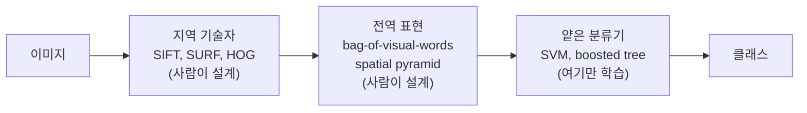

# AlexNet 이전의 이미지 인식은 무엇을 사람이 정했고, 표현 학습은 그중 무엇을 데이터에서 배우게 바꾸었는가?

## 문제

2012년 이전의 이미지 인식 시스템은 픽셀에서 feature를 뽑는 단계를 사람이 설계하고 마지막 분류기만 학습했습니다. AlexNet은 feature를 뽑는 단계까지 학습 대상으로 바꿨습니다. 여기서는 두 방식이 오차를 어디까지 고칠 수 있는지 비교하고, 당시 연구자들이 신경망 대신 SVM을 택한 기술적 근거와 ImageNet 대회의 결과를 봅니다.

## 아이디어

### AlexNet 이전의 표준 파이프라인

2000년대의 고성능 컴퓨터 비전 시스템은 전부 사람이 설계한 여러 단계로 이루어진 feature 파이프라인에 의존했습니다.



| 용어 | 하는 일 |
|---|---|
| **SIFT** (Scale-Invariant Feature Transform) | 이미지에서 특징점을 찾고, 그 주변의 밝기 변화 방향을 128차원 벡터로 기술합니다. 크기와 회전이 바뀌어도 비슷한 벡터가 나오게 설계됐습니다 |
| **SURF** | SIFT를 빠르게 근사한 것 |
| **HOG** (Histogram of Oriented Gradients) | 이미지를 작은 칸으로 나누고 칸마다 에지 방향의 히스토그램을 만듭니다. 물체의 윤곽 모양을 잡습니다 |
| bag-of-visual-words | 지역 기술자들을 군집화해 "시각 단어" 사전을 만들고, 이미지 하나를 단어 빈도 히스토그램 하나로 요약합니다 |
| **SVM** | 두 클래스를 가장 넓은 여백으로 가르는 경계를 찾는 분류기. 볼록 최적화라 전역 최적해가 보장됩니다 |

여기서 gradient는 픽셀 밝기의 공간적 변화량입니다. 손실의 기울기와 같은 수학이지만 대상이 다릅니다.

학습되는 부분은 마지막 분류기뿐입니다. 그 앞은 전부 사람이 정한 고정 함수입니다. 이런 분류기는 중간 표현을 학습하지 않고 입력 feature를 출력으로 바로 연결하므로 얕은(shallow) 학습이라고 부릅니다.

### 이 방식이 표준이었던 이유

- 사전 지식이 들어 있습니다. SIFT는 크기와 회전에, HOG는 윤곽에 맞춰 설계됐습니다. 시각의 불변성에 대한 사람의 이해를 코드로 옮긴 것입니다.
- 설명할 수 있습니다. 각 feature가 무엇을 재는지 연구자가 말할 수 있었습니다.
- 성적이 좋았습니다. 2012년 PASCAL VOC 우승작도 이 방식이었습니다.

반면 신경망의 자동 feature 학습은 불투명했고 큰 데이터가 필요했습니다. 대규모 일반 물체 인식에서는 학습된 feature가 SIFT, HOG, SURF를 이긴 적이 없었으므로 "feature는 학습해야 한다"는 주장은 이론에 머물렀습니다.

### 숨은 비용

손으로 설계한 feature는 "신호가 어떻게 생겨야 하는가"에 대한 특정한 생각을 하드코딩합니다. 현실이 그 가정과 다를 때 모델이 가정을 고칠 방법이 없습니다.

#### 물결을 자동차로 본 검출기

Vondrick 등(2013, HOGgles)은 HOG feature를 다시 이미지로 되돌려 보는 시각화를 만들었습니다. HOG 기반 검출기가 잔물결이 이는 수면을 자동차로 잘못 검출한 사례를 이 방법으로 보면, 그 물결의 HOG feature가 자동차의 feature와 닮아 있습니다. 분류기는 받은 입력을 제대로 갈랐고, 잘못은 그 앞의 feature 표현에 있었습니다. HOG는 "자동차 같은 에지"와 "자동차"를 구분하지 못했습니다.

```
 픽셀 ──▶ [HOG: 고정] ──▶ feature ──▶ [SVM: 학습] ──▶ "car"
             ▲                             │
             │      오차 신호가 여기서 멈춘다  │
             └──────────── ✗ ──────────────┘
```

SVM을 아무리 다시 학습해도 HOG는 바뀌지 않습니다. 오차 정보가 feature 추출 단계로 흘러 들어갈 경로가 없습니다.

#### DPM과 hard negative mining

Deformable Parts Model은 HOG feature와 latent structured SVM으로 물체를 부품들의 모음으로 표현했습니다. 오탐(false positive)이 나올 때마다 그것을 어려운 음성 예제로 학습 세트에 다시 넣고 재학습해 결정 경계를 고쳤습니다. DPM은 PASCAL VOC에서 여러 해 동안 가장 좋은 성적을 냈고, 수작업 feature 방식이 도달한 가장 높은 수준으로 꼽힙니다.

2011년 Torralba와 Efros는 "Unbiased Look at Dataset Bias"에서 한 데이터셋으로 학습한 검출기가 다른 데이터셋에서는 성능이 크게 떨어진다는 것을 보였습니다. 벤치마크 점수가 높아도 일반화는 나쁠 수 있다는 지적입니다.

### 표현 학습과 end-to-end

표현 학습(representation learning)은 feature 추출 함수 자체를 파라미터로 두고 데이터로 학습하는 것입니다. **end-to-end**는 입력 픽셀에서 출력 클래스까지 전체가 미분 가능한 함수 하나라서, 마지막의 오차 신호가 첫 layer까지 흘러간다는 뜻입니다.

```
 픽셀 ──▶ [conv1] ──▶ [conv2] ──▶ … ──▶ [FC] ──▶ "car"
            ▲            ▲                ▲          │
            └────────────┴────────────────┴── 기울기 ─┘
```

물결을 자동차로 잘못 분류하면 그 오차가 첫 conv layer의 필터까지 전달되어 "이런 에지 패턴은 자동차의 증거가 아니다"라는 방향으로 필터가 바뀝니다.

#### 학습된 feature의 단계

앞쪽 layer는 에지와 질감, 다음 layer는 그것을 조합한 수염이나 귀 모양의 윤곽, 더 깊은 layer는 부품을 모아 고양이 얼굴 전체를 표현합니다. 사람이 "1단계는 에지, 2단계는 부품"이라고 정해 준 것이 아니라 분류 오차를 줄이는 과정에서 생긴 구조입니다.

AlexNet 논문에는 학습된 첫 layer 필터 96개를 그린 그림이 실려 있습니다. 여러 방향의 에지 검출기와 색 얼룩 검출기가 나타납니다. 사람이 설계한 Gabor 필터와 닮았는데, 에지 검출기를 만들라고 지정한 적은 없습니다.

### 당시 SVM을 택한 이유: 볼록 최적화

SVM은 범주 사이에 선명한 경계를 긋는 분류기입니다. 볼록 최적화(convex optimization) 라는 수학적 성질 덕에 전역 최적해를 효율적으로 찾을 수 있어 인기를 얻었습니다. 반면 신경망은 이론적 보장이 없고 분석하기 어렵고 느린 블랙박스였습니다.

#### 볼록 함수

그릇 모양의 함수입니다. 곡면 위의 아무 두 점을 직선으로 이으면 그 선이 항상 곡면 위쪽에 있습니다.

$$
f(\lambda a + (1-\lambda) b) \le \lambda f(a) + (1-\lambda) f(b), \qquad 0 \le \lambda \le 1
$$

```
볼록:  ＼      ／         볼록 아님:  ＼    ／＼      ／
        ＼＿＿／                        ＼＿／  ＼＿＿／
     local min = global min             여러 개의 골
```

볼록 함수는 local minimum이 곧 global minimum입니다. 어디서 출발하든, 어떤 순서로 데이터를 넣든 같은 답에 도착합니다. 실험이 재현되고 결과를 수학적으로 분석할 수 있습니다.

#### SVM의 목적 함수

선형 SVM은 다음을 최소화합니다.

$$
\min_{\mathbf{w}, b}\ \frac12\|\mathbf{w}\|^2 + C\sum_n \max\big(0,\ 1 - y_n(\mathbf{w}\cdot\mathbf{x}_n + b)\big)
$$

첫 항은 경계의 여백을 넓히고, 둘째 항은 경계를 침범한 예제에 벌점을 줍니다. 두 항 모두 볼록이고 볼록 함수의 합은 볼록입니다.

#### 신경망은 볼록이 아니다

가장 간단한 이유는 대칭입니다. hidden layer의 두 뉴런을 서로 바꿔도(가중치를 통째로 교환해도) 네트워크의 출력은 같습니다. 같은 손실값을 갖는 서로 다른 파라미터 점이 적어도 둘 있습니다. 볼록 함수였다면 그 두 점의 중간도 손실이 같거나 낮아야 하는데, 두 뉴런의 가중치를 평균 내면 두 뉴런이 똑같아져 표현력이 줄고 손실이 올라갑니다. 그러므로 볼록이 아닙니다.

2000년대의 연구자 입장에서 선택은 이랬습니다.

| | SVM + 수작업 feature | 신경망 |
|---|---|---|
| 최적해 보장 | 있습니다 | 없습니다 |
| 재현성 | 높습니다 | 초기값에 따라 다릅니다 |
| 이론 | 일반화 한계를 증명할 수 있습니다 | 분석하기 어렵습니다 |
| 학습 시간 | 짧습니다 | 며칠 |
| 적은 데이터에서 | 잘 됩니다 | 과적합합니다 |
| 당시 성적 | 더 좋습니다 | 더 나쁩니다 |

모든 줄에서 SVM이 낫습니다. 이 표만 보면 신경망을 고를 이유가 없었습니다.

### 데이터가 많으면 단순한 방법도 강하다: nearest neighbor

새 방법을 평가할 때 자주 쓰는 baseline이 nearest neighbor입니다. 새 점을 알려진 모든 예제와 비교해 가장 가까운 것의 라벨을 붙이는 방법입니다. 학습된 feature 없이 데이터의 유사도에만 의존합니다.

$$
\hat{y}(\mathbf{x}) = y_{n^*}, \qquad n^* = \arg\min_n \|\mathbf{x} - \mathbf{x}_n\|
$$

$\arg\min_n$ 은 "그 값을 최소로 만드는 $n$"입니다.

#### 데이터가 많으면 강해지는 이유

학습 데이터가 무한히 많아지면 어떤 새 점이든 바로 옆에 같은 종류의 예제가 있습니다. 이론적으로 1-NN의 오류율은 데이터가 무한할 때 최적 분류기 오류율의 2배 이하로 수렴합니다(Cover와 Hart, 1967). 모델이 하는 일이 없어도 데이터가 많으면 성능이 나옵니다.

#### 이미지에서의 한계

거리를 픽셀 공간에서 재기 때문입니다. 같은 고양이를 3픽셀 옆으로 옮긴 사진은 픽셀 거리로는 아주 멉니다. 227x227x3 = 154,587차원 공간을 촘촘히 채우려면 데이터가 차원에 대해 지수적으로 필요합니다(차원의 저주). 실제로 통하려면 "고양이끼리 가까워지는 공간"으로 먼저 옮겨야 하고, 그 변환이 곧 feature입니다. 수작업 feature는 그 변환을 고정했고 CNN은 학습합니다.

### 데이터셋 규모 비교 (2012년 기준)

| 데이터셋 | 클래스 | 이미지 | 성격 |
|---|---|---|---|
| MNIST | 10 | 70,000 | 손글씨 숫자, 28x28 흑백 |
| CIFAR-10 | 10 | 60,000 | 32x32 컬러 |
| 독일 교통 표지판 | | 약 50,000 | DanNet이 우승한 대회 |
| PASCAL VOC | 20 | 약 11,000 | 꼼꼼한 주석. 당시 물체 인식의 대표 벤치마크 |
| ImageNet-1k (ILSVRC) | 1,000 | 약 120만 | 2012~2017년 대회용 부분집합 |
| ImageNet 전체 (2009년 공개 시) | 5,000 이상 | 320만 | |
| ImageNet 전체 (현재) | 22,000 이상 | 1,400만 이상 | |

ImageNet-1k는 PASCAL VOC의 약 100배입니다.

### 대회 결과

| 연도 | 우승 방식 | top-5 오류 |
|---|---|---|
| 2010 | SIFT + LBP + SVM | 28.2% |
| 2011 | SIFT 기반 Fisher vector + SVM | 25.8% |
| 2012 | AlexNet (2위는 26.2%) | 15.3% |
| 2013 | CNN (Clarifai) | 11.7% |
| 2014 | GoogLeNet | 6.7% |
| 2015 | ResNet | 3.57% |

2012년에 AlexNet이 오류를 26%대에서 15%대로 낮췄고, 2013년부터는 참가작 대부분이 CNN이었습니다. 2014년에는 PASCAL 쪽 연구자들도 CNN 기반 물체 검출기 R-CNN을 냈습니다. 2017년에는 상위권의 오류가 2~3%대로 모여 대회가 끝났습니다.

### 큰 모델에는 큰 데이터가 필요하다

파라미터 약 6,100만 개짜리 모델을 이미지 11,000장으로 학습하면 데이터를 외워 버립니다([과적합과 regularization](07-regularization.md)). PASCAL VOC는 이런 모델을 학습시키기에 너무 작았습니다. ImageNet의 120만 장은 dropout과 augmentation을 같이 썼을 때 8-layer CNN이 일반화할 수 있는 규모였습니다.

### DanNet

Dan Cireșan의 DanNet은 GPU로 학습한 CNN으로 2011~2012년에 이미지 인식 대회 여러 개를 우승했습니다. 2011년 IJCNN 독일 교통 표지판 대회에서는 정확도 99.46%로 2위와 1.15%p 차이가 났습니다.

| | DanNet | AlexNet |
|---|---|---|
| 방식 | GPU로 학습한 CNN | GPU로 학습한 CNN |
| 데이터 | 수만 장 규모의 특화된 데이터셋 | 120만 장, 1,000개 범주 |

DanNet은 CNN이 수작업 feature를 이길 수 있다는 것을 먼저 보였습니다. 같은 방식이 ImageNet 규모의 일반 물체 인식에서도 통한다는 것은 AlexNet이 보였습니다.

## 결과 해석

### 두 방식 비교

| | feature engineering | 표현 학습 |
|---|---|---|
| feature를 정하는 주체 | 연구자 | 데이터와 최적화 |
| 가정이 틀렸을 때 | 사람이 다시 설계합니다 | 기울기가 고칩니다 |
| 데이터가 늘면 | 분류기만 좋아지고 곧 정체합니다 | feature도 같이 좋아집니다 |
| 설명 가능성 | 높습니다 | 낮습니다 |
| 필요한 데이터와 연산 | 적습니다 | 많습니다 |
| 2012년 이전의 성적 | 우위 | 열위 |

이 표의 세 번째 줄(데이터가 늘 때)은 ILSVRC 대회 결과와 맞습니다. ImageNet이 PASCAL VOC보다 약 100배 컸는데도 수작업 feature 방식의 오류율은 2010년 28.2%에서 2011년 25.8%로 조금 내려갔습니다. feature 추출 단계가 고정돼 있으면 데이터가 늘어도 마지막 분류기만 조금 좋아진다는 설명과 맞습니다. 데이터 크기만 바꿔 가며 비교한 실험은 아니므로 이 표의 한 줄을 증명하지는 않습니다.

### 데이터만 많으면 되는가

2009년 Google의 Halevy, Norvig, Pereira는 "The Unreasonable Effectiveness of Data"에서 단순한 모델에 많은 데이터를 주는 쪽이 적은 데이터에 정교한 모델을 쓰는 쪽보다 낫다고 주장했습니다. 이 글의 예시는 n-gram 같은 단순한 통계 모델이었습니다.

ImageNet 대회에서는 데이터만 늘려서는 부족했습니다. 같은 데이터에서 SIFT + SVM 계열은 28.2%와 25.8%였고 CNN은 15.3%였습니다. 데이터가 늘었을 때 얻는 이득이 모델 구조에 따라 다르다는 해석과 맞습니다. 같은 질문을 [RNN과 LSTM](../03-rnn-lstm/README.md)의 n-gram과 RNN 비교에서 실험으로 다시 봅니다.

### 2012년에 달라진 것

| 회의론의 근거 | 2012년에 달라진 것 |
|---|---|
| 이론적 보장이 없습니다 | 여전히 없습니다. 다만 성능 차이가 보장의 가치를 넘어섰습니다 |
| 적은 데이터에서 과적합합니다 | ImageNet 120만 장, dropout, augmentation |
| 학습이 며칠 걸립니다 | GPU. 여전히 5~6일이지만 가능한 범위에 들어왔습니다 |
| 깊으면 학습이 안 됩니다 | ReLU, 초기화, momentum |
| 신경망이 대규모 벤치마크에서 이긴 적이 없습니다 | ILSVRC 2012에서 15.3% 대 26.2% |
| local minima에 갇힙니다 | 큰 네트워크에서는 local minima보다 곡률 차이와 saddle point가 문제라는 분석이 나왔습니다([최적화](06-optimization.md)) |

첫 줄은 지금도 해결되지 않았습니다. 신경망은 여전히 볼록이 아니고 이론적 보장이 약합니다. 해석 가능성 연구가 계속되는 이유입니다.

처음 질문에 답하면, AlexNet 이전에는 픽셀에서 feature를 뽑는 함수(SIFT, HOG, bag-of-visual-words)를 사람이 정했고 마지막 분류기만 학습했습니다. 표현 학습은 feature를 뽑는 함수까지 파라미터로 두고, 분류 오차의 기울기가 첫 layer까지 전달되게 해서 feature와 분류기를 함께 고칩니다. 그 대가로 볼록 최적화의 보장과 설명 가능성을 내주고 더 많은 데이터와 연산을 쓰게 됐습니다.

## References

- [ImageNet Classification with Deep Convolutional Neural Networks](https://papers.nips.cc/paper/2012/hash/c399862d3b9d6b76c8436e924a68c45b-Abstract.html) (Krizhevsky, Sutskever, Hinton, 2012)
- [ImageNet Large Scale Visual Recognition Challenge](https://arxiv.org/abs/1409.0575) (Russakovsky 외, 2015)
- [ImageNet: A Large-Scale Hierarchical Image Database](https://www.image-net.org/static_files/papers/imagenet_cvpr09.pdf) (Deng 외, 2009)
- [Multi-column Deep Neural Networks for Image Classification](https://arxiv.org/abs/1202.2745) (Ciresan, Meier, Schmidhuber, 2012)
- [HOGgles: Visualizing Object Detection Features](http://www.cs.columbia.edu/~vondrick/ihog/iccv.pdf) (Vondrick, Khosla, Malisiewicz, Torralba, 2013)
- [Unbiased Look at Dataset Bias](https://people.csail.mit.edu/torralba/publications/datasets_cvpr11.pdf) (Torralba, Efros, 2011)
- [The Unreasonable Effectiveness of Data](https://static.googleusercontent.com/media/research.google.com/en//pubs/archive/35179.pdf) (Halevy, Norvig, Pereira, 2009)
- Nearest neighbor pattern classification (Cover, Hart, IEEE Transactions on Information Theory, 1967)
