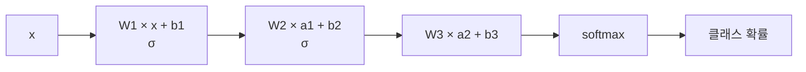

# 신경망은 입력에서 클래스 확률을 어떻게 계산하고, 예측이 틀린 정도는 어떤 숫자로 재는가?

## 문제

신경망 한 layer는 가중치 행렬을 곱하고 bias를 더한 뒤 활성화 함수를 통과시키는 계산입니다. 분류 네트워크는 이 계산을 여러 번 한 뒤 softmax로 클래스별 확률을 만들고, cross-entropy로 정답과의 차이를 숫자 하나로 잽니다. 여기서는 뉴런과 layer의 식, softmax와 cross-entropy를 숫자로 계산하고, 둘을 붙였을 때 기울기가 예측 확률에서 정답을 뺀 값이 되는 것을 유도합니다.

## 아이디어

### 뉴런의 정의

뉴런은 작은 계산 블록입니다. 입력을 받아 가중치를 곱하고, bias를 더하고, 활성화 함수에 통과시킵니다. 가중치와 bias를 합쳐 **파라미터**라고 부르고, 학습 중에 조정되는 것이 이 값들입니다.

식으로 쓰면 뉴런 하나는 다음과 같습니다.

$$
a = \sigma(z), \qquad z = \mathbf{w}\cdot\mathbf{x} + b = \sum_{i} w_i x_i + b
$$

- $\mathbf{x}$: 입력 벡터
- $\mathbf{w}$: 가중치(weight). 입력의 각 칸이 결과에 얼마나, 어느 방향으로 기여하는지
- $b$: bias. 입력이 전부 0이어도 남는 기본값
- $z$: 활성화 전의 값. pre-activation이라고 부릅니다
- $\sigma$: 활성화 함수. 자세한 내용은 [ReLU와 초기화](05-relu-and-initialization.md)에 있습니다
- $a$: 뉴런의 출력(activation)

```
 x1 ──w1──┐
 x2 ──w2──┼──▶ Σ(+b) ──▶ z ──▶ σ( ) ──▶ a
 x3 ──w3──┘
```

### layer는 뉴런 여러 개를 한 번에 계산한 것

뉴런 $m$개가 같은 입력 $\mathbf{x}$ 를 받으면, 각 뉴런의 $\mathbf{w}$ 를 행으로 쌓아 행렬 $W$ 를 만들 수 있습니다.

$$
\mathbf{z} = W\mathbf{x} + \mathbf{b}, \qquad \mathbf{a} = \sigma(\mathbf{z})
$$

흔히 "$Wx + b$"라고 줄여 부르는 것이 이 식입니다. 모든 입력이 모든 뉴런에 연결되므로 fully connected(FC) layer 또는 dense layer라고 부릅니다.

#### 손계산: 입력 3개, 뉴런 2개

$$
W = \begin{bmatrix} 1 & -2 & 0.5 \\ 0 & 1 & 1 \end{bmatrix},\quad
\mathbf{b} = \begin{bmatrix} -1 \\ -5 \end{bmatrix},\quad
\mathbf{x} = \begin{bmatrix} 4 \\ 1 \\ 2 \end{bmatrix}
$$

$$
\mathbf{z} = \begin{bmatrix} 3 \\ 3 \end{bmatrix} + \begin{bmatrix} -1 \\ -5 \end{bmatrix} = \begin{bmatrix} 2 \\ -2 \end{bmatrix}
$$

활성화 함수로 ReLU($\max(0, z)$)를 쓰면 $\mathbf{a} = (2, 0)$ 입니다. 두 번째 뉴런은 이 입력에 반응하지 않았습니다. 파라미터 수는 가중치 $2\times3 = 6$개와 bias 2개로 8개입니다.

### bias는 무엇을 하는가

$b$ 가 없으면 $z = \mathbf{w}\cdot\mathbf{x}$ 는 입력이 0일 때 항상 0입니다. $b$ 는 뉴런이 켜지는 문턱을 옮깁니다. 입력 3개, 뉴런 2개 손계산에서 두 번째 뉴런은 내적 값이 3인데 $b = -5$ 라서 꺼졌습니다. 점수가 5를 넘어야 켜지는 뉴런입니다.

AlexNet은 일부 layer의 bias를 0이 아닌 1로 초기화했습니다. 학습 초기에 ReLU 뉴런이 켜진 상태에서 시작하게 하려는 것입니다. 자세한 내용은 [ReLU와 초기화](05-relu-and-initialization.md)에 있습니다.

### 왜 "선형"이고, 왜 그것만으로 부족한가

$W\mathbf{x} + \mathbf{b}$ 는 선형(엄밀히는 affine) 변환입니다. 선형 변환을 두 번 쌓아도 선형 변환 하나와 같습니다.

$$
W_2(W_1\mathbf{x} + \mathbf{b}_1) + \mathbf{b}_2 = \underbrace{(W_2 W_1)}_{W'}\mathbf{x} + \underbrace{(W_2\mathbf{b}_1 + \mathbf{b}_2)}_{\mathbf{b}'}
$$

활성화 함수 없이 layer를 100개 쌓아도 layer 하나짜리와 표현력이 같습니다. layer 사이에 비선형 함수 $\sigma$ 를 끼워야 깊이가 의미를 갖습니다.

### 여러 layer를 쌓으면



$$
\hat{\mathbf{y}} = \text{softmax}\big(W_3\,\sigma(W_2\,\sigma(W_1\mathbf{x} + \mathbf{b}_1) + \mathbf{b}_2) + \mathbf{b}_3\big)
$$

함수 합성입니다. 코드로는 `f3(f2(f1(x)))` 입니다. 마지막의 softmax는 점수들을 합이 1인 확률로 바꾸는 함수입니다. 이 구조 덕분에 연쇄법칙으로 모든 파라미터의 기울기를 구할 수 있습니다. 기울기(gradient)는 파라미터를 조금 바꿀 때 손실이 얼마나 변하는지를 나타내는 값이고, 출력 쪽에서 입력 쪽으로 거슬러 가며 이 값을 계산하는 방법이 역전파(backpropagation)입니다([역전파](04-backpropagation.md)).

### 뉴런 수와 파라미터 수

AlexNet 논문은 파라미터 6,000만 개, 뉴런 약 65만 개라고 적습니다. 두 숫자는 뜻이 다릅니다.

- 파라미터 수는 학습 난이도, 실행 비용, 과적합(학습 데이터만 외워서 새 데이터에서 틀리는 현상) 위험과 직접 연결됩니다. 모델 크기를 말할 때 보통 이 숫자를 씁니다.
- 뉴런 수는 conv layer에서 애매합니다. 같은 가중치를 모든 위치에서 재사용하므로 뉴런은 많아도 파라미터는 적습니다.

65만이라는 숫자가 어디서 나오는지는 [AlexNet의 파라미터와 두 GPU 분할](09-alexnet-parameters-and-gpus.md)에서 layer별로 계산합니다.

## 수식으로 보기

### 손실 함수가 하는 일

신경망은 학습 데이터의 피드백으로 가중치와 bias를 조정해 예측 오차를 줄입니다. 이 과정을 이끄는 것이 손실 함수(loss function) 이고, 모델의 예측과 정답의 차이를 잽니다.

손실은 숫자 하나입니다. 약 6,100만 개 파라미터의 좋고 나쁨을 숫자 하나로 요약해야 "이 방향으로 고치면 나아진다"를 계산할 수 있습니다.

### 평균 제곱 오차 (MSE)

숫자를 맞히는 문제(회귀)에 씁니다.

$$
L = \frac{1}{N}\sum_{n=1}^{N} (\hat{y}_n - y_n)^2
$$

- $N$: 데이터 개수. $\hat{y}_n$: $n$번째 예측. $y_n$: $n$번째 정답.
- 제곱하면 부호가 없어지고 큰 오차에 더 큰 벌점이 갑니다. 미분하기도 쉽습니다.

손계산: 예측 1.5, 정답 1 이면 $(1.5 - 1)^2 = 0.25$. 미분을 편하게 하려고 $\tfrac{1}{2}$ 을 붙여 $\tfrac12(0.5)^2 = 0.125$ 로 쓰기도 합니다. [역전파](04-backpropagation.md)에서 이 형태를 씁니다.

### 분류 문제: softmax와 cross-entropy

AlexNet의 마지막 layer는 1,000개 클래스에 대한 점수 벡터를 내고, softmax가 이를 확률로 바꿉니다.

#### softmax

$$
p_k = \frac{e^{z_k}}{\sum_{j=1}^{K} e^{z_j}}
$$

- $z_k$: $k$번째 클래스의 점수(logit). $K$: 클래스 수. $p_k$: $k$번째 클래스일 확률.
- 지수 함수로 모든 값을 양수로 만들고 합으로 나눠 **총합이 1**이 되게 합니다.

손계산: 점수가 $\mathbf{z} = (2,\ 1,\ 0.1)$ 이면

$$
e^{2} = 7.389,\quad e^{1} = 2.718,\quad e^{0.1} = 1.105,\quad \text{합} = 11.212
$$

$$
\mathbf{p} = (0.659,\ 0.242,\ 0.099)
$$

#### cross-entropy

정답 클래스에 모델이 준 확률의 로그에 음수를 붙인 값입니다.

$$
L = -\sum_{k=1}^{K} y_k \log p_k = -\log p_{\text{정답}}
$$

- $y_k$: 정답이면 1, 아니면 0인 one-hot 벡터. 그래서 합에서 정답 항만 남습니다.
- $\log$ 는 자연로그.

손계산: 정답이 첫 번째 클래스면 $L = -\ln 0.659 = 0.417$.

| 정답 클래스에 준 확률 | 손실 $-\ln p$ |
|---|---|
| 0.99 | 0.010 |
| 0.659 | 0.417 |
| 0.1 | 2.303 |
| 0.001 | 6.908 |

확신하고 틀릴수록 벌점이 급격히 커집니다. 1,000개 클래스를 무작위로 찍으면 $p = 0.001$ 이라 손실이 약 6.9입니다. 학습 로그의 첫 손실이 $\ln K$ 근처인지 보는 것이 구현이 맞는지 확인하는 기본 점검입니다.

### softmax와 cross-entropy를 붙였을 때의 기울기

$$
\frac{\partial L}{\partial z_k} = p_k - y_k
$$

softmax와 cross-entropy를 붙여 놓으면, 점수(logit) $z_k$ 에 대한 손실의 기울기는 예측 확률에서 정답을 뺀 것입니다. 지수와 로그가 전부 상쇄됩니다. 분류 네트워크의 역전파는 항상 이 벡터에서 시작합니다. $\mathbf{y}$ 는 one-hot이라 $\sum_k y_k = 1$ 이라는 점을 씁니다.

**1단계.** $\log p_k$ 를 풀어 쓴다

$$
\log p_k = z_k - \log\sum_j e^{z_j}
$$

**2단계.** $z_i$ 로 미분한다

$$
\frac{\partial \log p_k}{\partial z_i} = \underbrace{\frac{\partial z_k}{\partial z_i}}_{\delta_{ki}} - \frac{e^{z_i}}{\sum_j e^{z_j}} = \delta_{ki} - p_i
$$

- $\delta_{ki}$ (크로네커 델타): $k = i$ 이면 1, 아니면 0.
- 둘째 항은 $\log$ 의 미분($1/u$)과 연쇄법칙으로 나옵니다. $\frac{\partial}{\partial z_i}\log\sum_j e^{z_j} = \frac{e^{z_i}}{\sum_j e^{z_j}} = p_i$.

**3단계.** 손실에 대입한다

$$
\frac{\partial L}{\partial z_i} = -\sum_k y_k(\delta_{ki} - p_i) = -y_i + p_i\underbrace{\sum_k y_k}_{=1} = p_i - y_i
$$

### MSE 대신 cross-entropy를 쓰는 이유

출력에 sigmoid나 softmax를 쓰고 손실로 MSE를 쓰면 기울기에 활성화 함수의 미분이 남습니다. sigmoid 하나로 보면

$$
\frac{\partial}{\partial z}\tfrac12(\sigma(z) - y)^2 = (\sigma(z) - y)\,\sigma'(z)
$$

모델이 **확신하고 틀렸을 때**($y = 1$ 인데 $\sigma(z) \approx 0$) $\sigma'(z) \approx 0$ 이라 기울기가 사라집니다. 가장 크게 고쳐야 할 때 가장 안 움직입니다. cross-entropy는 $\log$ 가 이 $\sigma'$ 을 상쇄해서 기울기가 $\sigma(z) - y \approx -1$ 로 크게 남습니다. [ReLU와 초기화](05-relu-and-initialization.md)에서 다루는 포화 문제를 output layer에서 피하는 방법입니다.

### 수치 안정성

$e^{1000}$ 은 float로 표현할 수 없습니다(overflow). softmax는 모든 점수에서 같은 상수를 빼도 결과가 같다는 성질을 씁니다.

$$
\frac{e^{z_k - c}}{\sum_j e^{z_j - c}} = \frac{e^{-c}e^{z_k}}{e^{-c}\sum_j e^{z_j}} = p_k
$$

$c = \max_j z_j$ 로 두면 지수의 입력이 전부 0 이하가 되어 안전합니다.

```python
import numpy as np

def softmax(z):
    z = z - z.max()
    e = np.exp(z)
    return e / e.sum()

def cross_entropy_with_grad(z, label):
    p = softmax(z)
    loss = -np.log(p[label])
    grad = p.copy()
    grad[label] -= 1.0          # p - y
    return loss, grad

print(cross_entropy_with_grad(np.array([2.0, 1.0, 0.1]), 0))
# (0.4170..., array([-0.3410,  0.2424,  0.0986]))
```

PyTorch의 `nn.CrossEntropyLoss` 는 softmax와 log와 음의 로그 가능도를 한 번에 처리합니다. 그래서 모델의 마지막에 softmax layer를 따로 넣으면 안 됩니다. 두 번 적용되어 학습이 느려지는데 에러는 나지 않아 찾기 어려운 실수입니다.

### 정보 이론에서의 의미

$-\log_2 p$ 는 확률 $p$ 인 사건을 부호화하는 데 필요한 비트 수입니다. cross-entropy는 "모델의 확률 분포로 정답을 부호화하면 평균 몇 비트가 드는가"입니다. 이 문서의 $L$ 은 자연로그로 계산했으므로 단위가 비트가 아니라 nat이고, $\ln 2$ 로 나누면 비트가 됩니다. 손실을 줄이는 것은 데이터를 더 짧게 부호화하는 모델을 찾는 것과 같습니다. 이 관점은 1960년대의 Kolmogorov complexity와 그 뒤에 나온 MDL(minimum description length) 원리에서 이어진 것입니다. [RNN과 LSTM](../03-rnn-lstm/README.md)에서 쓰는 perplexity는 $e^{L}$ 로, 이 손실을 다른 단위로 읽은 것입니다.

## 작은 숫자로 직접 계산

### 점수 (2, 1, 0.1)에서의 기울기

softmax 손계산의 점수 $\mathbf{z} = (2, 1, 0.1)$ 을 그대로 쓰고, 정답은 첫째 클래스입니다.

$$
\mathbf{p} = (0.659,\ 0.242,\ 0.099),\qquad \mathbf{y} = (1, 0, 0)
$$

$$
\frac{\partial L}{\partial \mathbf{z}} = \mathbf{p} - \mathbf{y} = (-0.341,\ 0.242,\ 0.099)
$$

- 정답 클래스의 기울기는 음수입니다. 경사하강법은 기울기의 반대로 가므로 $z_1$ 을 올립니다.
- 오답 클래스의 기울기는 양수입니다. $z_2$, $z_3$ 을 내립니다. 확률을 많이 가져간 오답일수록 더 세게 내립니다.
- 세 값의 합은 0입니다. 확률의 총합이 1로 고정돼 있어서 한쪽을 올리면 다른 쪽이 내려갑니다.
- 모델이 완벽하게 맞히면 $\mathbf{p} = \mathbf{y}$ 이고 기울기는 0입니다.

## 코드로 확인

[experiments/hand_calc.py](experiments/hand_calc.py)는 이 문서의 layer 손계산, softmax, cross-entropy, 기울기를 다시 계산합니다. 출력은 [results/hand-calc.txt](results/hand-calc.txt)에 있고 문서의 손계산 값과 같습니다.

```
Wx = [3. 3.]  Wx + b = [ 2. -2.]  ReLU = [2. 0.]
p = [0.659 0.242 0.099]  loss = 0.417  기울기 p - y = [-0.341   0.2424  0.0986]
```

## 결과 해석

### 손실과 평가 지표는 다르다

ImageNet 대회는 **top-5 error**로 순위를 매겼습니다. 모델이 고른 상위 5개 안에 정답이 없는 비율입니다. 2012년 AlexNet이 15.3%, 2위가 26.2%였습니다.

| | 손실(cross-entropy) | 평가 지표(top-5 error) |
|---|---|---|
| 쓰는 곳 | 학습 중 기울기 계산 | 대회 순위, 논문의 표 |
| 미분 가능 | 가능 | 불가능(순위는 계단 함수) |
| 값의 의미 | 확률이 얼마나 정답에 몰렸나 | 맞았나 틀렸나 |

top-5 error를 직접 최소화하지 못하는 이유는 미분이 안 되기 때문입니다. 그래서 미분 가능한 대리 목표(cross-entropy)를 줄이고, 그 결과 지표도 좋아지기를 기대합니다.

#### 왜 top-1이 아니라 top-5였나

ImageNet 이미지에는 물체가 여러 개 찍힌 경우가 많은데 정답 라벨은 하나입니다. 개와 공이 같이 있는 사진의 정답이 "공"이면 "개"라고 답한 모델이 틀린 것이 됩니다. 상위 5개를 허용하면 이 라벨의 모호함을 어느 정도 흡수합니다.

### 처음 질문에 대한 답

신경망은 layer마다 $W\mathbf{x} + \mathbf{b}$ 를 계산하고 활성화 함수를 통과시키는 일을 반복한 뒤, 마지막 점수를 softmax로 합이 1인 확률로 바꿉니다. 예측이 틀린 정도는 정답 클래스에 준 확률의 음의 로그인 cross-entropy 하나로 잽니다. 두 함수를 붙이면 점수에 대한 기울기가 $\mathbf{p} - \mathbf{y}$ 가 되어, 역전파가 이 단순한 벡터에서 시작합니다.

## References

- [ImageNet Classification with Deep Convolutional Neural Networks](https://papers.nips.cc/paper/2012/hash/c399862d3b9d6b76c8436e924a68c45b-Abstract.html) (Krizhevsky, Sutskever, Hinton, 2012)
