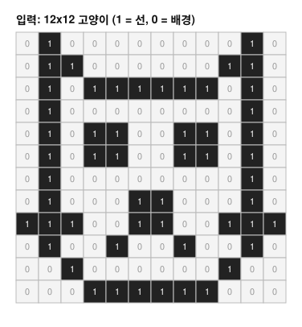
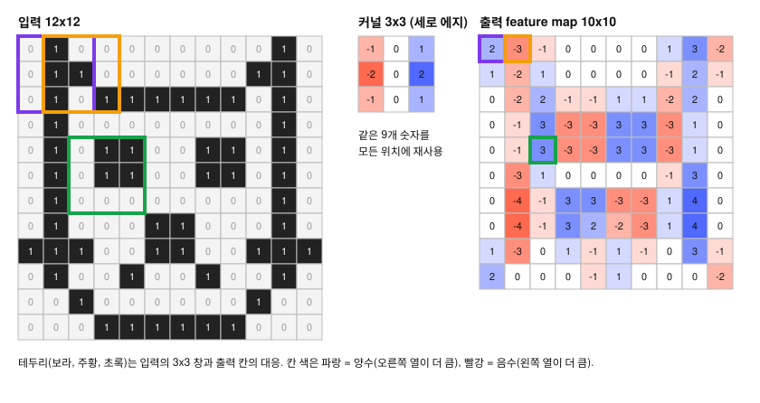
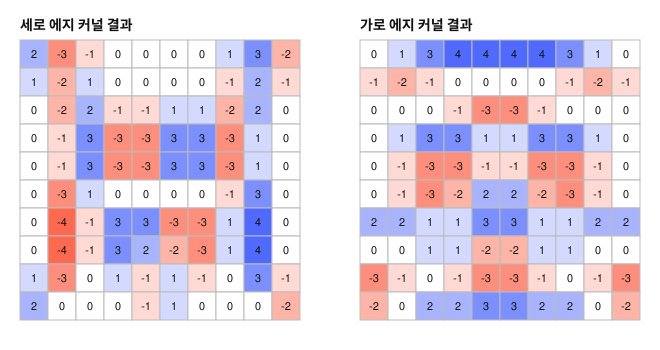
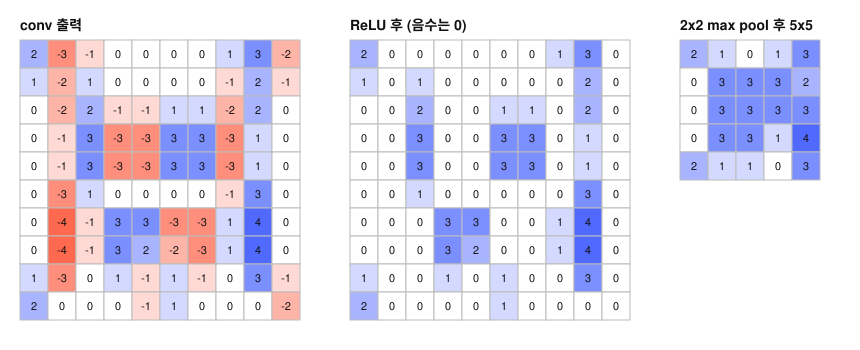
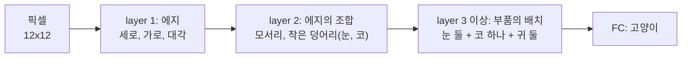

# 합성곱은 이미지에서 무엇을 계산하고, 같은 입력을 FC layer로 받을 때보다 파라미터가 왜 적은가?

## 문제

conv layer는 작은 필터를 이미지 위에서 한 칸씩 옮기며 각 위치의 창과 필터의 내적을 계산합니다. 같은 필터를 모든 위치에서 쓰기 때문에 파라미터가 입력 크기와 무관합니다. 여기서는 합성곱의 정의와 출력 크기 공식을 정리하고, 12x12 픽셀로 그린 고양이에 에지 검출 커널을 적용해 feature map을 위치별로 계산한 뒤, 같은 계산을 NumPy로 구현합니다.

## 아이디어

### conv layer가 하는 일

- conv layer는 작은 필터 여러 개를 입력 위에서 미끄러뜨리며, 각 구간을 학습된 패턴과 비교합니다.
- 비교는 필터의 가중치와 입력 픽셀의 내적입니다. 그 영역이 필터와 얼마나 닮았는지 재는 것입니다.
- 결과 값들이 **feature map**을 이룹니다. 특정 시각 패턴이 어디서 강하게 검출됐는지 보여 줍니다.
- 같은 필터를 모든 위치에 적용합니다. 그래서 파라미터 수가 크게 줄고, 패턴이 이미지의 어디에 있든 인식할 수 있습니다.

필터(filter)와 커널(kernel)은 같은 말로 씁니다.

### 왜 FC layer로 이미지를 처리하지 않는가

AlexNet의 입력인 227 x 227 x 3 이미지는 숫자 154,587개입니다. 이것을 뉴런 4,096개짜리 FC layer에 넣으면 가중치가

$$
154{,}587 \times 4{,}096 = 633{,}188{,}352 \approx 6.3\text{억 개}
$$

첫 layer 하나가 AlexNet 전체의 10배입니다([results/hand-calc.txt](results/hand-calc.txt)). 게다가 FC layer는 위치마다 다른 가중치를 씁니다. 왼쪽 위의 고양이 귀와 오른쪽 아래의 고양이 귀를 따로 배워야 합니다.

이미지에는 두 가지 성질이 있습니다.
1. **지역성**: 의미 있는 패턴(에지, 모서리)은 가까운 픽셀끼리 만듭니다.
2. **위치 무관성**: 에지는 어디에 있든 에지입니다.

합성곱은 이 두 성질을 구조에 넣은 것입니다. 작은 창만 보고(지역 연결), 같은 가중치를 모든 위치에서 재사용합니다(가중치 공유).

### translation invariance와 equivariance

같은 필터를 모든 위치에 적용하면 translation invariance(위치가 달라도 패턴을 인식하는 능력)를 얻는다고 흔히 설명합니다. 엄밀히는 두 가지로 나뉩니다.
- 합성곱 자체는 **equivariant**입니다. 입력이 오른쪽으로 2칸 움직이면 feature map도 2칸 움직입니다. 결과가 따라 움직입니다.
- **invariant**(입력이 움직여도 결과가 같음)는 pooling과 마지막 FC layer를 거치면서 근사적으로 얻습니다.

## 수식으로 보기

### 내적은 두 벡터가 닮은 정도를 잰다

내적(dot product)은 길이가 같은 두 벡터를 자리끼리 곱해서 전부 더한 숫자 하나입니다.

$$
\mathbf{w} \cdot \mathbf{x} = \sum_{i=1}^{n} w_i x_i = \|\mathbf{w}\|\,\|\mathbf{x}\|\cos\phi
$$

$\|\mathbf{w}\|$ 는 벡터의 길이, $\phi$ 는 두 벡터 사이의 각도입니다. 두 벡터가 같은 방향이면 $\cos\phi = 1$ 로 내적이 가장 크고, 직각이면 0, 반대 방향이면 음수입니다. $\mathbf{w}$ 를 찾고 싶은 패턴, $\mathbf{x}$ 를 지금 보고 있는 입력 조각으로 두면 내적은 패턴 일치 점수가 됩니다. 예를 들어 $\mathbf{w} = (1, -2, 0.5)$, $\mathbf{x} = (4, 1, 2)$ 이면 $4 - 2 + 1 = 3$ 입니다.

### 연산 정의

입력 $X$ (크기 $H \times W$), 커널 $K$ (크기 $k \times k$), 출력의 $(i, j)$ 칸은

$$
Y_{i,j} = \sum_{m=0}^{k-1}\sum_{n=0}^{k-1} K_{m,n}\, X_{i+m,\ j+n} + b
$$

입력에서 $(i,j)$ 를 왼쪽 위 모서리로 하는 $k \times k$ 창을 잘라 커널과 자리끼리 곱해 더합니다. 내적과 같습니다.

수학의 합성곱은 커널을 뒤집어서 곱합니다. 딥러닝 라이브러리가 실제로 하는 것은 뒤집지 않는 cross-correlation입니다. 커널이 학습되므로 뒤집든 말든 결과가 같아서 구분하지 않고 convolution이라고 부릅니다.

#### 손계산: 4x4 입력, 2x2 커널

$$
X = \begin{bmatrix} 1&2&0&1\\ 0&1&3&1\\ 2&1&0&0\\ 1&0&1&2 \end{bmatrix},\qquad
K = \begin{bmatrix} 1&0\\ 0&-1 \end{bmatrix}
$$

$Y_{0,0} = 1\cdot1 + 0\cdot2 + 0\cdot0 + (-1)\cdot1 = 0$
$Y_{0,1} = 1\cdot2 + 0 + 0 + (-1)\cdot3 = -1$
$Y_{0,2} = 1\cdot0 + 0 + 0 + (-1)\cdot1 = -1$

나머지도 같은 방식으로 하면

$$
Y = \begin{bmatrix} 0&-1&-1\\ -1&1&3\\ 2&0&-2 \end{bmatrix}
$$

출력은 3x3입니다. 더 큰 예는 「작은 숫자로 직접 계산」의 고양이 그림입니다.

### stride, padding, 출력 크기 공식

- **stride** $S$: 커널이 한 번에 움직이는 칸 수. 이미지를 얼마나 촘촘히 표본 추출할지, 공간 해상도를 얼마나 빨리 줄일지를 정합니다.
- **padding** $P$: 입력 테두리에 0을 덧대는 폭. 가장자리 정보가 덜 쓰이는 것을 막고 출력 크기를 유지합니다.

$$
O = \left\lfloor \frac{I - K + 2P}{S} \right\rfloor + 1
$$

$I$: 입력 한 변. $K$: 커널 한 변. $\lfloor\ \rfloor$: 내림.

| 경우 | $I$ | $K$ | $P$ | $S$ | $O$ |
|---|---|---|---|---|---|
| 4x4 손계산 | 4 | 2 | 0 | 1 | 3 |
| 고양이 예제 | 12 | 3 | 0 | 1 | 10 |
| AlexNet conv1 | 227 | 11 | 0 | 4 | 55 |
| AlexNet conv2 | 27 | 5 | 2 | 1 | 27 |
| AlexNet conv3 | 13 | 3 | 1 | 1 | 13 |

3x3 커널에 $P = 1$, 5x5 커널에 $P = 2$ 를 주면 크기가 유지됩니다. 일반적으로 $P = (K-1)/2$ 입니다.

### 채널: 입력도 출력도 여러 장

컬러 이미지는 R, G, B 세 장입니다. 커널도 입력 채널 수만큼 깊이를 가집니다. 커널 하나의 모양은 $k \times k \times C_{in}$ 이고, 세 채널에 걸쳐 전부 곱해 더해서 **숫자 하나**를 냅니다.

$$
Y_{i,j} = \sum_{c=0}^{C_{in}-1}\sum_{m}\sum_{n} K_{c,m,n}\, X_{c,\,i+m,\,j+n} + b
$$

필터를 $C_{out}$ 개 쓰면 feature map이 $C_{out}$ 장 나옵니다. 이것이 다음 layer의 입력 채널이 됩니다.

```
입력 (3 x 227 x 227)
   │   필터 96개, 각 필터는 (3 x 11 x 11)
   ▼
출력 (96 x 55 x 55)   ← feature map 96장
```

출력 채널 수는 필터의 개수이고, 필터 개수는 설계자가 정하는 값입니다. 입력 채널 수와 무관합니다.

#### 파라미터 수 공식

$$
\text{params} = (k \times k \times C_{in} + 1) \times C_{out}
$$

$+1$ 은 필터마다 하나씩 있는 bias입니다. AlexNet conv1은 $(11\times11\times3 + 1)\times96 = 34{,}944$개입니다. conv1의 입력은 $3 \times 227 \times 227 = 154{,}587$개, 출력은 $96 \times 55 \times 55 = 290{,}400$개입니다. 같은 입출력을 FC로 연결했다면 $154{,}587 \times 290{,}400 \approx 449$억 개입니다. 가중치 공유로 약 128만 분의 1이 됐습니다. 입력을 227로 계산한 이유는 [AlexNet 구조](08-alexnet-architecture.md)에 있습니다.

## 작은 숫자로 직접 계산

12x12 픽셀로 그린 고양이에 3x3 커널을 적용합니다. 이 절의 숫자는 「코드로 확인」에 있는 NumPy 코드([experiments/conv_numpy.py](experiments/conv_numpy.py))의 출력([results/conv-numpy.txt](results/conv-numpy.txt))과 같습니다.

### 입력: 12x12 고양이

선이 있는 칸이 1, 배경이 0입니다. 귀 두 개, 머리 윗선, 눈 두 개(2x2), 코(2x2), 수염, 입, 턱이 있습니다.



| |0|1|2|3|4|5|6|7|8|9|10|11|
|---|---|---|---|---|---|---|---|---|---|---|---|---|
|**0**|0|1|0|0|0|0|0|0|0|0|1|0|
|**1**|0|1|1|0|0|0|0|0|0|1|1|0|
|**2**|0|1|0|1|1|1|1|1|1|0|1|0|
|**3**|0|1|0|0|0|0|0|0|0|0|1|0|
|**4**|0|1|0|1|1|0|0|1|1|0|1|0|
|**5**|0|1|0|1|1|0|0|1|1|0|1|0|
|**6**|0|1|0|0|0|0|0|0|0|0|1|0|
|**7**|0|1|0|0|0|1|1|0|0|0|1|0|
|**8**|1|1|1|0|0|1|1|0|0|1|1|1|
|**9**|0|1|0|0|1|0|0|1|0|0|1|0|
|**10**|0|0|1|0|0|0|0|0|0|1|0|0|
|**11**|0|0|0|1|1|1|1|1|1|0|0|0|

컴퓨터가 보는 것은 이 숫자 144개입니다. "고양이"라는 개념은 어디에도 없습니다.

### 커널: 세로 에지 검출기

$$
K_V = \begin{bmatrix} -1 & 0 & 1 \\ -2 & 0 & 2 \\ -1 & 0 & 1 \end{bmatrix}
$$

Sobel 필터라고 부르는, 사람이 설계한 고전 커널입니다. 읽는 법은 이렇습니다.
- 왼쪽 열은 음수, 오른쪽 열은 양수, 가운데 열은 0.
- 창의 오른쪽 열 값이 왼쪽 열 값보다 크면 양수, 반대면 음수, 좌우가 같으면 0이 나옵니다.
- 왼쪽에서 오른쪽으로 가면서 값이 변하는 곳에 반응합니다.

내적의 말로 하면, 이 커널은 "왼쪽은 어둡고 오른쪽은 밝은 3x3 조각"이라는 패턴이고, 내적은 창이 그 패턴과 얼마나 닮았는지의 점수입니다.

### 커널을 한 칸씩 옮기며 계산하기



출력 크기는 공식대로 $(12 - 3 + 0)/1 + 1 = 10$, 즉 10x10입니다.

#### 위치 (0,0): 보라 테두리

입력의 왼쪽 위 3x3 창은 왼쪽 귀의 일부입니다.

$$
\begin{bmatrix} 0&1&0\\ 0&1&1\\ 0&1&0 \end{bmatrix} \odot
\begin{bmatrix} -1&0&1\\ -2&0&2\\ -1&0&1 \end{bmatrix} =
\begin{bmatrix} 0&0&0\\ 0&0&2\\ 0&0&0 \end{bmatrix},\qquad \text{합} = 2
$$

$\odot$ 는 자리끼리 곱한다는 기호입니다. 가운데 열의 세로선(1, 1, 1)은 커널의 0과 곱해져 사라집니다. 오른쪽 열에 1이 하나 있어서 $+2$ 가 남습니다.

#### 위치 (0,1): 주황 테두리

한 칸 오른쪽으로 옮깁니다. 이제 세로선이 창의 왼쪽 열에 옵니다.

$$
\begin{bmatrix} 1&0&0\\ 1&1&0\\ 1&0&1 \end{bmatrix} \odot K_V =
\begin{bmatrix} -1&0&0\\ -2&0&0\\ -1&0&1 \end{bmatrix},\qquad \text{합} = -3
$$

왼쪽 열이 전부 1이라 $-1-2-1 = -4$, 오른쪽 아래의 1이 $+1$ 이라 합은 $-3$ 입니다. 왼쪽이 더 크다는 뜻의 음수입니다.

#### 위치 (3,0): 세로선이 정중앙에 오면 0

$$
\begin{bmatrix} 0&1&0\\ 0&1&0\\ 0&1&0 \end{bmatrix} \odot K_V = \text{전부 } 0,\qquad \text{합} = 0
$$

이 커널은 선 자체가 아니라 값이 변하는 경계에 반응합니다. 선의 정중앙에서는 좌우가 대칭이라 0이고, 선의 왼쪽 경계와 오른쪽 경계에서 각각 양수와 음수가 나옵니다. 출력 표의 1열(맨 아래 칸을 빼고 전부 음수)과 8열(맨 아래 칸을 빼고 전부 양수)이 얼굴 양쪽 세로선의 경계입니다.

#### 위치 (4,2): 초록 테두리, 왼쪽 눈

$$
\begin{bmatrix} 0&1&1\\ 0&1&1\\ 0&0&0 \end{bmatrix} \odot K_V =
\begin{bmatrix} 0&0&1\\ 0&0&2\\ 0&0&0 \end{bmatrix},\qquad \text{합} = 3
$$

눈의 왼쪽 경계입니다. 왼쪽 열은 0이고 오른쪽 열에 1이 둘 있습니다.

### 전체 feature map

| |0|1|2|3|4|5|6|7|8|9|
|---|---|---|---|---|---|---|---|---|---|---|
|**0**|2|-3|-1|0|0|0|0|1|3|-2|
|**1**|1|-2|1|0|0|0|0|-1|2|-1|
|**2**|0|-2|2|-1|-1|1|1|-2|2|0|
|**3**|0|-1|3|-3|-3|3|3|-3|1|0|
|**4**|0|-1|3|-3|-3|3|3|-3|1|0|
|**5**|0|-3|1|0|0|0|0|-1|3|0|
|**6**|0|-4|-1|3|3|-3|-3|1|4|0|
|**7**|0|-4|-1|3|2|-2|-3|1|4|0|
|**8**|1|-3|0|1|-1|1|-1|0|3|-1|
|**9**|2|0|0|0|-1|1|0|0|0|-2|

표에서 볼 곳은 세 군데입니다.
- 3, 4행의 `3, -3, -3, 3, 3, -3` 반복: 두 눈의 좌우 경계입니다. 눈 하나가 (왼쪽 경계 +3, 오른쪽 경계 -3) 쌍을 만듭니다.
- 6행 3~6열의 `3, 3, -3, -3`(7행도 거의 같습니다): 코의 좌우 경계입니다.
- 0행 3~6열의 0: 머리 윗선은 가로선이라 이 커널에 걸리지 않습니다.

### 커널을 바꾸면 다른 것이 잡힌다

커널을 90도 돌리면 가로 에지 검출기입니다.

$$
K_H = \begin{bmatrix} -1 & -2 & -1 \\ 0 & 0 & 0 \\ 1 & 2 & 1 \end{bmatrix}
$$



| |0|1|2|3|4|5|6|7|8|9|
|---|---|---|---|---|---|---|---|---|---|---|
|**0**|0|1|3|4|4|4|4|3|1|0|
|**1**|-1|-2|-1|0|0|0|0|-1|-2|-1|
|**2**|0|0|0|-1|-3|-3|-1|0|0|0|
|**3**|0|1|3|3|1|1|3|3|1|0|
|**4**|0|-1|-3|-3|-1|-1|-3|-3|-1|0|
|**5**|0|-1|-3|-2|2|2|-2|-3|-1|0|
|**6**|2|2|1|1|3|3|1|1|2|2|
|**7**|0|0|1|1|-2|-2|1|1|0|0|
|**8**|-3|-1|0|-1|-3|-3|-1|0|-1|-3|
|**9**|-2|0|2|2|3|3|2|2|0|-2|

- 0행의 4, 4, 4, 4: 세로 커널이 0을 냈던 머리 윗선이 여기서는 가장 강하게 잡힙니다.
- 세로 커널에서 -4와 4가 나오던 얼굴 양옆의 경계(7행의 1열과 8열)는 여기서 0입니다.

같은 입력에서 필터마다 다른 feature map이 나옵니다. AlexNet의 첫 layer는 이런 필터를 96개 씁니다. 두 Sobel 커널은 사람이 정했고, AlexNet의 커널은 무작위 값에서 출발해 역전파로 정해졌습니다. 학습이 끝난 첫 layer 필터를 그려 보면 여러 방향의 에지 검출기가 나옵니다([표현 학습](01-representation-learning.md)).

### ReLU와 max pooling 이어 붙이기



ReLU는 음수를 0으로 만듭니다. "오른쪽이 더 크다"는 증거만 남기고 반대 방향은 버립니다. 반대 방향은 부호를 뒤집은 다른 필터가 맡습니다.

2x2 max pooling(stride 2)은 2x2 구역마다 최댓값 하나만 남깁니다. 10x10이 5x5가 됩니다.

| |0|1|2|3|4|
|---|---|---|---|---|---|
|**0**|2|1|0|1|3|
|**1**|0|3|3|3|2|
|**2**|0|3|3|3|3|
|**3**|0|3|3|1|4|
|**4**|2|1|1|0|3|

강한 반응이 2x2 구역 안에서 한 칸 움직여도 그 구역의 최댓값은 같습니다. 구역의 경계를 넘어가면 달라지므로 완전한 불변은 아니고, 작은 이동을 어느 정도 흡수하는 수준입니다. 자세한 내용은 [AlexNet 구조](08-alexnet-architecture.md)에 있습니다.

### 두 번째 layer는 무엇을 보는가

두 번째 conv layer의 입력은 픽셀이 아니라 첫 layer의 feature map들입니다. ReLU를 지나면 음수는 0이 되므로 이 feature map에는 0과 양수만 있습니다. 두 번째 layer의 필터 하나는 "세로 에지 map의 이 위치에 큰 값이 있고, 가로 에지 map의 바로 위쪽에도 큰 값이 있다"는 조합을 찾을 수 있습니다. 그 조합은 작은 사각형 덩어리의 모서리이고, 이 그림에서는 눈입니다.



feature의 단계는 이렇게 만들어집니다. layer마다 하는 일은 똑같이 "창 안의 값과 필터의 내적"인데, 입력이 점점 추상적인 것이 되므로 출력도 점점 추상적인 것이 됩니다.

### 이 예제가 단순화한 것

- 실제 입력은 0과 1이 아니라 0~255의 밝기이고 채널이 3개입니다.
- 실제 필터는 11x11x3(첫 layer)이고 값이 실수입니다.
- 실제로는 bias가 더해집니다.
- 실제 필터는 사람이 정하지 않습니다.

연산 자체는 똑같습니다.

## 코드로 확인

이 절의 코드를 모은 스크립트가 [experiments/conv_numpy.py](experiments/conv_numpy.py)이고, 실행 출력이 [results/conv-numpy.txt](results/conv-numpy.txt)입니다.

### 가장 단순한 구현

```python
import numpy as np

def conv2d(x, k, stride=1, pad=0):
    """x: (H, W), k: (kh, kw). 채널이 하나인 경우."""
    if pad:
        x = np.pad(x, pad)
    H, W = x.shape
    kh, kw = k.shape
    oh = (H - kh) // stride + 1
    ow = (W - kw) // stride + 1
    out = np.zeros((oh, ow))
    for i in range(oh):
        for j in range(ow):
            window = x[i*stride:i*stride+kh, j*stride:j*stride+kw]
            out[i, j] = (window * k).sum()      # 창과 커널의 내적
    return out
```

`oh`, `ow` 계산이 출력 크기 공식 $O = \lfloor (I - K + 2P)/S \rfloor + 1$ 입니다. `np.pad` 가 $2P$ 를 이미 더했으므로 식에는 안 보입니다.

### 고양이에 적용

```python
CAT = np.array([
 [0,1,0,0,0,0,0,0,0,0,1,0],
 [0,1,1,0,0,0,0,0,0,1,1,0],
 [0,1,0,1,1,1,1,1,1,0,1,0],
 [0,1,0,0,0,0,0,0,0,0,1,0],
 [0,1,0,1,1,0,0,1,1,0,1,0],
 [0,1,0,1,1,0,0,1,1,0,1,0],
 [0,1,0,0,0,0,0,0,0,0,1,0],
 [0,1,0,0,0,1,1,0,0,0,1,0],
 [1,1,1,0,0,1,1,0,0,1,1,1],
 [0,1,0,0,1,0,0,1,0,0,1,0],
 [0,0,1,0,0,0,0,0,0,1,0,0],
 [0,0,0,1,1,1,1,1,1,0,0,0]], dtype=float)

SOBEL_V = np.array([[-1,0,1],[-2,0,2],[-1,0,1]], dtype=float)   # 세로 에지
SOBEL_H = SOBEL_V.T                                             # 가로 에지

fv = conv2d(CAT, SOBEL_V)
print(fv.shape)          # (10, 10)
print(fv[0, :3])         # [ 2. -3. -1.]
print(fv[3])             # [ 0. -1.  3. -3. -3.  3.  3. -3.  1.  0.]
print(conv2d(CAT, SOBEL_H)[0])   # [0. 1. 3. 4. 4. 4. 4. 3. 1. 0.]
```

「작은 숫자로 직접 계산」의 표와 같은 값입니다.

### ReLU와 max pooling

```python
def relu(x):
    return np.maximum(x, 0)

def maxpool2d(x, size=2, stride=2):
    H, W = x.shape
    oh = (H - size) // stride + 1
    ow = (W - size) // stride + 1
    out = np.zeros((oh, ow))
    for i in range(oh):
        for j in range(ow):
            out[i, j] = x[i*stride:i*stride+size, j*stride:j*stride+size].max()
    return out

print(maxpool2d(relu(fv)))
# [[2. 1. 0. 1. 3.]
#  [0. 3. 3. 3. 2.]
#  [0. 3. 3. 3. 3.]
#  [0. 3. 3. 1. 4.]
#  [2. 1. 1. 0. 3.]]
```

### 채널과 필터 여러 개

실제 conv layer는 입력이 `(C_in, H, W)`, 가중치가 `(C_out, C_in, kh, kw)`, 출력이 `(C_out, oh, ow)` 모양입니다.

```python
def conv_layer(x, w, b, stride=1, pad=0):
    if pad:
        x = np.pad(x, ((0, 0), (pad, pad), (pad, pad)))
    C_in, H, W = x.shape
    C_out, _, kh, kw = w.shape
    oh = (H - kh) // stride + 1
    ow = (W - kw) // stride + 1
    out = np.zeros((C_out, oh, ow))
    for o in range(C_out):                  # 필터마다
        for i in range(oh):
            for j in range(ow):
                window = x[:, i*stride:i*stride+kh, j*stride:j*stride+kw]
                out[o, i, j] = (window * w[o]).sum() + b[o]   # 모든 입력 채널에 걸친 내적
    return out

# AlexNet conv1과 같은 모양 (계산이 오래 걸리므로 입력을 줄였다)
rng = np.random.default_rng(0)
x = rng.standard_normal((3, 67, 67))
w = rng.standard_normal((96, 3, 11, 11)) * 0.01     # AlexNet 초기화: 평균 0, 표준편차 0.01
b = np.zeros(96)
y = conv_layer(x, w, b, stride=4)
print(y.shape)                         # (96, 15, 15)
print(w.size + b.size)                 # 34944  ← conv1의 파라미터 수
```

마지막 줄이 [AlexNet의 파라미터와 두 GPU 분할](09-alexnet-parameters-and-gpus.md)의 conv1 값과 같습니다. 입력 크기가 달라도 파라미터 수는 같습니다. 가중치 공유 때문입니다.

### 반복문을 행렬 곱으로: im2col

`conv_layer` 는 3중 반복문이라 느립니다. 실제 라이브러리는 모든 창을 미리 잘라 행으로 펼친 큰 행렬을 만들고 행렬 곱 한 번으로 끝냅니다.

```python
def im2col(x, kh, kw, stride=1):
    C, H, W = x.shape
    oh = (H - kh) // stride + 1
    ow = (W - kw) // stride + 1
    cols = np.zeros((oh * ow, C * kh * kw))
    for i in range(oh):
        for j in range(ow):
            cols[i*ow + j] = x[:, i*stride:i*stride+kh, j*stride:j*stride+kw].ravel()
    return cols, oh, ow

def conv_layer_fast(x, w, b, stride=1):
    C_out, C_in, kh, kw = w.shape
    cols, oh, ow = im2col(x, kh, kw, stride)          # (창의 수, C_in*kh*kw)
    out = cols @ w.reshape(C_out, -1).T + b           # 행렬 곱 한 번
    return out.T.reshape(C_out, oh, ow)

print(np.allclose(conv_layer_fast(x, w, b, stride=4), y))   # True
```

```
입력 (3 x 67 x 67)
   │  im2col: 15x15 = 225개의 창을 각각 3x11x11 = 363칸으로 펼친다
   ▼
cols (225 x 363)   @   W (363 x 96)   =   (225 x 96)   →  reshape  →  (96 x 15 x 15)
```

- 합성곱이 행렬 곱 한 번으로 바뀝니다. conv layer는 창마다 적용하는 FC layer와 같습니다.
- 겹치는 창의 값이 중복 저장되어 메모리를 더 씁니다. 대신 수십 년 최적화된 행렬 곱 루틴(BLAS, GPU에서는 cuBLAS)을 씁니다. 메모리와 속도를 바꾼 것입니다.

최신 라이브러리는 im2col 외에도 Winograd, FFT 기반 알고리즘을 입력 크기에 따라 골라 씁니다.

## 결과 해석

합성곱은 입력의 각 위치에서 작은 창을 잘라 필터와 내적한 값을 모은 것입니다. 고양이 예제에서 세로 에지 커널은 얼굴 양옆과 눈, 코의 좌우 경계에 반응했고, 가로 에지 커널은 머리 윗선, 눈의 위아래 경계, 턱선에 반응했습니다. 같은 필터를 모든 위치에서 쓰므로 파라미터 수는 필터의 크기와 개수로만 정해집니다. AlexNet conv1은 $(11 \times 11 \times 3 + 1) \times 96 = 34{,}944$ 개이고, 같은 입출력을 FC layer로 연결하면 $154{,}587 \times 290{,}400 \approx 449$ 억 개가 됩니다([results/hand-calc.txt](results/hand-calc.txt)).

## 한계와 주의할 점

- 고양이 예제는 0과 1로 된 한 채널 입력과 사람이 정한 커널을 썼습니다. 실제 conv layer의 입력은 여러 채널의 실수이고 필터는 학습으로 정해집니다. 필터가 학습되는 과정은 [역전파](04-backpropagation.md)에서 봅니다.
- 가중치 공유는 "같은 패턴은 어디에 있든 같은 방식으로 찾는다"는 가정입니다. 위치에 따라 의미가 달라지는 입력에서는 이 가정이 맞지 않을 수 있습니다.

## 더 해 볼 것

1. `SOBEL_V` 의 부호를 뒤집은 커널로 돌려 보고 feature map이 어떻게 달라지는지 봅니다. ReLU 뒤에 남는 것이 무엇인지 비교합니다.
2. 대각선 에지 커널 `[[2,1,0],[1,0,-1],[0,-1,-2]]` 을 적용해 고양이 귀의 사선이 잡히는지 봅니다.
3. `CAT` 을 `np.roll(CAT, 1, axis=1)` 로 한 칸 옮긴 뒤 feature map도 한 칸 옮겨지는지 확인합니다(equivariance). max pooling 뒤에는 얼마나 달라지는지도 봅니다.
4. `conv2d(CAT, SOBEL_V, stride=2)` 의 출력 크기를 공식으로 먼저 계산하고 코드로 확인합니다. 답은 $\lfloor(12-3)/2\rfloor + 1 = 5$ 이고 [results/conv-numpy.txt](results/conv-numpy.txt)에도 있습니다.

## References

- [CS231n: Convolutional Neural Networks](https://cs231n.github.io/convolutional-networks/)
- [ImageNet Classification with Deep Convolutional Neural Networks](https://papers.nips.cc/paper/2012/hash/c399862d3b9d6b76c8436e924a68c45b-Abstract.html) (Krizhevsky, Sutskever, Hinton, 2012)
