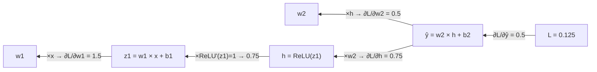

# 역전파는 수천만 개 가중치의 기울기를 어떻게 한 번의 역방향 계산으로 구하는가?

## 문제

학습은 손실을 줄이는 방향으로 모든 가중치를 조금씩 고치는 일이고, 그 방향이 기울기입니다. 역전파는 연쇄법칙으로 출력에서 입력 쪽으로 기울기를 전달해, 순전파의 몇 배 정도 비용으로 모든 가중치의 기울기를 구합니다. 여기서는 변수 네 개짜리 네트워크를 손으로 한 걸음 학습시키고, 행렬 형태의 일반식과 conv layer의 역전파를 유도한 뒤, 무작위 3x3 커널이 역전파만으로 에지 검출 커널이 되는지 확인합니다.

## 아이디어

### 학습에 필요한 질문으로 바꾸면

> 가중치 $w$ 를 조금 올리면 손실 $L$ 은 얼마나 변하는가

이것이 $\dfrac{\partial L}{\partial w}$ 입니다.

- 양수면 $w$ 를 올리면 손실이 커집니다. 그러니 $w$ 를 내립니다.
- 음수면 $w$ 를 올리면 손실이 줄어듭니다. 그러니 $w$ 를 올립니다.
- 절댓값이 크면 이 가중치가 지금 손실에 크게 관여합니다.
- 0에 가까우면 이 가중치를 건드려도 손실이 거의 안 변합니다.

사람이 가중치의 중요도를 정하지 않습니다. 처음에는 무작위로 두고, 이 값을 모든 가중치에 대해 계산해 부호의 반대 방향으로 조금씩 옮기는 일을 수십만 번 반복합니다.

### 편미분과 기울기 벡터

변수가 여러 개면 하나만 움직이고 나머지는 고정한 채 미분합니다. 이것이 편미분이고 기호는 $\partial$ (라운드 디)입니다.

$f(w_1, w_2) = w_1^2 + 3 w_1 w_2$ 이면

$$
\frac{\partial f}{\partial w_1} = 2w_1 + 3w_2, \qquad \frac{\partial f}{\partial w_2} = 3w_1
$$

$(w_1, w_2) = (1, 2)$ 에서 값은 $(8, 3)$ 입니다.

모든 편미분을 모은 벡터가 **기울기(gradient)** 입니다.

$$
\nabla_\theta L = \left( \frac{\partial L}{\partial \theta_1},\ \frac{\partial L}{\partial \theta_2},\ \dots,\ \frac{\partial L}{\partial \theta_P} \right)
$$

- $\nabla$ (나블라): 기울기 기호. $P$: 파라미터 수. AlexNet이면 길이 약 6,100만의 벡터입니다.
- 기울기는 손실이 가장 가파르게 증가하는 방향과 그 크기를 가리킵니다. 그래서 경사하강법은 그 반대 방향으로 움직입니다.

### 연쇄법칙 (chain rule)

신경망은 함수의 합성입니다. 합성 함수의 미분은 각 단계 미분의 곱입니다.

$y = f(g(x))$ 에서 $u = g(x)$ 로 두면

$$
\frac{dy}{dx} = \frac{dy}{du}\cdot\frac{du}{dx}
$$

손계산: $y = (3x + 1)^2$, $x = 1$.
- $u = 3x + 1 = 4$, $y = u^2 = 16$
- $\dfrac{dy}{du} = 2u = 8$, $\dfrac{du}{dx} = 3$
- $\dfrac{dy}{dx} = 8 \times 3 = 24$

검산: $y = 9x^2 + 6x + 1$, $y' = 18x + 6 = 24$. 일치합니다.

layer가 $n$개면 곱하는 항이 $n$개입니다.

$$
\frac{\partial L}{\partial x} = \frac{\partial L}{\partial a_n}\cdot\frac{\partial a_n}{\partial a_{n-1}}\cdots\frac{\partial a_2}{\partial a_1}\cdot\frac{\partial a_1}{\partial x}
$$

기울기는 뒤로 가며 여러 편미분을 곱한 값이고, 항들이 1보다 작으면 깊이에 따라 곱이 줄어들고(vanishing), 1보다 크면 폭발합니다(exploding).

| 항 하나의 크기 | layer 20개 뒤 |
|---|---|
| 0.25 | $9 \times 10^{-13}$ |
| 0.9 | 0.12 |
| 1.0 | 1 |
| 1.1 | 6.7 |
| 2.0 | 1,048,576 |

0.9만 계속 곱해도 layer 20개 뒤에는 0.12가 됩니다. 곱이 1 근처에 머물게 하는 것이 ReLU와 초기화, 그리고 [ResNet](../02-resnet/README.md)에서 다루는 잔차 연결과 batch normalization의 공통 목적입니다([results/hand-calc.txt](results/hand-calc.txt)).

## 수식으로 보기

### FC layer의 역전파

#### 표기

layer 번호를 $l = 1, \dots, n$ 이라 하겠습니다.

$$
\mathbf{z}^{(l)} = W^{(l)}\mathbf{a}^{(l-1)} + \mathbf{b}^{(l)}, \qquad \mathbf{a}^{(l)} = \sigma(\mathbf{z}^{(l)}), \qquad \mathbf{a}^{(0)} = \mathbf{x}
$$

**오차 신호**를 다음과 같이 정의합니다.

$$
\boldsymbol{\delta}^{(l)} = \frac{\partial L}{\partial \mathbf{z}^{(l)}}
$$

$l$번째 layer의 pre-activation 각 칸이 손실에 얼마나 영향을 주는지입니다. 역전파는 이 $\boldsymbol\delta$ 를 뒤에서 앞으로 전달하는 알고리즘입니다.

#### 네 개의 식

**(1) output layer**

$$
\boldsymbol\delta^{(n)} = \mathbf{p} - \mathbf{y}
$$

softmax와 cross-entropy를 쓰는 경우입니다([신경망과 손실](02-neural-network-and-loss.md)).

(2) layer 하나 뒤로 전달

$$
\boldsymbol\delta^{(l)} = \left( W^{(l+1)\top}\,\boldsymbol\delta^{(l+1)} \right) \odot \sigma'(\mathbf{z}^{(l)})
$$

- $W^{\top}$: 전치 행렬. 순전파에서 $W$ 를 곱했으면 역전파에서는 $W^\top$ 를 곱합니다.
- $\odot$: 자리끼리 곱.

**(3) 가중치의 기울기**

$$
\frac{\partial L}{\partial W^{(l)}} = \boldsymbol\delta^{(l)}\,\mathbf{a}^{(l-1)\top}
$$

열벡터 곱하기 행벡터라서 결과는 $W^{(l)}$ 과 같은 모양의 행렬입니다. $(i, j)$ 칸은 $\delta_i \cdot a_j$ 입니다. 「작은 숫자로 직접 계산」의 역전파 표에 나오는 "뒤에서 온 기울기 x 들어온 입력"을 모든 칸에 대해 한 번에 쓴 것입니다.

**(4) bias의 기울기**

$$
\frac{\partial L}{\partial \mathbf{b}^{(l)}} = \boldsymbol\delta^{(l)}
$$

#### 식 (2)의 유도

$\mathbf{z}^{(l)}$ 은 $\mathbf{a}^{(l)}$ 을 거쳐 $\mathbf{z}^{(l+1)}$ 에 영향을 주고, 그것이 손실에 영향을 줍니다. 칸 하나에 대해 연쇄법칙을 쓰면

$$
\delta^{(l)}_j = \sum_i \underbrace{\frac{\partial L}{\partial z^{(l+1)}_i}}_{\delta^{(l+1)}_i}\cdot \underbrace{\frac{\partial z^{(l+1)}_i}{\partial a^{(l)}_j}}_{W^{(l+1)}_{ij}}\cdot \underbrace{\frac{\partial a^{(l)}_j}{\partial z^{(l)}_j}}_{\sigma'(z^{(l)}_j)}
$$

$\sum_i W_{ij}\,\delta_i$ 는 $W^\top\boldsymbol\delta$ 의 $j$번째 칸입니다. 그래서 식 (2)가 나옵니다.

합 $\sum_i$ 가 생기는 이유는 이렇습니다. 뉴런 $j$ 의 출력은 다음 layer의 **모든** 뉴런으로 퍼져 나갑니다. 역방향에서는 그 모든 경로로 돌아온 기울기를 더합니다. 순방향의 fan-out이 역방향의 합산이 됩니다.

#### batch로 확장

mini-batch의 $B$개 예제를 행으로 쌓아 행렬 $A^{(l)}$ (모양 $B \times d_l$)로 두면 순전파와 역전파가 전부 행렬 곱이 됩니다.

$$
Z^{(l)} = A^{(l-1)}W^{(l)\top} + \mathbf{b}^{(l)}, \qquad
\frac{\partial L}{\partial W^{(l)}} = \frac{1}{B}\,\Delta^{(l)\top}A^{(l-1)}
$$

$\Delta^{(l)}$ 은 예제마다 계산한 $\boldsymbol\delta^{(l)}$ 을 행으로 쌓은 $B \times d_l$ 행렬입니다. 예제 128개를 `for`로 돌지 않고 행렬 곱 한 번으로 처리합니다. GPU가 mini-batch와 잘 맞는 이유입니다.

### conv layer의 역전파

#### 설정

입력 $X$ (3x3), 커널 $K$ (2x2), stride 1, padding 없음으로 두면 출력 $Y$ 는 2x2입니다.

$$
Y_{i,j} = \sum_{m=0}^{1}\sum_{n=0}^{1} K_{m,n}\,X_{i+m,\,j+n}
$$

풀어 쓰면

$$
\begin{aligned}
Y_{00} &= K_{00}X_{00} + K_{01}X_{01} + K_{10}X_{10} + K_{11}X_{11}\\
Y_{01} &= K_{00}X_{01} + K_{01}X_{02} + K_{10}X_{11} + K_{11}X_{12}\\
Y_{10} &= K_{00}X_{10} + K_{01}X_{11} + K_{10}X_{20} + K_{11}X_{21}\\
Y_{11} &= K_{00}X_{11} + K_{01}X_{12} + K_{10}X_{21} + K_{11}X_{22}
\end{aligned}
$$

뒤에서 $G = \partial L/\partial Y$ (2x2)가 넘어온다고 하겠습니다.

#### 커널의 기울기

$K_{00}$ 은 네 출력 전부에 쓰였습니다. 가중치 공유 때문입니다. 그래서 네 경로의 기울기를 **더합니다.**

$$
\frac{\partial L}{\partial K_{00}} = G_{00}X_{00} + G_{01}X_{01} + G_{10}X_{10} + G_{11}X_{11}
$$

일반형은 다음과 같습니다.

$$
\frac{\partial L}{\partial K_{m,n}} = \sum_{i}\sum_{j} G_{i,j}\,X_{i+m,\,j+n}
$$

식의 모양을 보면 입력 $X$ 위에서 $G$ 를 커널 삼아 합성곱한 것입니다. 커널의 기울기도 합성곱으로 계산됩니다.

#### 손계산

$$
X = \begin{bmatrix}1&2&0\\0&1&3\\2&1&0\end{bmatrix},\qquad
G = \begin{bmatrix}1&0\\-1&2\end{bmatrix}
$$

$$
\begin{aligned}
\partial L/\partial K_{00} &= 1\cdot1 + 0\cdot2 + (-1)\cdot0 + 2\cdot1 = 3\\
\partial L/\partial K_{01} &= 1\cdot2 + 0\cdot0 + (-1)\cdot1 + 2\cdot3 = 7\\
\partial L/\partial K_{10} &= 1\cdot0 + 0\cdot1 + (-1)\cdot2 + 2\cdot1 = 0\\
\partial L/\partial K_{11} &= 1\cdot1 + 0\cdot3 + (-1)\cdot1 + 2\cdot0 = 0
\end{aligned}
$$

$$
\frac{\partial L}{\partial K} = \begin{bmatrix}3&7\\0&0\end{bmatrix}
$$

#### 가중치 공유와 학습 신호

FC layer의 가중치는 예제 하나에서 기울기 신호를 하나 받습니다. 합성곱 커널의 가중치는 예제 하나에서 출력 칸 수만큼 받아 더합니다. AlexNet conv1의 필터 하나는 이미지 한 장에서 $55 \times 55 = 3{,}025$개 위치의 신호를 합산합니다. 이미지의 모든 위치가 같은 필터에 대한 학습 예제가 되는 셈입니다. 가중치 공유가 파라미터를 줄일 뿐 아니라 필터당 학습 신호를 늘린다는 점이 CNN이 데이터를 효율적으로 쓰는 이유입니다.

#### 입력의 기울기

앞 layer로 넘길 $\partial L/\partial X$ 도 필요합니다. $X_{11}$ (정중앙)은 네 출력 전부에 관여했습니다.

$$
\frac{\partial L}{\partial X_{11}} = G_{00}K_{11} + G_{01}K_{10} + G_{10}K_{01} + G_{11}K_{00}
$$

$G_{00}$ 에는 $K_{11}$ 이, $G_{11}$ 에는 $K_{00}$ 이 곱해집니다. **커널이 180도 뒤집혀서** 들어갑니다. 모서리의 $X_{00}$ 은 $Y_{00}$ 에만 관여했으므로 $\partial L/\partial X_{00} = G_{00}K_{00}$ 하나입니다.

일반적으로는 $G$ 의 테두리에 0을 $k-1$ 칸씩 덧대고, 180도 회전한 커널로 합성곱합니다.

$$
\frac{\partial L}{\partial X} = \text{pad}(G) * \text{rot180}(K)
$$

FC layer에서 순방향이 $W$, 역방향이 $W^\top$ 이었던 것과 같은 관계입니다. 이 연산을 transposed convolution이라고 부르고, 이미지 생성이나 segmentation에서 해상도를 다시 키우는 layer로도 씁니다.

#### max pooling의 역전파

순전파에서 최댓값이 나온 자리를 기억해 두고, 기울기를 그 자리로만 보냅니다. 나머지 자리는 0입니다.

```
순전파                     역전파
[1 3]                      [0 g]
[2 0]  ──max──▶ 3    g ──▶ [0 0]
```

최댓값이 아니었던 칸은 조금 바뀌어도 출력이 안 변하므로 미분이 0입니다. ReLU와 마찬가지로 기울기를 통과시키거나 막는 **스위치**입니다. 크기를 줄이지는 않습니다.

#### 채널과 batch가 있을 때

$$
\frac{\partial L}{\partial K_{o,c,m,n}} = \sum_{b}\sum_{i}\sum_{j} G_{b,o,i,j}\,X_{b,c,\,i+m,\,j+n}
$$

$b$: batch 안의 예제 번호. $o$: 출력 채널. $c$: 입력 채널. 합산 범위가 batch와 모든 위치로 늘어날 뿐 구조는 같습니다.

## 작은 숫자로 직접 계산

### 문제 설정

가장 작은 2-layer 네트워크입니다. 입력, 은닉 뉴런, 출력이 모두 숫자 하나입니다.

$$
z_1 = w_1 x + b_1,\qquad h = \text{ReLU}(z_1),\qquad \hat{y} = w_2 h + b_2,\qquad L = \tfrac{1}{2}(\hat{y} - y)^2
$$

초기값: $x = 2$, 정답 $y = 1$, $w_1 = 0.5$, $b_1 = 0$, $w_2 = 1.5$, $b_2 = 0$, 학습률 $\eta = 0.1$.

### 순전파 (forward)

중간값을 전부 저장해 둡니다. 역전파에서 다시 씁니다.

```
x=2 ──▶ [×w1 +b1] ──▶ z1=1.0 ──▶ [ReLU] ──▶ h=1.0 ──▶ [×w2 +b2] ──▶ ŷ=1.5 ──▶ [½(ŷ-y)²] ──▶ L=0.125
         w1=0.5                                          w2=1.5                    y=1
```

### 역전파 (backward)

출력에서 입력 쪽으로, 연쇄법칙을 한 단계씩 적용합니다. 각 단계는 "뒤에서 받은 기울기 × 내 단계의 미분" 입니다.

| 단계 | 식 | 값 |
|---|---|---|
| 1 | $\dfrac{\partial L}{\partial \hat{y}} = \hat{y} - y$ | $1.5 - 1 = 0.5$ |
| 2 | $\dfrac{\partial L}{\partial w_2} = \dfrac{\partial L}{\partial \hat{y}}\cdot h$ | $0.5 \times 1.0 = 0.5$ |
| 3 | $\dfrac{\partial L}{\partial b_2} = \dfrac{\partial L}{\partial \hat{y}}\cdot 1$ | $0.5$ |
| 4 | $\dfrac{\partial L}{\partial h} = \dfrac{\partial L}{\partial \hat{y}}\cdot w_2$ | $0.5 \times 1.5 = 0.75$ |
| 5 | $\dfrac{\partial L}{\partial z_1} = \dfrac{\partial L}{\partial h}\cdot \text{ReLU}'(z_1)$ | $0.75 \times 1 = 0.75$ ($z_1 > 0$) |
| 6 | $\dfrac{\partial L}{\partial w_1} = \dfrac{\partial L}{\partial z_1}\cdot x$ | $0.75 \times 2 = 1.5$ |
| 7 | $\dfrac{\partial L}{\partial b_1} = \dfrac{\partial L}{\partial z_1}\cdot 1$ | $0.75$ |



표에서 두 가지를 볼 수 있습니다.

1. 가중치의 기울기 = 뒤에서 온 기울기 × 그 가중치에 들어온 입력. 2단계와 6단계가 같은 모양입니다. 입력이 0이면 그 가중치는 이번에 갱신되지 않습니다.
2. 앞 layer로 넘기는 기울기 = 뒤에서 온 기울기 × 가중치. 4단계입니다. layer를 지날 때마다 가중치가 곱해지므로 가중치가 작으면 기울기가 줄고 크면 폭발합니다. 가중치 초기화가 중요한 이유입니다.

### 갱신

$$
\theta \leftarrow \theta - 0.1 \times \text{기울기}
$$

| 파라미터 | 이전 | 기울기 | 이후 |
|---|---|---|---|
| $w_2$ | 1.5 | 0.5 | 1.45 |
| $b_2$ | 0 | 0.5 | -0.05 |
| $w_1$ | 0.5 | 1.5 | 0.35 |
| $b_1$ | 0 | 0.75 | -0.075 |

### 다시 순전파해서 확인

$$
z_1 = 0.35 \times 2 - 0.075 = 0.625,\quad h = 0.625,\quad \hat{y} = 1.45 \times 0.625 - 0.05 = 0.85625
$$

$$
L = \tfrac12 (0.85625 - 1)^2 = 0.0103
$$

손실이 0.125에서 0.0103으로 줄었습니다. 예측은 1.5에서 0.856으로 움직여 정답 1을 조금 지나쳤습니다. 학습률이 이 문제에 비해 약간 컸다는 뜻입니다.

### ReLU가 꺼져 있었다면

$w_1 = -0.5$ 였다고 하겠습니다. $z_1 = -1$, $h = 0$, $\hat{y} = 0$.

- 5단계에서 $\text{ReLU}'(-1) = 0$ 이므로 $\partial L/\partial z_1 = 0$.
- $w_1$, $b_1$ 의 기울기가 0이라 갱신되지 않습니다.
- $w_2$ 의 기울기도 $h = 0$ 이라 0입니다. $b_2$ 만 움직입니다.

모든 입력에 대해 이 상태면 뉴런이 회복하지 못합니다. 이것이 dying ReLU이고, AlexNet이 일부 bias를 1로 시작한 이유입니다.

### 대칭 깨기: 왜 무작위로 초기화하는가

모든 가중치를 같은 값으로 초기화하면 layer 하나의 모든 뉴런이 같은 기울기를 받아 똑같이 갱신됩니다. layer 전체가 뉴런 하나와 같아집니다. 무작위 초기화가 이 대칭을 깹니다.

역전파 표로 확인할 수 있습니다. 은닉 뉴런이 둘이고 $w_1$ 이 같고 $w_2$ 도 같으면, 역전파 계산의 모든 단계가 두 뉴런에서 같은 값을 냅니다. 같은 값에서 출발해 같은 양만큼 움직이므로 영원히 같습니다.

## 코드로 확인

### 수치 미분으로 검산하기

역전파를 직접 구현했으면 수치 미분과 비교합니다. gradient check라고 부릅니다. 수치 미분은 파라미터 하나를 아주 조금 올리고 내려서 손실의 차이를 재는 방법이고, 양쪽을 재는 중앙 차분 $\dfrac{f(x+h) - f(x-h)}{2h}$ 가 한쪽만 재는 전진 차분보다 오차가 작습니다.

```python
def loss(w1, b1, w2, b2, x=2.0, y=1.0):
    h = max(0.0, w1 * x + b1)
    return 0.5 * (w2 * h + b2 - y) ** 2

eps = 1e-6
g = (loss(0.5 + eps, 0, 1.5, 0) - loss(0.5 - eps, 0, 1.5, 0)) / (2 * eps)
print(g)  # 1.4999999999945612
```

역전파로 구한 $\partial L/\partial w_1 = 1.5$ 와 같습니다. 손계산 전체는 [experiments/hand_calc.py](experiments/hand_calc.py)가 다시 계산하고 출력은 [results/hand-calc.txt](results/hand-calc.txt)에 있습니다.

### conv layer의 기울기 검산

「conv layer의 역전파」의 손계산을 NumPy로 확인합니다. 스크립트는 [experiments/conv_backprop.py](experiments/conv_backprop.py), 출력은 [results/conv-backprop.txt](results/conv-backprop.txt)입니다.

```python
import numpy as np

def conv2d(x, k):
    kh, kw = k.shape
    oh, ow = x.shape[0] - kh + 1, x.shape[1] - kw + 1
    return np.array([[(x[i:i+kh, j:j+kw] * k).sum() for j in range(ow)] for i in range(oh)])

X = np.array([[1, 2, 0], [0, 1, 3], [2, 1, 0]], dtype=float)
G = np.array([[1, 0], [-1, 2]], dtype=float)
K = np.array([[0.5, -1.0], [2.0, 0.0]])

dK = conv2d(X, G)                                   # 커널의 기울기
dX = conv2d(np.pad(G, 1), np.rot90(K, 2))           # 입력의 기울기
print(dK)   # [[3. 7.] [0. 0.]]

# 수치 미분으로 확인: L = sum(G * conv2d(X, K)) 로 두면 dL/dY = G
eps = 1e-6
num = np.zeros_like(K)
for m in range(2):
    for n in range(2):
        Kp, Km = K.copy(), K.copy(); Kp[m, n] += eps; Km[m, n] -= eps
        num[m, n] = ((G * conv2d(X, Kp)).sum() - (G * conv2d(X, Km)).sum()) / (2 * eps)
print(np.allclose(num, dK))   # True

# 입력의 기울기도 같은 방법으로 확인
numX = np.zeros_like(X)
for i in range(3):
    for j in range(3):
        Xp, Xm = X.copy(), X.copy(); Xp[i, j] += eps; Xm[i, j] -= eps
        numX[i, j] = ((G * conv2d(Xp, K)).sum() - (G * conv2d(Xm, K)).sum()) / (2 * eps)
print(dX)   # [[ 0.5 -1.   0. ] [ 1.5  2.  -2. ] [-2.   4.   0. ]]
print(np.allclose(numX, dX))  # True
```

## 실험 결과

### 무작위 3x3 커널은 역전파만으로 Sobel 커널이 되는가

conv layer의 필터가 데이터에서 학습된다는 것을 가장 작은 규모로 확인합니다.

- 가설: 커널의 기울기 $\partial L/\partial K$ 를 「conv layer의 역전파」에서 유도한 대로 계산해 경사하강법을 돌리면, 무작위 커널이 목표 feature map을 만드는 커널로 수렴합니다.
- 설정: 입력은 [합성곱](03-convolution.md)의 12x12 고양이 그림입니다. 목표는 세로 에지 Sobel 커널로 만든 10x10 feature map입니다. 시작 커널은 표준편차 0.1의 무작위 값(seed 0), 손실은 두 feature map의 MSE, 학습률 0.5, 500걸음입니다.
- 기울기 계산은 한 줄입니다. $\partial L/\partial Y$ 를 입력 위에서 합성곱하면 커널의 기울기가 나옵니다.

```python
target = conv2d(CAT, SOBEL_V)
k = rng.standard_normal((3, 3)) * 0.1
for step in range(500):
    diff = conv2d(CAT, k) - target            # dL/dY (상수배 생략)
    dk = conv2d(CAT, diff) / diff.size        # 커널의 기울기 = 입력 위에서 dL/dY를 합성곱
    k -= 0.5 * dk
```

[experiments/learn_sobel.py](experiments/learn_sobel.py)의 출력([results/learn-sobel.txt](results/learn-sobel.txt))입니다.

| 걸음 | MSE |
|---|---|
| 1 | 3.634803 |
| 10 | 0.203471 |
| 50 | 0.000011 |
| 100 | 0.000000 |

```
시작 커널                  학습된 커널
[[ 0.01 -0.01  0.06]       [[-1. -0.  1.]
 [ 0.01 -0.05  0.04]        [-2.  0.  2.]
 [ 0.13  0.09 -0.07]]       [-1.  0.  1.]]
```

학습된 커널과 Sobel 커널의 원소별 최대 차이는 $1.7 \times 10^{-14}$ 입니다.

## 결과 해석

### 커널 학습 실험

무작위 커널이 100걸음 안에 MSE 0에 가까워졌고 500걸음 뒤에는 Sobel 커널과 부동소수점 오차 수준까지 같아졌습니다. 목표 feature map을 만든 커널이 있고 입력이 그 커널을 정할 만큼 다양하면, 커널의 기울기만으로 그 커널을 되찾습니다. 사람이 설계하던 에지 검출 커널이 학습으로 얻어질 수 있다는 것을 가장 작은 규모에서 본 것입니다.

### 깊이와 기울기의 크기

식 (2)를 첫 layer까지 반복하면

$$
\boldsymbol\delta^{(1)} = \left[\prod_{l=1}^{n-1} D^{(l)}\,W^{(l+1)\top}\right]\boldsymbol\delta^{(n)}, \qquad D^{(l)} = \text{diag}\big(\sigma'(\mathbf{z}^{(l)})\big)
$$

$\text{diag}(\cdot)$ 은 벡터를 대각선에 놓은 행렬입니다.

곱해지는 행렬 $D\,W^\top$ 가 벡터를 줄이는 쪽이면(행렬의 가장 큰 특이값이 1 미만) 곱이 지수적으로 0에 가까워지고, 늘리는 쪽이면 폭발합니다.

| 요인 | 식에서의 위치 | 조절 수단 |
|---|---|---|
| 활성화 함수의 미분 | $D^{(l)}$ 의 대각 성분 | ReLU: 0 또는 1. sigmoid: 최대 0.25 |
| 가중치의 크기 | $W^{(l+1)}$ | 초기화 |
| 깊이 | 곱의 항 수 $n - 1$ | layer 8개에 머물거나, 곱을 우회하는 경로를 만듭니다 |

셋째 줄의 "우회"가 [ResNet](../02-resnet/README.md)의 잔차 연결입니다. $\mathbf{a}^{(l+1)} = \mathbf{a}^{(l)} + F(\mathbf{a}^{(l)})$ 로 두면 야코비안이 $I + \partial F/\partial\mathbf{a}$ 가 되어, 곱을 전개했을 때 항등 행렬 $I$ 만으로 이뤄진 경로가 하나 남습니다. 그 경로로는 기울기가 줄지 않고 전달됩니다. [RNN과 LSTM](../03-rnn-lstm/README.md)에서 보는 LSTM의 cell state도 같은 구조입니다.

### 알고리즘과 비용

```
forward:
    for l in 1..n:   z[l] = W[l] @ a[l-1] + b[l];  a[l] = σ(z[l])      # z, a를 전부 저장
backward:
    δ = p - y
    for l in n..1:
        dW[l] = outer(δ, a[l-1]);  db[l] = δ
        if l > 1:  δ = (W[l].T @ δ) * σ'(z[l-1])
update:
    W[l] -= η * dW[l];  b[l] -= η * db[l]
```

- **시간**: 역방향은 layer마다 행렬 곱이 두 번($W^\top\boldsymbol\delta$ 와 $\boldsymbol\delta\,\mathbf{a}^\top$)이라 순방향의 약 2배입니다. 학습 한 걸음은 추론의 약 3배입니다.
- **메모리**: 모든 layer의 $\mathbf{z}$, $\mathbf{a}$ 를 역방향이 끝날 때까지 들고 있어야 합니다. 추론은 직전 layer의 출력만 있으면 됩니다.
- **수치 미분과 비교**: 파라미터 $P$개의 기울기를 수치 미분으로 구하면 순전파가 $2P$번 필요합니다. AlexNet이면 1억 2천만 번입니다. 역전파는 순전파 3번 정도의 비용으로 같은 결과를 냅니다.

### 자동 미분

PyTorch와 같은 프레임워크는 순전파 중에 실행된 연산을 그래프로 기록하고, `backward()` 가 호출되면 그래프를 거꾸로 돌면서 연산마다 등록된 "국소 미분 규칙"을 적용합니다. 식 (2)~(4)는 `Linear` 연산의 국소 규칙입니다. 새 연산을 만들 때 순전파와 그 국소 미분만 정의하면 나머지는 프레임워크가 처리합니다. 역방향 누적(reverse-mode) 자동 미분이라고 부릅니다. 출력이 숫자 하나(손실)이고 입력이 수천만 개(파라미터)일 때 유리한 방식입니다.

### 동적 계획법으로 보면

역전파는 메모이제이션을 쓰는 동적 계획법입니다. 순전파에서 중간값을 저장해 두고, 역방향으로 한 번 훑으면서 각 layer의 기울기를 한 번씩만 계산합니다. 저장의 대가는 메모리이고, 그래서 학습은 추론보다 메모리를 훨씬 많이 씁니다([AlexNet의 파라미터와 두 GPU 분할](09-alexnet-parameters-and-gpus.md)).

### 처음 질문에 대한 답

역전파는 순전파에서 중간값을 저장해 두고, 출력의 기울기 $\mathbf{p} - \mathbf{y}$ 에서 시작해 layer마다 "뒤에서 온 기울기에 가중치의 전치를 곱하고 활성화 함수의 미분을 곱하는" 계산을 한 번씩 합니다. 각 가중치의 기울기는 그 과정에서 "뒤에서 온 기울기 x 들어온 입력"으로 바로 나옵니다. 파라미터마다 따로 계산하지 않으므로 비용이 순전파의 약 2~3배에 그치고, conv layer도 같은 규칙에 가중치 공유로 생긴 합산이 붙을 뿐입니다.

## 한계와 주의할 점

- 손계산과 커널 학습 실험은 변수 네 개, 커널 하나짜리 작은 문제입니다. 실제 네트워크에서는 기울기가 layer를 지나며 줄거나 커지는 문제가 따로 생기고, [ReLU와 초기화](05-relu-and-initialization.md)에서 다룹니다.
- 커널 학습 실험은 목표 feature map이 Sobel 커널로 만든 것이라 정답 커널이 존재합니다. 분류 학습에서는 이런 정답 커널이 없고, 손실을 줄이는 방향으로 필터가 정해질 뿐입니다.

## References

- [Learning representations by back-propagating errors](https://www.nature.com/articles/323533a0) (Rumelhart, Hinton, Williams, 1986)
- [ImageNet Classification with Deep Convolutional Neural Networks](https://papers.nips.cc/paper/2012/hash/c399862d3b9d6b76c8436e924a68c45b-Abstract.html) (Krizhevsky, Sutskever, Hinton, 2012)
