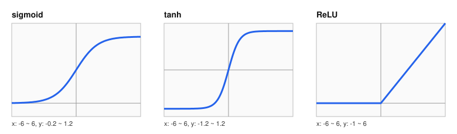

# ReLU와 가중치 초기화는 layer를 지날 때 신호와 기울기의 크기를 어떻게 바꾸는가?

## 문제

역전파에서 기울기는 layer를 하나 지날 때마다 활성화 함수의 미분과 가중치가 곱해집니다. 이 곱이 1보다 작으면 깊이에 따라 줄고, 크면 커집니다. 여기서는 sigmoid, tanh, ReLU의 미분과 초기화에 따른 분산 변화를 계산하고, AlexNet 논문이 ReLU에 대해 보고한 내용과 작은 CNN을 활성화 함수와 초기화만 바꿔 학습시킨 결과를 봅니다.

## 아이디어

### AlexNet 논문이 ReLU에 대해 말한 것

1. AlexNet은 모든 conv layer와 FC layer의 출력에 ReLU를 붙였습니다.
2. 논문은 tanh와 sigmoid를 포화하는(saturating) 비선형 함수라고 부르고, 경사하강법으로 학습할 때 포화하지 않는 ReLU보다 훨씬 느리다고 적었습니다.
3. CIFAR-10에서 4-layer CNN이 학습 오류 25%에 도달하는 데 걸린 반복 횟수를 비교했더니 ReLU 쪽이 tanh 쪽보다 6배 빨랐습니다. 두 네트워크의 학습률은 각각 가장 빠르게 학습되도록 따로 골랐습니다.
4. 논문은 전통적인 포화 뉴런을 썼다면 이렇게 큰 신경망으로 실험하지 못했을 것이라고 적었습니다.

논문이 말한 것은 여기까지이고 모두 학습 속도에 관한 내용입니다. 기울기 소실과의 관계는 「결과 해석」에서 따로 설명합니다. 이후에 나온 VGGNet, GoogLeNet, ResNet도 ReLU를 썼습니다.

### 6배가 뜻하는 것

AlexNet의 학습은 GPU 두 장으로 5~6일 걸렸습니다. 6배 느렸다면 한 번 돌리는 데 한 달이 넘습니다. 하이퍼파라미터를 바꿔 가며 수십 번 돌려야 하는 연구에서는 한 달짜리 실험을 반복할 수 없습니다. ReLU는 정확도를 직접 올렸다기보다 실험할 수 있는 모델의 크기를 키웠습니다.

## 수식으로 보기

### 활성화 함수의 역할

layer와 layer 사이에 끼우는 비선형 함수입니다. 없으면 여러 layer가 layer 하나와 같아집니다([신경망과 손실](02-neural-network-and-loss.md)). 값마다 따로 적용합니다(element-wise).



### 세 함수의 정의와 미분

미분값을 같이 보는 이유가 있습니다. 학습은 기울기를 뒤로 전달하는 과정이고, 활성화 함수를 지날 때마다 그 함수의 미분값이 곱해집니다([역전파](04-backpropagation.md)). 미분값이 작으면 기울기가 줄어듭니다.

#### sigmoid

$$
\sigma(z) = \frac{1}{1 + e^{-z}}, \qquad \sigma'(z) = \sigma(z)\,(1 - \sigma(z))
$$

- 출력 범위 0~1. S자 곡선.
- 미분의 **최댓값이 0.25** ($z = 0$ 일 때 $0.5 \times 0.5$).
- $|z|$ 가 크면 곡선이 평평해져 미분이 0에 가깝습니다. 이 상태를 **포화(saturation)** 라고 합니다.

| $z$ | $\sigma(z)$ | $\sigma'(z)$ |
|---|---|---|
| 0 | 0.500 | 0.250 |
| 2 | 0.881 | 0.105 |
| 5 | 0.993 | 0.0066 |
| 10 | 0.99995 | 0.000045 |

#### tanh

$$
\tanh(z) = \frac{e^{z} - e^{-z}}{e^{z} + e^{-z}}, \qquad \tanh'(z) = 1 - \tanh^2(z)
$$

- 출력 범위 -1~1. 0을 중심으로 대칭.
- 미분의 최댓값은 1 ($z=0$). sigmoid보다 낫지만 $|z|$ 가 크면 똑같이 포화합니다.

#### ReLU (rectified linear unit)

$$
\text{ReLU}(z) = \max(0, z), \qquad \text{ReLU}'(z) = \begin{cases} 1 & z > 0 \\ 0 & z < 0 \end{cases}
$$

- 음수는 0으로 만들고 양수는 그대로 내보냅니다.
- 양수 영역에서 **미분이 항상 1**입니다. 몇 layer를 지나도 이 함수 때문에 기울기가 줄지 않습니다.
- 지수 함수 계산이 없고 비교 한 번이면 끝납니다.

### 그래도 sigmoid와 tanh는 남아 있다

- sigmoid는 출력이 0~1이라 "얼마나 통과시킬지"를 나타내는 게이트로 씁니다. [RNN과 LSTM](../03-rnn-lstm/README.md)의 LSTM이 이 용도로 씁니다.
- tanh는 -1~1의 값을 만드는 데 씁니다. 역시 LSTM에 나옵니다.
- hidden layer의 기본 활성화 함수로는 잘 쓰이지 않지만 이런 용도로 계속 쓰입니다.

### local response normalization

LRN(local response normalization)은 같은 위치의 이웃 feature map들끼리 활성화를 정규화(normalization)해 뉴런 간 경쟁을 유도합니다. 실제 뉴런의 측면 억제에서 착안했다고 했습니다. AlexNet 논문은 LRN으로 top-1 오류율이 1.4%p, top-5 오류율이 1.2%p 줄었다고 보고했습니다. 2014년 VGG 논문은 같은 LRN을 넣어 봐도 ILSVRC에서 성능이 나아지지 않고 메모리와 계산 시간만 늘었다고 보고했고, 이후의 구조에서는 쓰이지 않게 됐습니다.

ReLU는 출력에 상한이 없습니다. 어떤 뉴런의 값이 매우 커질 수 있으므로 이를 주변 값과 비교해 눌러 주는 것이 LRN의 역할입니다. 이후에 널리 쓰인 batch normalization은 [ResNet](../02-resnet/README.md)에서 다룹니다.

### 가중치 초기화

#### 대칭 깨기

모든 가중치를 같은 값으로 두면 layer 하나의 뉴런들이 같은 기울기를 받아 똑같이 갱신됩니다. layer가 뉴런 하나로 줄어든 것과 같습니다. 무작위 초기화가 이것을 막습니다. 손계산은 [역전파](04-backpropagation.md)에 있습니다.

#### 크기

무작위라도 크기가 맞아야 합니다.
- 너무 크면 활성화 함수 뒤의 출력이 과도하게 커지거나 포화합니다. 기울기가 폭발하거나 0이 됩니다. 수렴하지 않습니다.
- 너무 작으면 신호와 기울기가 layer를 지날 때마다 줄어듭니다. 학습이 느리거나 멈춥니다.
- layer가 깊을수록 두 문제가 심해집니다.

#### 깊을수록 심해지는 이유: 분산 계산

뉴런 하나가 입력 $n$개를 받습니다. 입력과 가중치가 평균 0이고 서로 독립이면

$$
\text{Var}(z) = n \cdot \text{Var}(w) \cdot \text{Var}(x)
$$

layer를 지날 때마다 신호의 분산에 $n\,\text{Var}(w)$ 가 곱해집니다. 이 값이 1이면 신호 크기가 유지되고, 1보다 작으면 layer마다 줄고, 크면 layer마다 커집니다.

$n = 1{,}000$ 이고 표준편차 0.01로 초기화하면 $\text{Var}(w) = 0.0001$, $n\,\text{Var}(w) = 0.1$ 입니다. layer마다 분산이 10분의 1이 되고 layer 8개를 지나면 $10^{-8}$ 입니다. AlexNet도 표준편차 0.01로 초기화했으므로 같은 계산이 적용됩니다. 예를 들어 conv2는 $n = 5 \times 5 \times 48 = 1{,}200$ 이라 $n\,\text{Var}(w) = 0.12$ 입니다. AlexNet은 일부 layer의 bias를 1로 두어 ReLU에 양수 입력이 들어가게 하는 방법으로 이 문제를 줄였고, layer가 8개뿐이라 학습이 됐습니다. 더 깊은 네트워크에서는 이 방법이 통하지 않습니다. $n\,\text{Var}(w) = 1$ 이 되게 하는 것이 Xavier 초기화(2010), ReLU가 절반을 0으로 만드는 것을 보정해 $\text{Var}(w) = 2/n$ 으로 두는 것이 He 초기화(2015)입니다. He 초기화는 ResNet의 저자들이 만들었고 [ResNet](../02-resnet/README.md)에서 다룹니다.

#### ReLU의 약점: dying ReLU

$z < 0$ 이면 출력도 0, 미분도 0입니다. 어떤 뉴런이 모든 입력에 대해 $z < 0$ 이 되면 기울기가 0이라 가중치가 갱신되지 않고, 그 상태에서 빠져나오지 못합니다. AlexNet이 일부 bias를 1로 초기화한 것이 이 문제를 줄이려는 선택입니다.

이후에 나온 변형들은 음수 영역에 작은 기울기를 남깁니다. Leaky ReLU는 $\max(0.01z, z)$ 입니다. 현재 Transformer 계열은 GELU나 SiLU처럼 매끄러운 변형을 주로 씁니다. 공통점은 양수 쪽이 포화하지 않는다는 것입니다.

#### AlexNet의 초기화

AlexNet의 초기화는 다음과 같습니다.
- 가중치: 평균 0, 표준편차 0.01의 가우시안.
- 일부 layer의 bias: 0이 아니라 **1**. ReLU 뉴런이 학습 시작부터 켜져 있게 해서 dying ReLU를 줄입니다.

bias를 1로 둔 layer는 conv2, conv4, conv5와 FC hidden layer들입니다. 나머지는 0입니다.

[역전파](04-backpropagation.md)에서 본 대로, 꺼진 ReLU에는 기울기가 0이라 스스로 회복하지 못합니다. 시작 시점에 $z = \mathbf{w}\cdot\mathbf{x} + 1$ 로 양수 쪽에 두면 대부분의 뉴런이 기울기를 받으며 출발합니다.

### 기울기 소실과 폭발

역전파의 기울기는 뒤에서 앞으로 가면서 여러 편미분을 곱한 값입니다. 1보다 작으면 깊이에 따라 줄어 앞쪽 layer가 사실상 학습을 멈추고(vanishing), 1보다 크면 폭발해 갱신이 불규칙해집니다(exploding). sigmoid와 tanh가 이 문제를 더 키웠습니다.

[역전파](04-backpropagation.md)의 두 관찰을 합치면, layer 하나를 뒤로 지날 때 기울기에 곱해지는 것은 (가중치) x (활성화 함수의 미분) 입니다.

$$
\frac{\partial L}{\partial a_{l-1}} = \frac{\partial L}{\partial a_l}\cdot \underbrace{\sigma'(z_l)}_{\text{활성화}} \cdot \underbrace{w_l}_{\text{가중치}}
$$

| 원인 | AlexNet의 대응 | 이후의 대응 |
|---|---|---|
| $\sigma'$ 가 작습니다 (sigmoid 최대 0.25) | ReLU | |
| $w$ 의 크기가 안 맞습니다 | 가우시안 0.01, bias 1 | Xavier, He 초기화 |
| 곱이 깁니다 (layer가 많다) | layer 8개에 머뭅니다 | 잔차 연결(ResNet), LSTM의 cell state |
| layer마다 분포가 흔들립니다 | 없음 | batch normalization |

당시 연구자들은 이 문제 때문에 깊이 자체가 문제라고 봤습니다. 깊은 네트워크는 학습 시간이 더 걸릴 뿐 아니라 성능도 더 나빴습니다.

## 작은 숫자로 직접 계산

### 손계산: layer 8개를 지나면 기울기가 얼마나 남는가

활성화 함수의 미분만 곱해 봅니다(가중치의 영향은 뺀 단순화).

- sigmoid, 가장 좋은 경우(모든 layer에서 $z=0$): $0.25^8 \approx 0.0000153$. layer 8개 만에 6만 5천분의 1.
- ReLU, 켜져 있는 경로: $1^8 = 1$.

tanh는 미분이 최대 1이지만 입력이 0에서 조금만 벗어나도 빠르게 작아집니다. 계산은 [experiments/hand_calc.py](experiments/hand_calc.py)의 출력([results/hand-calc.txt](results/hand-calc.txt))과 같습니다.

## 실험 결과

[experiments/small_cnn.py](experiments/small_cnn.py)로 활성화 함수와 초기화만 바꿔 학습했습니다. CIFAR-10 학습 이미지 10,000장, 시험 이미지 2,000장, 20 epoch, seed 0, CPU에서 돌린 축소판입니다. 모델과 설정은 [regularization](07-regularization.md)의 「코드로 확인」에 있습니다. 결과는 [results/small-cnn.txt](results/small-cnn.txt)에 있습니다.

| 설정 | 20 epoch 뒤 train loss | 시험 정확도 epoch 1 | epoch 5 | epoch 20 |
|---|---:|---:|---:|---:|
| ReLU, PyTorch 기본 초기화 | 1.471 | 10.4% | 19.5% | 48.7% |
| ReLU, He 초기화 | 1.423 | 14.3% | 20.1% | 52.9% |
| tanh, PyTorch 기본 초기화 | 1.138 | 26.2% | 45.3% | 60.7% |

ReLU 기본 초기화 설정은 epoch 1~3 동안 train loss가 2.302~2.303에 머물렀습니다. 10개 클래스를 무작위로 찍을 때의 손실 $\ln 10 = 2.303$과 같은 값입니다.

## 결과 해석

### 기울기 흐름으로 보면

[역전파](04-backpropagation.md)에서 본 대로 활성화 함수를 뒤로 지날 때마다 그 미분이 곱해집니다.

```
        conv5 ◀─ ×σ' ─ conv4 ◀─ ×σ' ─ conv3 ◀─ ×σ' ─ conv2 ◀─ ×σ' ─ conv1
tanh :   기울기가 layer마다 0~1 사이 값으로 곱해진다. 포화한 뉴런에서는 0에 가깝다
ReLU :   켜진 뉴런은 ×1, 꺼진 뉴런은 ×0
```

tanh는 모든 뉴런에서 조금씩 줄입니다. ReLU는 일부 뉴런에서 완전히 막고 나머지는 그대로 통과시킵니다. 평균 기울기의 크기가 깊이에 따라 덜 줄어듭니다.

### 포화와 손실 곡면의 모양

포화한 뉴런에 연결된 가중치는 기울기가 거의 0이라 그 방향으로는 손실 곡면이 매우 평평합니다. 포화하지 않은 가중치 방향은 가파릅니다. 방향에 따라 곡률 차이가 큰 곡면이 [최적화](06-optimization.md)에서 다루는 "좁고 긴 골짜기"이고, 1차 방법이 가장 못 다루는 지형입니다. ReLU는 포화 자체를 없애 이 불균형을 줄입니다.

AlexNet 논문은 ReLU를 속도 측면에서만 설명하고 곡률은 언급하지 않습니다. 이 절의 설명은 포화와 곡률을 연결해 본 해석입니다.

### 비교표

| | sigmoid, tanh | ReLU |
|---|---|---|
| 미분값 | sigmoid 0~0.25, tanh 0~1, 포화하면 0에 가까움 | 양수 쪽 1, 음수 쪽 0 |
| 계산 | 지수 함수 | 비교 한 번 |
| 출력 범위 | 유한 | 0 이상, 상한 없음 |
| 약점 | 포화, 기울기 소실 | dying ReLU, 큰 활성화 |
| AlexNet의 대응 | | bias 1 초기화, LRN |

## 한계와 주의할 점

이 조건에서는 tanh가 ReLU보다 빨리 올라갔고 20 epoch 뒤에도 높았습니다. AlexNet 논문이 보고한 "ReLU가 tanh보다 6배 빨리 수렴한다"와 반대 방향입니다. 이 실험만으로는 이유를 정할 수 없습니다. 조건이 논문과 다른 점은 다음과 같습니다.

- 모델이 작고(파라미터 약 257만 개) 입력이 32x32입니다. 논문은 CIFAR-10에서 conv layer 4개짜리 네트워크가 학습 오류율 25%에 닿는 속도를 비교했습니다. 이 실험은 20 epoch 뒤의 시험 정확도를 봤으므로 재는 것도 다릅니다.
- 학습률 0.01 하나만 썼습니다. ReLU와 tanh는 알맞은 학습률이 다를 수 있습니다.
- ReLU 기본 초기화 설정이 처음 3 epoch 동안 무작위 추측 수준에 머문 것은 초기화와 학습률의 조합 문제로 보입니다. He 초기화로 바꾸면 epoch 1부터 움직이기 시작했습니다.
- seed가 하나이고 시험 이미지가 2,000장이라 1%p(20장) 안팎의 차이는 흔들림과 구분되지 않습니다.

## References

- [ImageNet Classification with Deep Convolutional Neural Networks](https://papers.nips.cc/paper/2012/hash/c399862d3b9d6b76c8436e924a68c45b-Abstract.html) (Krizhevsky, Sutskever, Hinton, 2012)
- [Understanding the difficulty of training deep feedforward neural networks](https://proceedings.mlr.press/v9/glorot10a.html) (Glorot, Bengio, 2010)
- [Delving Deep into Rectifiers](https://arxiv.org/abs/1502.01852) (He, Zhang, Ren, Sun, 2015)
- [Very Deep Convolutional Networks for Large-Scale Image Recognition](https://arxiv.org/abs/1409.1556) (Simonyan, Zisserman, 2014)
