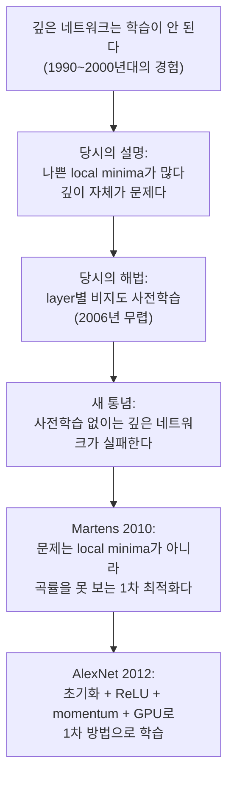
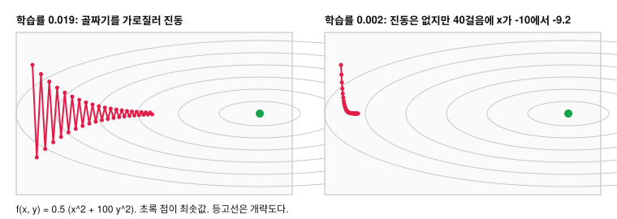

# AlexNet은 2차 최적화 없이 SGD와 momentum으로 좁은 골짜기 모양의 손실 곡면을 어떻게 내려갔는가?

## 문제

2012년 이전에는 깊은 신경망의 학습 실패를 나쁜 local minima 때문이라고 보는 경우가 많았습니다. Martens(2010)는 원인을 곡률을 보지 못하는 1차 최적화에서 찾았고, AlexNet은 2차 방법 대신 momentum과 학습률 조절을 더한 SGD로 학습했습니다. 여기서는 경사하강법과 momentum의 식을 정리하고, 곡률이 방향마다 100배 다른 2차원 함수에서 학습률에 따라 경로가 어떻게 달라지는지 계산합니다.

## 아이디어

깊은 신경망이 잘 학습되지 않는 원인을 무엇으로 봤고 어떻게 풀었는지를 순서대로 적으면 다음과 같습니다.



### 당시의 해법: layer별 비지도 사전학습

```
1단계: layer 1만 학습 (입력을 복원하는 비지도 과제)
2단계: layer 1을 고정하고, layer 1의 출력을 입력 삼아 layer 2만 학습
3단계: … layer마다 반복
4단계: 전부 이어 붙여(unroll) 하나의 네트워크로 만든다
5단계: 라벨을 써서 전체를 역전파로 미세 조정(fine-tuning)
```

사전학습이 가중치를 좋은 해 근처로 옮겨 놓으므로 마지막의 역전파가 성공합니다. Hinton, Osindero, Teh(2006)가 deep belief net에서 제안했고 Bengio 등이 같은 시기에 autoencoder로 확장했습니다. 이 방법이 잘 통하면서 사전학습 없이는 깊은 네트워크를 학습할 수 없다는 생각이 널리 퍼졌습니다.

### 손실 지형 (loss landscape)

파라미터 $\theta$ 를 가로축들로, 손실 $L(\theta)$ 를 높이로 그린 곡면을 말합니다. 학습은 이 곡면에서 낮은 곳을 찾아가는 일입니다.

실제 곡면은 약 6,100만 차원이라 그릴 수 없습니다. 2차원 그림으로 상상하면 "나쁜 웅덩이(local minimum)에 빠진다"는 걱정이 커 보입니다.

### local minima에 대한 걱정과 고차원

당시에는 손실 곡면이 오차가 낮지만 최저는 아닌 나쁜 local minima로 가득하다고 봤습니다. 이 직관은 2차원이나 3차원 그림에서 나온 것이고, 고차원에서는 잘 맞지 않습니다.

#### 고차원에서 다른 점

기울기가 0인 점(임계점)에서 곡면의 모양은 각 방향의 곡률 부호로 정해집니다.
- 모든 방향으로 위로 휘면 local minimum입니다.
- 어떤 방향은 위로, 어떤 방향은 아래로 휘면 saddle point(안장점)입니다.

차원이 $P$ 이면 방향이 $P$개입니다. 각 방향의 곡률 부호가 대략 무작위라고 단순화하면, 전부 양수일 확률은 $2^{-P}$ 수준입니다. $P$ 가 6,100만이면 사실상 0입니다. 고차원의 임계점은 거의 전부 saddle point이고, saddle point에는 빠져나갈 내리막 방향이 있습니다.

또한 실험과 이론 연구들은 손실이 높은 임계점일수록 saddle일 가능성이 높고, 진짜 local minimum은 손실이 global minimum과 비슷한 낮은 곳에 몰려 있는 경향을 보고했습니다(Dauphin 등 2014, Choromanska 등 2015). $2^{-P}$ 논증은 직관을 위한 단순화이고 엄밀한 증명은 아닙니다.

```
2차원에서 상상한 것                 고차원에서 실제로 흔한 것
   ＼  ／＼    ／                          ＼        ／
    ＼／  ＼＿／                     ───────＼──────／───── 이 축으로는 골
   나쁜 웅덩이에 갇힘                         ＼＿＿／
                                    (다른 축으로는 내리막이 남아 있다)
```

mini-batch의 잡음도 도움이 됩니다. 잡음은 saddle point 근처의 평평한 영역에서 빠져나갈 방향을 찾게 해 주기도 합니다.

### Martens의 진단

James Martens의 논문 *Deep learning via Hessian-free optimization* (ICML 2010)은 문제의 원인을 다르게 봤습니다.

- 어려움의 원인은 널리 믿던 것처럼 local minima가 많아서가 아닙니다.
- 1차 방법의 한계입니다. 경사하강법은 손실 함수의 기울기만 쓰고 곡률(곡면이 휘는 정도, 2차 미분)을 보지 못합니다. 2차 미분까지 쓰는 최적화를 2차 방법이라고 부릅니다.
- 신경망의 손실 곡면에는 pathological curvature 영역이 흔합니다. 좁고 긴 골짜기입니다.
- 곡률을 쓰는 2차 방법으로 그때까지 사전학습 없이는 학습하지 못하던 deep autoencoder를 무작위 초기화에서 바로 학습했고, Hinton과 Salakhutdinov(2006)의 사전학습 결과보다 좋았습니다.

갇힌 것이 아니라 너무 느리게 가고 있었는데, 손실이 안 내려가는 것을 보고 갇혔다고 해석했다는 것입니다. 좁은 골짜기가 왜 느린지는 「작은 숫자로 직접 계산」에서 숫자로 봅니다.

## 수식으로 보기

### 갱신 규칙

$$
\theta \leftarrow \theta - \eta\,\nabla_\theta L
$$

- $\theta$: 파라미터. $\nabla_\theta L$: 기울기. $\eta$ (에타): 학습률(learning rate). 한 걸음의 크기.
- 기울기는 손실이 늘어나는 방향이므로 빼서 반대로 갑니다.

### batch, mini-batch, stochastic

손실은 원래 전체 데이터의 평균입니다.

$$
L(\theta) = \frac{1}{N}\sum_{n=1}^{N} \ell(f(x_n;\theta),\, y_n)
$$

ImageNet은 $N$이 120만입니다. 한 걸음에 120만 장을 전부 계산하면 너무 느립니다.

| 방식 | 한 걸음에 쓰는 데이터 | 특징 |
|---|---|---|
| batch GD | 전체 $N$ | 기울기가 정확하지만 한 걸음이 비쌉니다 |
| stochastic GD | 1장 | 싸지만 기울기가 매우 시끄럽습니다 |
| **mini-batch SGD** | $B$장 (AlexNet은 128) | 둘의 절충. GPU가 $B$장을 병렬로 처리합니다 |

$$
\nabla L \approx \frac{1}{B}\sum_{n \in \text{batch}} \nabla \ell_n
$$

mini-batch는 전체에서 뽑은 표본이라 기울기 추정에 잡음이 있습니다.

전체 데이터를 한 바퀴 도는 것이 **1 epoch**, 한 걸음이 **1 iteration**입니다. ImageNet 120만 장을 128장씩 나누면 1 epoch은 약 9,400 iteration입니다.

### AlexNet의 갱신 규칙

AlexNet 논문의 식입니다.

$$
v_{t+1} = 0.9\,v_t \;-\; 0.0005\,\eta\,w_t \;-\; \eta\left\langle \frac{\partial L}{\partial w}\Big|_{w_t} \right\rangle_{\text{batch}}
$$

$$
w_{t+1} = w_t + v_{t+1}
$$

| 항 | 이름 | 하는 일 |
|---|---|---|
| $0.9\,v_t$ | momentum | 지난 걸음의 속도를 90% 유지합니다 |
| $0.0005\,\eta\,w_t$ | weight decay | 가중치를 매 걸음 조금씩 0 쪽으로 당깁니다 |
| $\eta\langle\cdot\rangle$ | 기울기 | mini-batch 128장의 평균 기울기 방향으로 내려갑니다 |

$\eta$ 는 학습률(0.01에서 시작), $\langle\cdot\rangle$ 은 batch 평균입니다.

### momentum을 전개해 보면

weight decay를 빼고 $g_t$ 를 $t$번째 기울기라 하면

$$
v_{t+1} = -\eta\,(g_t + 0.9\,g_{t-1} + 0.81\,g_{t-2} + 0.729\,g_{t-3} + \cdots)
$$

과거 기울기의 지수 가중 합입니다. 오래된 것일수록 0.9배씩 덜 반영합니다.

#### 기울기가 계속 같은 방향이면

$g_t = g$ 로 일정하면 등비급수의 합으로

$$
v \to -\eta\,g\,(1 + 0.9 + 0.81 + \cdots) = -\frac{\eta\,g}{1 - 0.9} = -10\,\eta\,g
$$

실질 학습률이 10배가 됩니다.

#### 기울기의 부호가 매번 뒤집히면

$g_t = (-1)^t g$ 이면

$$
v \to -\eta\,g\,(1 - 0.9 + 0.81 - \cdots) = -\frac{\eta\,g}{1 + 0.9} \approx -0.53\,\eta\,g
$$

실질 학습률이 약 절반이 됩니다. 두 배율 10과 0.526은 [results/hand-calc.txt](results/hand-calc.txt)에 있습니다.

### weight decay

#### L2 정규화(regularization)와의 관계

손실에 가중치 크기의 제곱을 벌점으로 더합니다.

$$
L_{\text{total}} = L + \frac{\lambda}{2}\sum_i w_i^2
$$

미분하면 기울기에 $\lambda w$ 가 더해집니다.

$$
\frac{\partial L_{\text{total}}}{\partial w} = \frac{\partial L}{\partial w} + \lambda w
$$

경사하강법에 넣으면 $w \leftarrow w - \eta\lambda w - \eta\,\partial L/\partial w = (1 - \eta\lambda)\,w - \cdots$ 가 됩니다. 매 걸음 가중치에 1보다 약간 작은 수를 곱합니다. AlexNet은 $\lambda = 0.0005$, $\eta = 0.01$ 이므로 $1 - 0.000005$ 입니다.

#### 과적합을 줄이는 이유

가중치가 크면 입력의 작은 변화에 출력이 크게 변합니다. 학습 데이터의 잡음까지 따라가는 구불구불한 함수는 큰 가중치를 필요로 합니다. 가중치를 작게 유지하면 함수가 매끄러워집니다.

AlexNet 논문은 이 작은 weight decay가 regularizer에 그치지 않고 학습 오류도 줄였다고 적었습니다.

### 학습률 스케줄

검증 정확도가 정체할 때마다 학습률을 10분의 1로 줄였습니다. 0.01에서 시작해 종료 전까지 세 번 줄였습니다(0.01 → 0.001 → 0.0001 → 0.00001).

```
학습률
0.01   ────────────┐
0.001              └──────────┐
0.0001                        └───────┐
0.00001                               └────
       └──────────────────────────────────── epoch (약 90)
```

큰 학습률은 기울기의 잡음 때문에 최솟값 주변에서 계속 튑니다. 학습률을 줄이면 튀는 폭이 줄어 더 낮은 곳에 자리 잡습니다. 학습 곡선에서 학습률을 내린 직후 손실이 계단처럼 뚝 떨어지는 모양이 나옵니다. 지금은 cosine decay, warmup 같은 자동 스케줄을 주로 씁니다.

### 2차 미분과 곡률

1차 미분은 기울기이고, 2차 미분은 기울기가 변하는 속도, 즉 곡면이 얼마나 휘었는지(곡률)입니다.

$$
f''(x) = \frac{d}{dx}\left(\frac{df}{dx}\right)
$$

변수가 여러 개면 2차 미분을 모은 행렬이 되고 이를 헤시안(Hessian) $H$ 라고 부릅니다. $H_{ij} = \dfrac{\partial^2 L}{\partial\theta_i\,\partial\theta_j}$.

경사하강법처럼 1차 미분(기울기)만 쓰는 방법을 1차 방법이라고 부릅니다. 1차 방법은 곡률을 보지 못합니다. 2차 미분까지 쓰는 2차 방법은 곡률 정보로 걸음의 크기와 방향을 조정합니다. Martens(2010)의 논문이 이 차이를 다뤘습니다.

헤시안은 파라미터 수의 제곱만큼 칸이 있어서, 파라미터가 약 6,100만 개인 AlexNet에서는 저장할 수 없는 크기입니다. 그래서 2차 방법을 그대로 쓰지 못합니다.

## 작은 숫자로 직접 계산

### 손계산: 변수 하나

$L(w) = (w - 3)^2$. 최솟값은 $w = 3$. 미분은 $L'(w) = 2(w-3)$. $w_0 = 0$, $\eta = 0.1$.

| 걸음 | $w$ | $L'(w)$ | 새 $w = w - 0.1\,L'$ | $L$ |
|---|---|---|---|---|
| 0 | 0 | -6 | 0.6 | 9 |
| 1 | 0.6 | -4.8 | 1.08 | 5.76 |
| 2 | 1.08 | -3.84 | 1.464 | 3.69 |
| 3 | 1.464 | -3.072 | 1.771 | 2.36 |

매 걸음마다 남은 거리가 0.8배가 됩니다. 학습률을 바꾸면

| $\eta$ | 남은 거리에 곱해지는 값 $(1 - 2\eta)$ | 결과 |
|---|---|---|
| 0.01 | 0.98 | 수렴하지만 느립니다 |
| 0.1 | 0.8 | 적당합니다 |
| 0.5 | 0 | 한 번에 도착합니다 |
| 0.9 | -0.8 | 최솟값을 넘나들며 수렴합니다 |
| 1.1 | -1.2 | 발산합니다 |

안전한 학습률의 상한은 곡률이 정합니다. 이 예에서 2차 미분은 2이고 상한은 $2/2 = 1$ 입니다. 일반적으로 $\eta < 2/\text{(가장 큰 곡률)}$ 입니다. 방향마다 곡률이 다르면 이 상한이 문제가 됩니다.

### 좁은 골짜기를 숫자로

좁고 긴 골짜기를 가장 단순한 식으로 쓰면 다음과 같습니다.

$$
f(x, y) = \tfrac12\,(x^2 + 100\,y^2)
$$

- $x$ 방향(골짜기를 따라가는 방향)의 곡률은 1로 완만합니다.
- $y$ 방향(골짜기를 가로지르는 방향)의 곡률은 100으로 가파릅니다.
- 기울기는 $(x,\ 100y)$ 이고 최솟값은 $(0, 0)$ 입니다.

경사하강법 한 걸음은

$$
x \leftarrow (1 - \eta)\,x, \qquad y \leftarrow (1 - 100\eta)\,y
$$

$y$ 가 발산하지 않으려면 $|1 - 100\eta| < 1$, 즉 $\eta < 0.02$ 여야 합니다. 가파른 방향이 학습률의 상한을 정합니다. 그 상한 안에서 $x$ 는 한 걸음에 2%도 못 줄어듭니다.

$(-10,\ 1)$ 에서 출발해 40걸음을 간 결과입니다.

| 학습률 | $x$ (목표 0) | $y$ (목표 0) | 모습 |
|---|---|---|---|
| 0.019 | -4.64 | 0.015 | $y$ 가 매 걸음 부호를 바꾸며 골짜기 양쪽 벽을 오갑니다. $x$ 는 절반쯤 왔습니다 |
| 0.002 | -9.23 | 0.0001 | 진동은 없습니다. $x$ 는 거의 제자리입니다 |



큰 걸음은 골짜기를 가로질러 진동하고, 작은 걸음은 바닥을 따라 느리게 갑니다. 곡률이 높거나 낮아서가 아니라 한 방향은 높고 다른 방향은 낮아서 생기는 문제입니다. 두 곡률의 비(여기서는 100)를 condition number라고 부릅니다.

### 2차 방법은 무엇이 다른가

Newton 방법은 기울기를 곡률로 나눕니다.

$$
\theta \leftarrow \theta - H^{-1}\nabla L
$$

$H$ 는 「2차 미분과 곡률」에서 정의한 헤시안입니다. 이 골짜기에서는 $H = \begin{bmatrix}1&0\\0&100\end{bmatrix}$ 이므로

$$
\begin{bmatrix}x\\y\end{bmatrix} - \begin{bmatrix}1&0\\0&1/100\end{bmatrix}\begin{bmatrix}x\\100y\end{bmatrix} = \begin{bmatrix}0\\0\end{bmatrix}
$$

한 걸음에 도착합니다. 가파른 방향으로는 작게, 완만한 방향으로는 크게 걷기 때문입니다.

변수 하나와 좁은 골짜기 40걸음의 손계산은 [experiments/hand_calc.py](experiments/hand_calc.py)가 다시 계산하고, 출력은 [results/hand-calc.txt](results/hand-calc.txt)에 있습니다.

문제는 $H$ 의 크기입니다. Martens의 방법은 $H$ 를 만들지 않고 "$H$ 에 벡터를 곱한 결과"만 계산하는 기법과 conjugate gradient를 써서 이를 피했습니다. 그래서 이름이 Hessian-free입니다.

### momentum을 더하면

같은 골짜기에서 학습률을 0.019로 두고 momentum만 바꿔 40걸음을 갔습니다.

| momentum | $x$ (목표 0) | $y$ (목표 0) |
|---|---|---|
| 0 | -4.64 | 0.0148 |
| 0.5 | -2.08 | 0.0000 |
| 0.9 | -0.29 | 0.1216 |

- 골짜기를 따라가는 $x$ 방향은 기울기 부호가 일정해서 momentum이 쌓입니다. 0.9에서는 $x$ 가 목표의 3% 거리까지 왔습니다. 등비급수로 계산한 최대 10배 가속이 이 방향에서 일어납니다.
- 골짜기를 가로지르는 $y$ 방향은 기울기 부호가 번갈아 나옵니다. momentum 0.5에서는 진동이 0으로 가라앉았지만, 0.9에서는 40걸음 뒤에도 0.12가 남았습니다. 번갈아 나오는 기울기를 0.526배로 줄인다는 계산은 부호가 매 걸음 정확히 뒤집히는 경우이고, 실제로는 쌓인 속도가 벽을 넘어가며 천천히 줄어드는 진동을 만듭니다.

momentum은 곡률 정보를 쓰지 않고 완만한 방향의 전진을 키웁니다. 가파른 방향의 진동까지 없애려면 momentum 값과 학습률을 함께 맞춰야 합니다. 이 표는 [results/hand-calc.txt](results/hand-calc.txt)에 있습니다.

Sutskever, Martens, Dahl, Hinton은 2013년에 *On the importance of initialization and momentum in deep learning* 을 냈습니다. 잘 고른 초기화와 momentum 스케줄이 있으면 1차 방법이 Hessian-free에 가까운 결과를 낸다는 내용입니다.

## 실험 결과

[experiments/small_cnn.py](experiments/small_cnn.py)로 momentum만 바꿔 학습했습니다. CIFAR-10 학습 이미지 10,000장, 시험 이미지 2,000장, 20 epoch, seed 0, CPU에서 돌린 축소판입니다. 모델과 설정은 [regularization](07-regularization.md)의 「코드로 확인」에 있습니다. 결과는 [results/small-cnn.txt](results/small-cnn.txt)에 있습니다.

| 설정 | 20 epoch 뒤 train loss | 시험 정확도 epoch 5 | epoch 10 | epoch 20 |
|---|---:|---:|---:|---:|
| ReLU, He 초기화, momentum 0.9 | 1.423 | 20.1% | 35.0% | 52.9% |
| ReLU, He 초기화, momentum 0 | 1.680 | 25.2% | 36.8% | 43.1% |

같은 학습률 0.01에서 momentum 0은 epoch 5와 10에서는 오히려 조금 앞섰지만, 20 epoch 뒤에는 train loss가 더 높고 시험 정확도가 약 10%p 낮았습니다. momentum 0.9는 한 걸음의 실제 이동량을 최대 10배까지 키우므로, 같은 학습률이면 momentum을 끈 쪽이 사실상 작은 학습률로 학습한 셈입니다. 이 실험은 그 차이를 가르지 않았습니다. momentum 0에서 학습률을 10배로 올린 비교는 하지 않았습니다.

## 결과 해석

### 1차 방법으로 돌아가기

Martens의 방법은 깊은 네트워크를 무작위 초기화에서 바로 학습할 수 있다는 것을 보였지만 계산이 무거워 작은 문제에만 쓸 수 있었습니다. AlexNet은 2차 방법을 쓰지 않았습니다. 초기화, 활성화 함수, momentum을 손보고 GPU로 연산량을 늘려서 1차 방법인 SGD로 같은 일을 해냈습니다.

#### AlexNet이 손본 것

| 다듬은 것 | 곡률 문제에 주는 효과 |
|---|---|
| momentum 0.9 | 완만한 방향의 전진을 누적합니다. 골짜기 40걸음에서 $x$ 가 -4.64 대신 -0.29까지 왔습니다. 가파른 방향의 진동은 학습률과 함께 맞춰야 줄어듭니다 |
| ReLU | 포화를 없애 방향별 곡률 차이를 줄입니다 |
| 초기화, bias 1 | 출발점을 신호가 살아 있는 영역에 둡니다 |
| mini-batch | 기울기의 잡음이 saddle point 근처의 평평한 영역에서 벗어날 방향을 줍니다 |
| 학습률 단계적 감소 | 초반에는 크게, 바닥 근처에서는 작게 |

### AlexNet의 학습 설정

| 항목 | 값 |
|---|---|
| 최적화 | mini-batch SGD + momentum 0.9 |
| batch 크기 | 128 |
| 초기 학습률 | 0.01, 정체 시 1/10 |
| 가중치 초기화 | 평균 0, 표준편차 0.01 가우시안 |
| bias 초기화 | 일부 layer는 1, 나머지 0 |
| weight decay | 0.0005 |
| 학습 기간 | 약 90 epoch, GTX 580 두 장으로 5~6일 |

### SGD는 최솟값을 보장하지 않는다

SGD는 전역 최솟값을 보장하지 않습니다. AlexNet은 mini-batch, momentum, 단계적으로 줄이는 학습률을 같이 써서 실용적으로 충분히 좋은 해에 도달했습니다.

### 이후의 최적화기

- **Adam**(Kingma, Ba, 2014): 파라미터마다 기울기의 이동 평균과 기울기 제곱의 이동 평균을 들고 있다가, 앞의 것을 뒤의 것의 제곱근으로 나눠 걸음의 크기를 맞춥니다. 파라미터별로 학습률을 따로 갖는 효과가 납니다. 현재 Transformer 학습의 기본값은 그 변형인 AdamW입니다.
- CNN 분류에서는 SGD + momentum이 지금도 경쟁력이 있습니다.
- Martens의 Hessian-free 같은 완전한 2차 방법은 주류가 되지 못했습니다. 큰 모델에서는 계산 비용이 너무 큽니다.

## References

- [Deep learning via Hessian-free optimization](https://www.cs.toronto.edu/~jmartens/docs/Deep_HessianFree.pdf) (Martens, 2010)
- [On the importance of initialization and momentum in deep learning](https://proceedings.mlr.press/v28/sutskever13.html) (Sutskever, Martens, Dahl, Hinton, 2013)
- [Identifying and attacking the saddle point problem in high-dimensional non-convex optimization](https://arxiv.org/abs/1406.2572) (Dauphin 외, 2014)
- [The Loss Surfaces of Multilayer Networks](https://arxiv.org/abs/1412.0233) (Choromanska 외, 2015)
- [ImageNet Classification with Deep Convolutional Neural Networks](https://papers.nips.cc/paper/2012/hash/c399862d3b9d6b76c8436e924a68c45b-Abstract.html) (Krizhevsky, Sutskever, Hinton, 2012)
- [Greedy Layer-Wise Training of Deep Networks](https://proceedings.neurips.cc/paper/2006/hash/5da713a690c067105aeb2fae32403405-Abstract.html) (Bengio, Lamblin, Popovici, Larochelle, 2006)
- A fast learning algorithm for deep belief nets (Hinton, Osindero, Teh, Neural Computation, 2006)
- [Adam: A Method for Stochastic Optimization](https://arxiv.org/abs/1412.6980) (Kingma, Ba, 2014)
