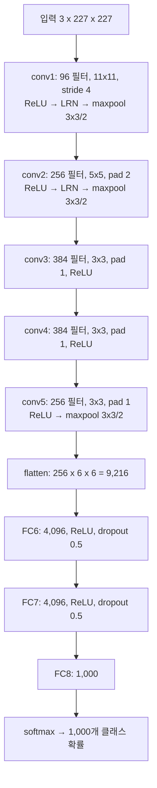

# AlexNet의 각 layer는 입력을 어떤 크기로 바꾸고, 뒤쪽 layer의 뉴런은 입력 이미지의 어느 범위를 보는가?

## 문제

AlexNet은 conv layer 5개와 FC layer 3개로 되어 있습니다. 여기서는 출력 크기 공식으로 layer별 feature map의 모양을 계산하고, receptive field 공식으로 각 layer의 뉴런 하나가 입력 이미지의 몇 픽셀을 보는지 계산한 뒤, PyTorch로 같은 모양이 나오는지 확인합니다.

## 아이디어

### 전체 구조

conv layer 5개가 feature를 추출하고, FC layer 3개가 그 feature를 범주 예측으로 해석합니다. 파라미터는 약 6,100만 개, 뉴런은 약 65만 개입니다.



### 각 부분의 역할

| 부분 | 역할 | 방식 |
|---|---|---|
| conv1~2 | 에지, 색, 질감 | 큰 필터(11x11, 5x5)로 거친 feature에서 시작합니다 |
| conv3~5 | 부품, 물체의 일부 | 작은 필터(3x3)를 여러 개. layer 사이에 pooling 없이 연달아 쌓아 receptive field를 넓힙니다 |
| max pool | 크기 축소, 위치 변화에 대한 내성 | 작은 영역의 가장 강한 활성화만 남깁니다 |
| FC6~7 | 전역 통합 | 공간 구조를 쓰지 않고 이미지 전체의 feature를 종합합니다 |
| FC8 + softmax | 1,000개 범주의 확률 | 가장 높은 확률이 최종 분류입니다 |

## 수식으로 보기

### max pooling

max pooling은 작은 공간 영역(AlexNet은 3x3 창) 안에서 가장 강한 활성화만 골라 feature map의 크기를 줄입니다. 계산량이 줄고, 작은 위치 변화와 입력 왜곡에 강해집니다.

학습할 파라미터가 없습니다. 고정된 연산입니다.

#### 손계산: 4x4 입력, 2x2 창, stride 2

$$
\begin{bmatrix} 1&3&2&0\\ 5&2&1&1\\ 0&1&4&2\\ 2&0&3&6 \end{bmatrix}
\ \xrightarrow{\ \text{max pool}\ }\
\begin{bmatrix} \max(1,3,5,2) & \max(2,0,1,1)\\ \max(0,1,2,0) & \max(4,2,3,6) \end{bmatrix}
= \begin{bmatrix} 5&2\\ 2&6 \end{bmatrix}
$$

출력 크기는 합성곱과 같은 공식을 씁니다. $O = \lfloor (I - K)/S \rfloor + 1$.

#### 남기는 것과 버리는 것

- 남기는 것은 이 구역 어딘가에 이 패턴이 강하게 있었다는 사실입니다.
- 버리는 것은 구역 안의 정확히 어느 칸이었는지입니다.

분류 문제에서는 고양이 귀가 3픽셀 옆에 있어도 고양이이므로 이 손실이 이득입니다. 픽셀 단위로 답해야 하는 문제(segmentation)에서는 이 손실이 문제가 됩니다. 이런 문제에서는 pooling을 줄이고 dilated convolution처럼 해상도를 유지하며 receptive field를 넓히는 방법을 씁니다.

#### AlexNet의 overlapping pooling

AlexNet은 3x3 창을 stride 2로 움직입니다. 창이 stride보다 커서 이웃한 창이 한 줄씩 겹칩니다. 원 논문은 겹치지 않는 2x2, stride 2 방식보다 top-1 오류가 0.4%p, top-5 오류가 0.3%p 낮았고 과적합이 약간 덜했다고 보고합니다.

| 단계 | 입력 | 창 | stride | 출력 |
|---|---|---|---|---|
| pool1 | 55 | 3 | 2 | $\lfloor(55-3)/2\rfloor+1 = 27$ |
| pool2 | 27 | 3 | 2 | 13 |
| pool5 | 13 | 3 | 2 | 6 |

AlexNet의 공간 해상도가 $227 \to 55 \to 27 \to 13$ 으로 줄어드는 것은 이 표와 conv1의 stride 4 때문입니다.

### receptive field

receptive field는 어떤 뉴런의 활성화에 영향을 주는 입력 이미지의 영역입니다. AlexNet은 깊은 layer로 갈수록 필터 크기를 줄이고 feature map 수를 늘리면서 각 뉴런의 receptive field를 넓혔습니다. 그래서 점점 넓은 영역에 걸친 복잡한 추상을 표현할 수 있습니다.

#### 작은 필터를 쌓으면 넓게 본다

3x3 필터를 두 번 쌓으면 둘째 layer의 한 칸은 첫째 layer의 3x3을 보고, 그 3x3의 각 칸은 입력의 3x3을 봅니다. 겹치는 부분을 빼면 입력의 5x5입니다.

```
입력        layer 1 출력      layer 2 출력
■■■■■
■■■■■       ■■■
■■■■■  ──▶  ■■■    ──▶    ■
■■■■■       ■■■
■■■■■
 5x5         3x3          1x1
```

#### 계산 공식

layer를 하나 지날 때마다 다음과 같이 갱신합니다.

$$
r_{out} = r_{in} + (k - 1)\times j_{in}, \qquad j_{out} = j_{in} \times s
$$

- $r$: receptive field의 한 변(입력 픽셀 단위)
- $j$: jump. 이 layer에서 한 칸 옆으로 가면 입력에서는 몇 픽셀 움직인 것인가. 앞선 stride들의 곱입니다.
- $k$: 이 layer의 커널 크기. $s$: 이 layer의 stride.
- 시작값: $r = 1$, $j = 1$.

stride가 큰 layer를 지나면 $j$ 가 커지고, 그 뒤의 layer들은 같은 3x3 커널로도 receptive field를 훨씬 빨리 넓힙니다.

#### AlexNet에 적용

| layer | $k$ | $s$ | $r$ | $j$ |
|---|---|---|---|---|
| 입력 | | | 1 | 1 |
| conv1 | 11 | 4 | 11 | 4 |
| pool1 | 3 | 2 | 19 | 8 |
| conv2 | 5 | 1 | 51 | 8 |
| pool2 | 3 | 2 | 67 | 16 |
| conv3 | 3 | 1 | 99 | 16 |
| conv4 | 3 | 1 | 131 | 16 |
| conv5 | 3 | 1 | 163 | 16 |
| pool5 | 3 | 2 | 195 | 32 |

계산 예: conv2는 $r = 19 + (5-1)\times 8 = 51$.

conv1의 뉴런은 11x11 픽셀만 봅니다. 에지나 색 얼룩을 볼 수 있는 크기입니다. pool5의 뉴런은 195x195, 즉 이미지의 거의 전체를 봅니다. 물체 전체의 형태를 볼 수 있는 크기입니다.

## 작은 숫자로 직접 계산

### layer별 출력 크기 계산

공식은 [합성곱](03-convolution.md)의 $O = \lfloor (I - K + 2P)/S \rfloor + 1$ 입니다.

| layer | 입력 | 커널 | stride | pad | 계산 | 출력 (채널 x 높이 x 너비) |
|---|---|---|---|---|---|---|
| conv1 | 3 x 227 x 227 | 11 | 4 | 0 | $(227-11)/4+1 = 55$ | 96 x 55 x 55 |
| pool1 | 96 x 55 x 55 | 3 | 2 | 0 | $(55-3)/2+1 = 27$ | 96 x 27 x 27 |
| conv2 | 96 x 27 x 27 | 5 | 1 | 2 | $(27-5+4)/1+1 = 27$ | 256 x 27 x 27 |
| pool2 | 256 x 27 x 27 | 3 | 2 | 0 | $(27-3)/2+1 = 13$ | 256 x 13 x 13 |
| conv3 | 256 x 13 x 13 | 3 | 1 | 1 | $(13-3+2)/1+1 = 13$ | 384 x 13 x 13 |
| conv4 | 384 x 13 x 13 | 3 | 1 | 1 | 13 | 384 x 13 x 13 |
| conv5 | 384 x 13 x 13 | 3 | 1 | 1 | 13 | 256 x 13 x 13 |
| pool5 | 256 x 13 x 13 | 3 | 2 | 0 | $(13-3)/2+1 = 6$ | 256 x 6 x 6 |
| FC6 | 9,216 | | | | | 4,096 |
| FC7 | 4,096 | | | | | 4,096 |
| FC8 | 4,096 | | | | | 1,000 |

공간 해상도가 $55 \to 27 \to 13$ 으로 줄어듭니다.

#### 224인가 227인가

논문은 입력을 224x224라고 적습니다. 그런데 공식에 넣으면 $(224 - 11)/4 + 1 = 54.25$ 로 정수가 아니고 55가 나오지 않습니다. 227을 넣어야 정확히 55입니다. 널리 알려진 불일치이고, 이 문서의 표는 계산이 맞는 227을 썼습니다. 논문의 구조도를 그대로 구현하면 shape 에러를 만나는 자리입니다.

### 모양의 변화를 그림으로

```
        227                55            27           13     13     13      6
       ┌─────┐          ┌────┐        ┌───┐        ┌──┐   ┌──┐   ┌──┐    ┌─┐
       │     │  conv1   │    │ pool   │   │ conv2  │  │…  │  │…  │  │ p  │ │  flatten   FC    FC    FC
  3 ch │     │ ──────▶  │ 96 │ ────▶  │256│ +pool  │384│  │384│  │256│ ─▶ │256│ ──▶ 9216 ▶ 4096 ▶ 4096 ▶ 1000
       │     │ 11x11/4  │    │        │   │        │  │   │  │   │  │    │ │
       └─────┘          └────┘        └───┘        └──┘   └──┘   └──┘    └─┘
  넓고 얕다 ───────────────────────────────────────────────────────▶ 좁고 깊다
```

- 공간 크기는 227 → 55 → 27 → 13 → 6으로 약 38분의 1이 됩니다.
- 채널 수는 3 → 96 → 256 → 384 → 384 → 256으로 늘어납니다.
- 첫 layer 하나(stride 4)와 그 뒤의 pooling이 해상도를 8분의 1로 줄입니다.

### 필터는 작아지고 개수는 늘어난다

AlexNet의 다섯 conv layer는 다음과 같이 바뀝니다.
- 필터 개수: 96 → 256 → 384 → 384 → 256
- 필터 크기: 11x11 → 5x5 → 3x3

| layer | 공간 크기 | 채널 | 칸 수(공간 x 채널) |
|---|---|---|---|
| conv1 | 55x55 | 96 | 290,400 |
| conv2 | 27x27 | 256 | 186,624 |
| conv3 | 13x13 | 384 | 64,896 |
| conv5 | 13x13 | 256 | 43,264 |
| pool5 | 6x6 | 256 | 9,216 |

공간 해상도를 줄이는 대신 채널을 늘립니다. "어디에"에 대한 정보를 줄이고 "무엇이"에 대한 정보를 늘립니다. 앞쪽 layer에서 구분할 패턴은 에지 방향과 색 정도라 96종이면 되지만, 뒤쪽 layer에서 구분할 것은 눈, 바퀴, 글자, 털 질감처럼 종류가 훨씬 많습니다.

### conv에서 FC로 넘어가는 곳

FC layer는 feature map을 하나의 벡터로 펼칩니다(flatten). 여기서부터는 공간 구조를 쓰지 않고 feature 전체를 하나의 벡터로 다룹니다.

$6 \times 6 \times 256 = 9{,}216$칸이 길이 9,216의 벡터가 되어 FC6에 들어갑니다. 이 연결 하나에 가중치 약 3,775만 개가 들어갑니다([AlexNet의 파라미터와 두 GPU 분할](09-alexnet-parameters-and-gpus.md)).

이후의 구조들은 이 연결을 바꿨습니다. 채널마다 공간 평균을 내어(global average pooling) 256칸짜리 벡터로 만들면 FC의 파라미터가 크게 줍니다. GoogLeNet과 ResNet이 이 방식을 씁니다.

## 코드로 확인

[experiments/alexnet_params.py](experiments/alexnet_params.py)는 layer별 출력 크기 표와 receptive field 표를 공식으로 다시 계산하고, 같은 구조를 PyTorch로 만들어 모양을 확인합니다. 두 GPU 분할은 `groups=2` 로 표현했고 LRN은 뺐습니다.

```python
features = nn.Sequential(
    nn.Conv2d(3, 96, 11, stride=4), nn.ReLU(), nn.MaxPool2d(3, 2),
    nn.Conv2d(96, 256, 5, padding=2, groups=2), nn.ReLU(), nn.MaxPool2d(3, 2),
    nn.Conv2d(256, 384, 3, padding=1), nn.ReLU(),
    nn.Conv2d(384, 384, 3, padding=1, groups=2), nn.ReLU(),
    nn.Conv2d(384, 256, 3, padding=1, groups=2), nn.ReLU(), nn.MaxPool2d(3, 2),
)
x = torch.zeros(1, 3, 227, 227)
for layer in features:
    x = layer(x)
```

출력([results/alexnet-params.txt](results/alexnet-params.txt))입니다. 출력 크기 표와 같은 모양입니다.

```
Conv2d           (1, 96, 55, 55)
MaxPool2d        (1, 96, 27, 27)
Conv2d          (1, 256, 27, 27)
MaxPool2d       (1, 256, 13, 13)
Conv2d          (1, 384, 13, 13)
Conv2d          (1, 384, 13, 13)
Conv2d          (1, 256, 13, 13)
MaxPool2d         (1, 256, 6, 6)
Linear 출력              (1, 1000)

224 x 224를 넣으면 conv1 출력: (224 - 11) / 4 + 1 = 54.25
```

## 결과 해석

### 깊이가 필요했다는 증거

AlexNet 논문은 conv layer 하나를 빼고 다시 학습하면 top-1 성능이 약 2% 떨어진다고 적습니다. 각 conv layer의 파라미터는 모델 전체의 1% 안팎입니다. 파라미터의 96%는 FC layer에 있지만, 파라미터가 1% 안팎인 conv layer 하나를 빼도 성능이 떨어졌습니다. 이후에 나온 VGG(layer 19개), GoogLeNet(22개), ResNet(152개)이 이 방향으로 갔고 [ResNet](../02-resnet/README.md)에서 다룹니다.

논문은 "각 layer가 1% 미만"이라고 적지만 [AlexNet의 파라미터와 두 GPU 분할](09-alexnet-parameters-and-gpus.md)에서 계산하면 conv3은 약 1.45%, conv4는 약 1.09%로 1%를 조금 넘습니다.

### 처음 질문에 대한 답

공간 크기는 227에서 55, 27, 13을 거쳐 6이 되고, 채널은 3에서 96, 256, 384, 384, 256으로 늘어납니다. 해상도를 줄이는 대신 채널을 늘려 "어디에"에 대한 정보를 "무엇이"에 대한 정보로 바꿔 갑니다. receptive field는 conv1의 11픽셀에서 pool5의 195픽셀까지 넓어져, 마지막 conv layer 뒤의 뉴런은 227픽셀 입력의 대부분을 봅니다. 두 GPU로 나뉜 구조는 [AlexNet의 파라미터와 두 GPU 분할](09-alexnet-parameters-and-gpus.md)에서 다룹니다.

## References

- [ImageNet Classification with Deep Convolutional Neural Networks](https://papers.nips.cc/paper/2012/hash/c399862d3b9d6b76c8436e924a68c45b-Abstract.html) (Krizhevsky, Sutskever, Hinton, 2012)
- [CS231n: Convolutional Neural Networks](https://cs231n.github.io/convolutional-networks/)
