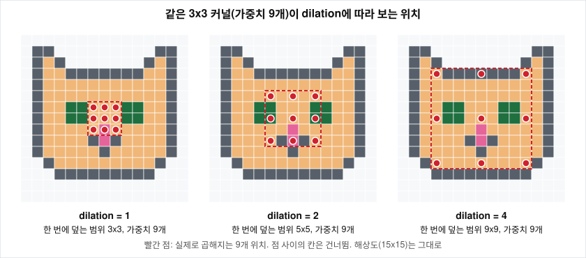

# layer를 더 쌓았는데 왜 학습 오차까지 커지는가?

## 문제

2015년 이전에는 layer를 늘려도 성능이 오르지 않았고, 어느 깊이를 넘으면 학습 데이터에서의 오차부터 올라갔습니다. 깊이가 왜 필요한지, 깊은 네트워크가 나빠지는 현상이 과적합이나 기울기 소실과 어떻게 다른지, 그리고 이 현상이 왜 이상한 결과인지를 봅니다. ResNet 논문은 이 현상을 degradation이라고 불렀습니다.

## 아이디어

### 깊이가 주는 것

여기서 가중치(weight)는 학습으로 값이 정해지는 숫자이고, 가중치와 편향(bias)을 합쳐 파라미터라고 부릅니다. 손실(loss)은 네트워크의 출력이 정답과 얼마나 다른지를 나타내는 숫자이고, 학습은 손실이 줄어드는 쪽으로 파라미터를 조금씩 고치는 과정입니다.

conv layer(합성곱 layer)는 3x3 같은 작은 격자(커널)를 이미지 위에서 한 칸씩 옮겨 가며 같은 계산을 반복합니다. 그 출력 격자를 feature map이라고 하고, 커널을 여러 개 두면 feature map도 여러 장 나옵니다. 이 장수가 채널 수입니다. conv layer 하나는 작은 패턴을 찾고, layer를 쌓으면 앞 layer가 찾은 패턴을 뒤 layer가 다시 조합합니다.

```
layer 1~2   : 선, 모서리, 색 변화
layer 3~5   : 모서리의 조합 (곡선, 질감, 격자무늬)
중간 layer  : 부품 (눈, 귀, 바퀴)
뒤쪽 layer  : 물체 (고양이 얼굴, 자동차)
```

고양이를 예로 들면 "뾰족한 귀"는 "비스듬한 선 두 개가 위에서 만난다"이고, "고양이 얼굴"은 "뾰족한 귀 두 개 아래에 눈 두 개와 코 하나가 삼각형으로 놓였다"입니다. 이런 조합을 layer 하나에서 한꺼번에 표현하려면 경우의 수가 폭발합니다. layer를 나누면 각 layer는 바로 앞 layer의 결과만 조합하면 됩니다.

깊이가 주는 다른 하나는 **수용 영역**(receptive field)입니다. feature map의 한 칸이 입력 이미지의 어느 범위를 보고 계산됐는가를 뜻합니다. 3x3 합성곱 한 장을 지나면 출력 한 칸은 입력 3x3을 보고, 한 장을 더 지나면 원본 기준 5x5를 봅니다.

```
입력(원본)          layer 1 출력             layer 2 출력
. . . . . . .
. # # # # # .       . . . . .
. # # # # # .       . # # # .            . . .
. # # # # # .  -->  . # # # .    -->     . # .
. # # # # # .       . # # # .            . . .
. # # # # # .       . . . . .
. . . . . . .
 원본의 5x5          layer 1의 3x3            layer 2의 1칸
```

그래서 더 어려운 문제일수록 layer를 더 쌓고 싶어집니다.

### 이전 구조들이 깊이를 다룬 방식

| 구조 | 연도 | layer 수 | 파라미터 | ImageNet top-5 오차 | 깊이를 다룬 방식 |
|---|---|---|---|---|---|
| AlexNet | 2012 | 8 | 약 6,000만 | 15.3% | layer마다 다르게 설계 (11x11, 5x5, 3x3) |
| ZFNet | 2013 | 8 | 비슷 | AlexNet보다 낮음 | AlexNet의 첫 layer를 7x7, stride 2로 조정 |
| VGG-16 / 19 | 2014 | 16 / 19 | 약 1.38억 / 1.44억 | 7.3% (앙상블) | 같은 3x3 layer를 반복해서 쌓습니다 |
| GoogLeNet | 2014 | 22 | 약 680만 | 6.7% (앙상블) | 병렬 경로를 가진 Inception module을 쌓습니다 |
| ResNet-152 | 2015 | 152 | 약 6,000만 | 4.49% (단일), 3.57% (앙상블) | 같은 residual block을 반복하고 shortcut으로 잇습니다 |

top-1 오차는 모델이 가장 높은 확률로 고른 답 하나가 틀린 비율이고, top-5 오차는 상위 다섯 개 안에 정답이 없는 비율입니다. VGG와 GoogLeNet의 수치는 여러 모델을 합친 앙상블 결과라서 ResNet-152의 단일 모델 수치와 조건이 다릅니다. VGG-16과 VGG-19의 파라미터 수는 torchvision 구현에서 센 값입니다([results/param-count.txt](results/param-count.txt)).

- VGGNet은 layer를 하나하나 설계하는 대신 같은 3x3 conv를 쌓고 사이에 pooling을 끼웠습니다. 같은 모듈을 $N$번 쌓는다는 생각은 ResNet이 그대로 물려받았습니다. VGG 논문은 19-layer에서 오차 감소가 포화했다고 적었습니다. 파라미터의 대부분(VGG-16에서 약 89%)은 끝의 fully connected layer 세 개에 있습니다.
- GoogLeNet의 Inception module은 1x1, 3x3, 5x5 합성곱과 pooling을 한 모듈 안에서 병렬로 돌려 출력을 채널 방향으로 이어 붙입니다. 3x3과 5x5 앞의 1x1 conv가 채널을 줄여 비용을 낮추고, FC layer 대신 global average pooling을 써서 파라미터가 VGG의 20분의 1입니다. 학습 때는 중간 layer에 보조 분류기 두 개를 달아 손실 신호를 직접 넣었습니다.

```
                 ┌─ 1x1 conv ────────────────┐
                 ├─ 1x1 conv ── 3x3 conv ────┤
  입력 feature map ┤                            ├── 채널 방향으로 이어 붙인다(concat)
                 ├─ 1x1 conv ── 5x5 conv ────┤
                 └─ 3x3 maxpool ── 1x1 conv ─┘
```

GoogLeNet이 파라미터 효율은 더 좋았는데도 ResNet이 표준 backbone(특징을 뽑는 몸통 네트워크)이 된 이유는 확장성입니다. Inception module은 버전마다 병렬 경로의 필터 크기와 채널 수를 다시 조정해야 했습니다. ResNet은 같은 블록의 반복 횟수만 바꿔서 ImageNet에서 152-layer, CIFAR-10에서 1,202-layer까지 늘렸습니다. 병렬 경로는 너비 방향의 아이디어이고 shortcut은 깊이 방향의 아이디어라서 둘은 함께 쓸 수 있고, 실제로 Inception-ResNet(2016)이 나왔습니다.

### 세 가지 현상의 구분

| 현상 | 학습 오차 | 테스트 오차 | 원인 |
|---|---|---|---|
| 과적합 (overfitting) | 낮습니다 | 높습니다 | 모델이 학습 데이터를 외웠습니다. 용량이 데이터에 비해 큽니다 |
| 기울기 소실 | 거의 안 내려갑니다 | 높습니다 | 앞쪽 layer에 기울기가 도달하지 않아 학습이 멈춥니다 |
| degradation | 얕은 모델보다 높습니다 | 얕은 모델보다 높습니다 | 깊은 모델을 최적화하기가 어렵습니다. 학습은 진행되는데 더 나쁜 곳에 도달합니다 |

과적합이면 학습 오차는 용량이 큰 깊은 모델 쪽이 더 낮아야 합니다. degradation은 그 반대입니다.

### 논문이 보인 현상

ResNet 논문은 CIFAR-10에서 residual connection이 없는 plain 네트워크 두 개를 학습시켰습니다. 56-layer가 20-layer보다 학습 오차부터 높았고 테스트 오차도 높았습니다. ImageNet에서도 plain 34-layer가 plain 18-layer보다 학습 내내 나빴습니다. ImageNet top-1 오차는 plain-18 27.94%, plain-34 28.54%, ResNet-18 27.88%, ResNet-34 25.03%입니다.

| | 18-layer | 34-layer | 깊어지면 |
|---|---|---|---|
| plain | 27.94% | 28.54% | 나빠집니다 (degradation) |
| ResNet | 27.88% | 25.03% | 좋아집니다 |

18-layer에서는 plain과 ResNet의 차이가 0.06%p로 사실상 같습니다. 얕은 네트워크에는 풀어야 할 degradation이 없습니다. 이 점은 [09-plain-vs-residual-experiment.md](09-plain-vs-residual-experiment.md)에서 다시 다룹니다.

## 수식으로 보기

### 수용 영역

$l$번째 layer까지의 수용 영역 한 변의 길이를 $r_l$이라고 하면

$$
r_l = r_{l-1} + (k_l - 1)\cdot d_l \cdot \prod_{i=1}^{l-1} s_i, \qquad r_0 = 1
$$

- $k_l$: $l$번째 layer의 커널 한 변 크기 (3x3이면 3)
- $d_l$: dilation. 커널 원소 사이의 간격. 보통 1
- $s_i$: $i$번째 layer의 stride. 커널을 몇 칸씩 옮기는가. stride가 2면 출력의 가로세로가 절반이 됩니다
- $\prod s_i$: 앞의 layer들이 해상도를 몇 배 줄였는가. 해상도가 절반이 된 뒤의 한 칸은 원본의 두 칸에 해당하므로 곱해 줍니다

### 포함 관계 논증

34-layer 네트워크는 원리상 18-layer가 표현하는 모든 함수를 표현할 수 있습니다.

1. 잘 학습된 18-layer 네트워크 $N_{18}$이 있습니다.
2. 그 뒤에 16개 layer를 붙이되, 붙인 layer가 입력을 그대로 내보내는 항등 사상(identity mapping, $f(x) = x$)이 되게 합니다.
3. 이렇게 만든 34-layer는 $N_{18}$과 출력이 같고, 학습 오차도 같습니다.

$$
N_{34}(x) = \underbrace{I \circ I \circ \cdots \circ I}_{16\text{개}} \circ N_{18}(x) = N_{18}(x)
$$

따라서 34-layer에는 적어도 18-layer만큼 좋은 해가 존재합니다. 해가 존재하는데도 경사하강법이 그것을 찾지 못한다는 것이 degradation입니다.

## 작은 숫자로 직접 계산

### 3x3을 세 장 쌓으면

stride 1, dilation 1로 3x3을 쌓습니다.

| layer | 계산 | 수용 영역 |
|---|---|---|
| 0 (입력) | | 1 |
| 1 | $1 + (3-1)\cdot 1 \cdot 1$ | 3 |
| 2 | $3 + 2$ | 5 |
| 3 | $5 + 2$ | 7 |

3x3 세 장은 7x7 한 장과 같은 범위를 봅니다.

### 같은 범위를 보는데 작은 커널을 쌓는 이유

입력 채널 $C$, 출력 채널 $C$일 때 가중치 개수는 $k^2 C^2$입니다.

| 구성 | 수용 영역 | 가중치 개수 | $C=64$일 때 |
|---|---|---|---|
| 7x7 한 장 | 7 | $49C^2$ | 200,704 |
| 3x3 세 장 | 7 | $27C^2$ | 110,592 |
| 5x5 한 장 | 5 | $25C^2$ | 102,400 |
| 3x3 두 장 | 5 | $18C^2$ | 73,728 |

작은 커널을 쌓으면 가중치가 줄고 layer 사이마다 ReLU가 들어가 비선형성이 늘어납니다. VGGNet의 설계이고 ResNet이 물려받았습니다.

### stride와 pooling이 끼면

ResNet의 앞부분은 7x7 conv(stride 2) 다음 3x3 max pooling(stride 2)입니다.

| layer | 계산 | 수용 영역 | 누적 stride |
|---|---|---|---|
| 7x7 conv, s=2 | $1 + 6 \cdot 1$ | 7 | 2 |
| 3x3 pool, s=2 | $7 + 2 \cdot 2$ | 11 | 4 |
| 3x3 conv, s=1 | $11 + 2 \cdot 4$ | 19 | 4 |
| 3x3 conv, s=1 | $19 + 2 \cdot 4$ | 27 | 4 |

해상도를 4분의 1로 줄인 뒤에는 3x3 한 장이 수용 영역을 8씩 넓힙니다. stride와 pooling은 수용 영역을 싸게 넓히는 방법이고, 대가는 해상도입니다. 224x224 이미지가 ResNet의 마지막 단계에서는 7x7이 됩니다.

### dilation을 넣으면

해상도를 줄이지 않고 수용 영역을 넓히는 방법이 dilated convolution입니다. 커널 원소 사이에 간격 $d$를 둡니다. 3x3 커널은 $d$가 얼마든 가중치가 9개이고, 한 변이 덮는 길이는 $3 + 2(d-1)$입니다. dilation을 1, 2, 4, 8, 16으로 늘리며 다섯 장을 쌓으면

| layer | dilation | 계산 | 수용 영역 |
|---|---|---|---|
| 1 | 1 | $1 + 2\cdot1$ | 3 |
| 2 | 2 | $3 + 2\cdot2$ | 7 |
| 3 | 4 | $7 + 2\cdot4$ | 15 |
| 4 | 8 | $15 + 2\cdot8$ | 31 |
| 5 | 16 | $31 + 2\cdot16$ | 63 |

이고, dilation 없이 다섯 장을 쌓으면 11입니다. 가중치를 모두 1로 둔 conv를 쌓고 출력 한 칸의 입력에 대한 기울기가 0이 아닌 범위를 재 보면 두 경우 모두 이 표와 같은 값(3, 7, 15, 31, 63과 3, 5, 7, 9, 11)이 나옵니다([results/param-count.txt](results/param-count.txt)). 이 방법을 쓴 Yu와 Koltun(2016)의 논문은 README의 Further Reading에 있습니다.

3x3 커널이 dilation 1, 2, 4에서 입력의 어느 칸을 보는지를 15x15 고양이 그림 위에 찍으면 아래와 같습니다.



모든 표의 숫자는 [results/hand-calc.txt](results/hand-calc.txt)와 같습니다.

## 결과 해석

학습 오차까지 커지는 이유는 과적합이 아닙니다. 과적합이라면 학습 오차는 깊은 쪽이 더 낮아야 합니다. 포함 관계 논증에 따르면 깊은 네트워크에는 얕은 네트워크만큼 좋은 해가 존재하므로 표현력의 문제도 아닙니다. 남는 것은 최적화, 즉 경사하강법이 그 해를 찾아가지 못한다는 것입니다.

기울기 소실과의 관계는 조심해서 읽어야 합니다. ResNet 논문의 plain 네트워크는 batch normalization을 썼고, 저자들은 순방향 신호의 분산이 0이 아니며 역방향 기울기의 크기도 정상이었다고 적었습니다. 그래서 논문은 기울기 소실이 원인일 가능성을 낮게 보고, 깊은 plain 네트워크의 수렴 속도가 지수적으로 느릴 수 있다고 추측한 뒤 원인은 후속 연구로 남겼습니다. 이 저장소의 측정에서도 BN이 있는 plain-56의 기울기 크기는 소실되지 않았습니다([04-skip-connection-gradient.md](04-skip-connection-gradient.md)).

포함 관계 논증에서 막힌 곳은 "추가한 layer가 항등 사상이 되면 된다"였습니다. ResNet은 항등 사상을 배우게 하지 않고 구조에 넣었습니다. [03-residual-learning.md](03-residual-learning.md)에서 다룹니다.

## 한계와 주의할 점

- 위의 오차 수치는 모두 ResNet 논문의 값입니다. 이 저장소에서 ImageNet 학습을 재현하지는 않았습니다. CIFAR-10을 줄여서 돌린 plain 대 residual 실험은 [09-plain-vs-residual-experiment.md](09-plain-vs-residual-experiment.md)에 있고, 그 길이로는 degradation을 보이지 못합니다.
- degradation의 원인은 한 가지로 정리돼 있지 않습니다. 순방향 신호가 layer를 지나며 조금씩 왜곡된다는 설명, 깊은 plain 네트워크에서 기울기의 방향이 입력에 따라 크게 달라진다는 설명(Balduzzi 등, 2017)이 있습니다.

## References

- [Deep Residual Learning for Image Recognition](https://arxiv.org/abs/1512.03385) (He, Zhang, Ren, Sun, 2015)
- [Very Deep Convolutional Networks for Large-Scale Image Recognition](https://arxiv.org/abs/1409.1556) (Simonyan, Zisserman, 2014)
- [Going Deeper with Convolutions](https://arxiv.org/abs/1409.4842) (Szegedy 등, 2014)
- [Visualizing and Understanding Convolutional Networks](https://arxiv.org/abs/1311.2901) (Zeiler, Fergus, 2013)
- [The Shattered Gradients Problem](https://arxiv.org/abs/1702.08591) (Balduzzi 등, 2017)
- [CS231n Convolutional Neural Networks](https://cs231n.github.io/convolutional-networks/): 합성곱, 수용 영역, 파라미터 계산
