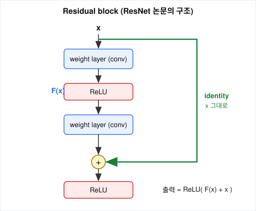

# 잔차 학습 y = F(x) + x에서 항등 사상은 왜 배우기 쉬워지는가?

## 문제

[01-why-depth-fails.md](01-why-depth-fails.md)의 포함 관계 논증은 "추가한 layer가 항등 사상이 되면 깊은 네트워크도 얕은 네트워크만큼 좋다"였고, 막힌 곳은 layer가 그 항등 사상을 배우지 못한다는 것이었습니다. ResNet은 블록의 출력을 $y = F(x) + x$로 바꿨습니다. plain layer로 항등 사상을 만들 때와 residual block으로 만들 때 필요한 조건이 어떻게 다른지를 봅니다.

## 아이디어

### 블록의 구조



residual block은 순전파 때 두 경로를 병렬로 계산합니다.

- 변환 경로: 입력을 합성곱, batch normalization, 비선형 활성화에 통과시킵니다. 결과가 $F(x)$입니다.
- shortcut 경로: 입력을 바꾸지 않고 넘깁니다.

두 결과를 더한 것이 블록의 출력입니다.

$$
y = F(x) + x
$$

- $x$: 블록의 입력 feature map
- $F(x)$: 블록 안쪽 layer들이 계산한 값. 이것을 **잔차**(residual)라고 부릅니다
- $y$: 블록의 출력. 원 논문 구조에서는 이 뒤에 ReLU가 한 번 더 붙습니다

말을 여러 사람에게 차례로 전하면 조금씩 달라져서 끝에서는 뭉개지는데, layer를 많이 쌓은 네트워크에서 신호가 겪는 일이 이와 비슷합니다. residual connection은 변환을 거치는 경로 옆에 입력을 그대로 넘기는 경로를 하나 더 두고 두 결과를 더합니다.

용어가 여러 개인데 같은 것을 가리킵니다.

| 용어 | 가리키는 것 |
|---|---|
| residual connection | 구조 전체. 잔차를 배우게 하는 연결 |
| skip connection | shortcut 경로. layer를 건너뛰는 연결 |
| shortcut, identity shortcut, skip path | 같은 경로의 다른 이름 |
| identity mapping | shortcut이 하는 일. $x \mapsto x$ |

### 왜 잔차라고 부르나

블록이 배워야 하는 함수를 $H(x)$라고 하겠습니다. plain 네트워크에서는 layer들이 $H(x)$를 직접 배웁니다. ResNet에서는 layer들이 $F(x)$를 배우고 출력이 $F(x) + x$이므로

$$
F(x) = H(x) - x
$$

입니다. layer들이 배우는 것은 원하는 출력과 입력의 차이입니다. 통계에서 관측값과 예측값의 차이를 잔차라고 부르는 것과 같은 말입니다.

개발자라면 전체 스냅샷을 매번 새로 만드는 대신 이전 상태에 대한 diff만 만드는 것을 떠올리면 됩니다. 바뀐 것이 없으면 diff는 비어 있고, 빈 diff를 만드는 것은 전체를 똑같이 복제하는 것보다 훨씬 쉽습니다.

## 수식으로 보기

### plain layer로 항등 사상을 만드는 조건

layer 하나가 $\text{ReLU}(Wx + b)$일 때 이것이 $x$와 같으려면 아래가 모두 필요합니다.

1. $W$가 단위행렬 $I$여야 합니다. 합성곱이면 가운데 원소만 1이고 나머지는 0이며, 자기 채널에서만 1인 커널이어야 합니다.
2. $b = 0$이어야 합니다.
3. $x$의 모든 원소가 0 이상이어야 합니다. 아니면 ReLU가 잘라 냅니다.
4. 중간에 BN이 있으면 $\gamma = \sqrt{\sigma^2 + \epsilon},\ \beta = \mu$로 정규화를 정확히 되돌려야 합니다.

3x3 conv, 64채널이면 가중치 36,864개가 특정한 값 하나에 정확히 맞아야 합니다. 난수에서 출발한 경사하강법이 이 점을 찾아갈 이유가 없습니다.

### residual block으로 만드는 조건

$y = F(x) + x$가 $x$와 같으려면 $F(x) = 0$이면 됩니다. ResNet 논문은 항등이 최적이라면 여러 비선형 layer로 항등을 맞추는 것보다 잔차를 0으로 미는 편이 쉽다고 가정합니다.

BN이 들어간 실제 블록에서는 초기 상태의 $F(x)$가 작지 않습니다. BN이 출력을 분산 1 근처로 맞추기 때문입니다. 블록이 정확히 항등에서 출발하게 하려면 마지막 BN의 $\gamma$를 0으로 초기화합니다(zero-init residual).

| | plain layer | residual block |
|---|---|---|
| 항등이 되려면 | $W = I$ (특정한 한 점) | $F(x) = 0$ (마지막 BN의 $\gamma = 0$이면 됩니다) |
| 초기 상태에서의 동작 | 입력을 무작위로 뒤섞습니다 | 입력에 무작위 변환을 더합니다. zero-init을 쓰면 입력을 그대로 통과시킵니다 |
| layer를 하나 더 넣으면 | 뒤섞는 단계가 하나 늘어납니다 | 입력은 그대로 남고 더해지는 항이 하나 늘어납니다 |

### 순방향에서: 원본이 끝까지 간다

블록을 여러 개 쌓으면

$$
x_1 = x_0 + F_0(x_0),\quad x_2 = x_1 + F_1(x_1),\quad \dots
\qquad\Longrightarrow\qquad
x_L = x_0 + \sum_{i=0}^{L-1} F_i(x_i)
$$

마지막 출력 $x_L$ 안에 원래 입력 $x_0$이 그대로 들어 있습니다. plain 네트워크에서는 $x_L = f_L(f_{L-1}(\cdots f_1(x_0)))$로 $x_0$이 $L$번 변환된 뒤에야 도착합니다. 더해지는 것은 가중치가 아니라 블록의 입력 feature map $x$입니다.

원 논문 구조는 덧셈 뒤에 ReLU가 있어서 이 식이 정확히 성립하지는 않습니다. 그 ReLU를 없애서 식이 정확히 성립하게 만든 것이 ResNet v2입니다([07-preactivation.md](07-preactivation.md)).

## 코드로 확인

skip connection은 분기문이나 layer 실행을 생략하는 장치가 아닙니다. 입력 텐서를 변수에 잡아 뒀다가 마지막에 더하는 한 줄입니다(`experiments/blocks.py`).

```python
def forward(self, x):
    identity = self.shortcut(x)          # 같은 단계 안에서는 nn.Identity()

    out = self.relu(self.bn1(self.conv1(x)))
    out = self.bn2(self.conv2(out))

    out = out + identity                 # skip connection
    return self.relu(out)
```

변환 경로는 항상 실행됩니다. 건너뛰는지 여부는 코드가 아니라 학습된 가중치가 정합니다. $F$의 가중치가 0에 가까우면 그 블록은 통과 구간이 됩니다. `out + identity`는 원소별 덧셈이라 두 텐서의 모양이 같아야 하고, 모양이 바뀌는 자리는 [06-bottleneck.md](06-bottleneck.md)의 projection shortcut이 처리합니다.

zero-init을 한 블록이 실제로 항등인지 확인합니다.

```python
torch.manual_seed(0)
blk = BasicBlock(64, 64)
nn.init.zeros_(blk.bn2.weight)                  # 마지막 BN의 gamma를 0으로
blk.eval()
x_pos = torch.relu(torch.randn(1, 64, 8, 8))    # 0 이상인 입력
x_any = torch.randn(1, 64, 8, 8)                # 음수 포함
print(torch.allclose(blk(x_pos), x_pos))
print(torch.allclose(blk(x_any), x_any))
```

## 실험 결과

[results/blocks.txt](results/blocks.txt)의 출력입니다.

| 입력 | `y == x` |
|---|---|
| 0 이상인 입력 | True |
| 음수가 섞인 입력 | False |

$F(x) = 0$이 되어도 블록 끝의 ReLU가 음수를 0으로 바꾸므로, 입력에 음수가 있으면 출력이 입력과 달라집니다. 원 논문 구조의 residual block은 0 이상인 입력에 대해서만 정확히 항등입니다. 앞 블록의 출력이 이미 ReLU를 지나 0 이상이므로 실제 네트워크 안에서는 이 조건이 맞습니다. 같은 확인을 pre-activation 블록에 하면 음수 입력에서도 True가 나옵니다([07-preactivation.md](07-preactivation.md)).

## 결과 해석

항등 사상이 배우기 쉬워지는 이유는 목표가 바뀌기 때문입니다. plain layer가 항등이 되려면 가중치 수만 개가 단위행렬이라는 한 점에 맞아야 합니다. residual block이 항등이 되려면 변환 경로의 출력을 0으로 줄이면 되고, 마지막 BN의 $\gamma$ 하나를 0으로 두는 것으로도 됩니다. 그래서 쓸모 있는 변환을 찾지 못한 블록은 $F$를 0 쪽으로 줄여 입력을 통과시키고, 변환이 필요한 블록은 입력에 대한 잔차를 배웁니다. layer를 더해도 포함 관계 논증의 해가 구조 안에 이미 들어 있는 셈입니다.

ResNet 앙상블은 ILSVRC 2015에서 top-5 오차 3.57%를 기록했고(단일 모델 4.49%), ResNet-152는 19-layer인 VGG-19보다 8배 깊으면서 연산량과 파라미터가 더 적습니다. 가벼운 이유는 [06-bottleneck.md](06-bottleneck.md)에서 계산합니다.

## 한계와 주의할 점

- 순방향 식 $x_L = x_0 + \sum F_i$는 덧셈 뒤에 ReLU가 없을 때만 정확합니다.
- "잔차를 0으로 미는 편이 쉽다"는 ResNet 논문의 가정이고 증명이 아닙니다. 논문은 이 가정이 실험 결과와 맞는다는 것을 보였습니다.
- 역방향에서 덧셈이 무엇을 하는지는 [04-skip-connection-gradient.md](04-skip-connection-gradient.md)에서 다룹니다.

## References

- [Deep Residual Learning for Image Recognition](https://arxiv.org/abs/1512.03385) (He, Zhang, Ren, Sun, 2015)
- [Identity Mappings in Deep Residual Networks](https://arxiv.org/abs/1603.05027) (He, Zhang, Ren, Sun, 2016)
