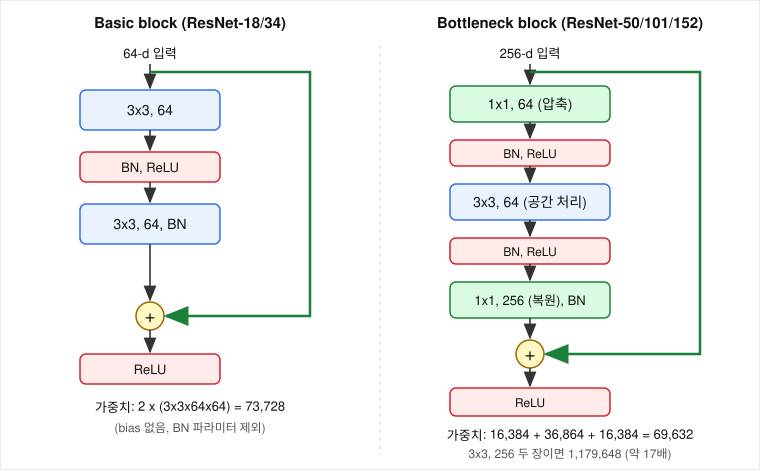
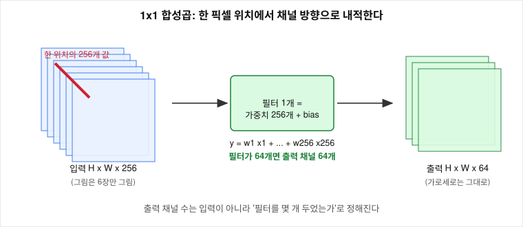

# 1x1 convolution과 bottleneck은 어떻게 layer를 늘리면서 연산량을 유지하는가?

## 문제

ResNet-152는 VGG-19보다 8배 깊은데 파라미터와 연산량이 더 적습니다. 1x1 conv인데 출력 채널 수가 입력과 달라지는 이유, 채널을 줄였는데도 학습이 되는 이유, ResNet-18부터 152까지가 어떻게 구성되는지, 모양이 바뀌는 자리의 shortcut과 마지막의 global average pooling이 무엇을 하는지를 계산합니다.

## 아이디어

각 채널은 같은 이미지를 보는 서로 다른 방식입니다. 모서리, 색, 질감을 강조하는 서로 다른 필터를 적용한 결과입니다. 채널이 많으면 다양한 세부를 잡지만 전부 처리하는 것은 비싸고 중복이 많습니다. bottleneck block은 1x1 conv로 채널 수를 줄이고, 줄인 상태에서 비싼 3x3 conv를 한 뒤, 다시 1x1 conv로 채널을 늘립니다.



1. 1x1 conv로 채널을 줄입니다 (256 → 64).
2. 줄어든 공간에서 3x3 conv를 합니다 (64 → 64).
3. 1x1 conv로 채널을 되돌립니다 (64 → 256).

## 수식으로 보기

### 합성곱 필터 하나의 모양

필터 하나의 모양은 $k \times k \times C_{in}$이고, 필터는 입력의 모든 채널을 한꺼번에 봅니다.

$$
y[i,j] = \sum_{c=1}^{C_{in}} \sum_{u=1}^{k} \sum_{v=1}^{k} w[c,u,v]\cdot x[c,\ i+u,\ j+v] + b
$$

필터 하나가 출력 채널 하나를 만듭니다. 출력 채널을 $C_{out}$개 만들려면 필터를 $C_{out}$개 둡니다.

$$
\text{가중치} = k^2 \cdot C_{in} \cdot C_{out}
$$

$C_{out}$은 설계자가 정하는 숫자입니다. 입력이 3채널(RGB)인데 첫 conv의 출력이 64채널인 것도 필터를 64개 두었기 때문입니다.

### 1x1 합성곱은 채널 방향 내적이다

$k=1$을 대입하면 공간 방향의 합이 사라집니다.

$$
y[i,j] = \mathbf{w}^{\top}\mathbf{x}_{ij} + b,
\qquad
\mathbf{y}_{ij} = W\,\mathbf{x}_{ij},\quad W \in \mathbb{R}^{C_{out}\times C_{in}}
$$

$\mathbf{x}_{ij}$는 위치 $(i,j)$의 채널 값을 모은 길이 $C_{in}$의 벡터입니다. 한 픽셀 위치에서 채널 방향으로 내적하고 주변 픽셀은 보지 않습니다. 모든 픽셀 위치에 같은 fully connected layer를 적용하는 것과 같습니다.



256채널을 64채널로 줄이는 1x1 conv는 크기 $1 \times 1 \times 256$인 필터 64개입니다. 64는 필터의 개수이고 필터 하나의 깊이는 입력 채널 수인 256입니다.

### 연산량

FLOPs는 입력 하나를 처리하는 데 드는 곱셈과 덧셈의 횟수입니다. 파라미터 수가 저장 비용이라면 FLOPs는 계산 비용입니다. conv layer 하나의 곱셈-덧셈 횟수는 가중치 개수에 출력 위치 수를 곱한 것입니다.

$$
\text{FLOPs} \approx H_{out}\cdot W_{out}\cdot k^2\cdot C_{in}\cdot C_{out}
$$

### 모양이 달라지는 자리: projection shortcut

stage가 바뀌는 첫 블록에서는 변환 경로의 출력이 입력과 모양이 다릅니다. 예를 들어 입력이 $64 \times 56 \times 56$이고 변환 경로의 첫 conv가 stride 2, 출력 128채널이면 $F(x)$는 $128 \times 28 \times 28$이라 더할 수 없습니다. 이 자리에서는 shortcut에 1x1 conv를 둡니다.

$$
y = F(x) + W_s\,x
$$

$W_s$는 채널 수를 맞추고 stride로 해상도를 맞추는 1x1 conv입니다. ResNet 논문은 세 가지를 비교했습니다. 늘어난 채널을 0으로 채우는 방법(A, 파라미터 없음), 모양이 바뀌는 자리에서만 사영하는 방법(B), 모든 shortcut을 사영하는 방법(C)입니다. C가 B보다, B가 A보다 조금 나았지만 차이가 작아서 저자들은 B를 택했고 torchvision도 B입니다. projection shortcut의 기울기 첫 항은 $I$가 아니라 $W_s^{\top}$이지만, ResNet-152의 블록 50개 중 46개는 순수한 항등 shortcut입니다.

### global average pooling

마지막 feature map의 각 채널을 공간 전체에서 평균 내어 숫자 하나로 만듭니다. 가중치가 없습니다.

$$
g_c = \frac{1}{H W}\sum_{i=1}^{H}\sum_{j=1}^{W} x[c,i,j]
$$

$2048 \times 7 \times 7$ feature map이 길이 2048인 벡터가 됩니다. Network in Network(2013)에서 제안됐고 GoogLeNet이 먼저 썼습니다.

## 작은 숫자로 직접 계산

### 1x1 conv 한 위치

입력 채널 3개, 출력 채널 2개. 어떤 위치의 값이 $\mathbf{x} = [1, 2, 3]$이고

$$
W = \begin{bmatrix} 1 & 0 & -1 \\ 0.5 & 0.5 & 0.5 \end{bmatrix}
$$

이면 $\mathbf{y} = [1 - 3,\ \ 0.5(1+2+3)] = [-2,\ 3]$입니다. 첫 번째 출력은 1번 채널과 3번 채널의 차이, 두 번째 출력은 세 채널의 평균에 비례하는 값이라는 새로운 특징의 조합입니다.

### bottleneck의 파라미터

BN이 뒤따르므로 bias 없이 셉니다.

| layer | 계산 | 가중치 |
|---|---|---|
| 1x1, 256 → 64 | $256 \cdot 64$ | 16,384 |
| 3x3, 64 → 64 | $9 \cdot 64 \cdot 64$ | 36,864 |
| 1x1, 64 → 256 | $64 \cdot 256$ | 16,384 |
| 합계 | | 69,632 |

256채널을 유지한 채 3x3 두 장을 쓰면 $2 \times 9 \cdot 256 \cdot 256 = 1{,}179{,}648$개입니다. 비율은 약 16.9배입니다. 3x3의 비용은 채널 수의 제곱에 비례하므로 채널을 4분의 1로 줄이면 3x3 비용은 16분의 1이 됩니다. 64채널 basic block(3x3 두 장, 73,728개)과 256채널 bottleneck(69,632개)의 비용이 거의 같습니다.

$56 \times 56$ feature map에서 곱셈-덧셈 횟수는 bottleneck이 $3{,}136 \times 69{,}632 \approx 2.18$억, 3x3 두 장이 약 37억입니다.

projection shortcut(1x1, 64 → 128)은 $64 \cdot 128 = 8{,}192$개로, 같은 블록의 3x3 두 장($9\cdot64\cdot128 + 9\cdot128\cdot128 = 221{,}184$)에 비하면 작습니다.

### ResNet 구성표와 layer 수

입력 224x224. conv1(7x7, 64, stride 2)과 maxpool(stride 2) 뒤에 stage 2~5가 오고, stage가 바뀔 때마다 해상도는 절반, 채널은 두 배가 됩니다.

| 모델 | 블록 | stage별 블록 수 | stage별 출력 채널 | 파라미터 (torchvision) | FLOPs (논문) |
|---|---|---|---|---|---|
| ResNet-18 | basic | [2, 2, 2, 2] | 64, 128, 256, 512 | 11,689,512 | 18억 |
| ResNet-34 | basic | [3, 4, 6, 3] | 64, 128, 256, 512 | 21,797,672 | 36억 |
| ResNet-50 | bottleneck | [3, 4, 6, 3] | 256, 512, 1024, 2048 | 25,557,032 | 38억 |
| ResNet-101 | bottleneck | [3, 4, 23, 3] | 256, 512, 1024, 2048 | 44,549,160 | 76억 |
| ResNet-152 | bottleneck | [3, 8, 36, 3] | 256, 512, 1024, 2048 | 60,192,808 | 113억 |

이름의 숫자는 가중치가 있는 layer(conv와 FC)의 개수입니다. BN, ReLU, pooling, projection shortcut의 1x1 conv는 세지 않습니다.

$$
\text{layer 수} = 1\ (\text{conv1}) + (\text{블록 수 합계}) \times (\text{블록당 conv 수}) + 1\ (\text{FC})
$$

ResNet-18은 $1 + 8 \times 2 + 1 = 18$, ResNet-50은 $1 + 16 \times 3 + 1 = 50$, ResNet-152는 $1 + 50 \times 3 + 1 = 152$입니다. ResNet-34와 ResNet-50은 블록 개수가 16개로 같고 basic block을 bottleneck으로 바꿨을 뿐이라 FLOPs도 36억과 38억으로 비슷합니다. 깊이를 늘릴 때는 주로 stage 4의 블록 수를 늘립니다.

### VGG와 비교: FC layer

| | 첫 FC 입력 | FC layer의 가중치 |
|---|---|---|
| VGG-16 | $512 \times 7 \times 7 = 25{,}088$ | 약 1.24억 (전체 1.38억의 89%) |
| ResNet-152 | global average pooling 뒤 2,048 | $2{,}048 \times 1{,}000 + 1{,}000 = 2{,}049{,}000$ |

ResNet-152가 8배 깊으면서 파라미터가 VGG-16의 절반 이하인 이유는 bottleneck과 global average pooling입니다. 위 숫자는 [results/hand-calc.txt](results/hand-calc.txt), [results/param-count.txt](results/param-count.txt), [results/blocks.txt](results/blocks.txt)와 같습니다.

## 코드로 확인

`experiments/blocks.py`에 BasicBlock과 Bottleneck이 있습니다. stride는 torchvision 구현을 따라 3x3 conv에 둡니다. 원 논문은 첫 1x1 conv에 뒀는데, 1x1 conv에 stride 2를 주면 입력 위치의 4분의 3을 보지 않고 버리게 됩니다.

```python
class Bottleneck(nn.Module):
    expansion = 4

    def __init__(self, in_planes, planes, stride=1):
        super().__init__()
        out_planes = planes * self.expansion
        self.conv1 = nn.Conv2d(in_planes, planes, kernel_size=1, bias=False)   # 채널을 줄인다
        self.bn1 = nn.BatchNorm2d(planes)
        self.conv2 = nn.Conv2d(planes, planes, kernel_size=3,
                               stride=stride, padding=1, bias=False)           # 공간 방향 처리
        self.bn2 = nn.BatchNorm2d(planes)
        self.conv3 = nn.Conv2d(planes, out_planes, kernel_size=1, bias=False)  # 채널을 되돌린다
        self.bn3 = nn.BatchNorm2d(out_planes)
        self.relu = nn.ReLU(inplace=True)
        self.shortcut = nn.Identity()
        if stride != 1 or in_planes != out_planes:                             # projection shortcut
            self.shortcut = nn.Sequential(
                nn.Conv2d(in_planes, out_planes, kernel_size=1, stride=stride, bias=False),
                nn.BatchNorm2d(out_planes))

    def forward(self, x):
        identity = self.shortcut(x)
        out = self.relu(self.bn1(self.conv1(x)))
        out = self.relu(self.bn2(self.conv2(out)))
        out = self.bn3(self.conv3(out))
        return self.relu(out + identity)
```

`count_conv_weights`는 conv 가중치만 세고, `count_all`은 BN의 $\gamma, \beta$를 포함해 셉니다. BN의 running mean과 running var는 `parameters()`가 아니라 `buffers()`에 있어서 세어지지 않습니다.

## 실험 결과

[results/blocks.txt](results/blocks.txt)의 출력입니다.

| 확인한 것 | 출력 | 손계산 |
|---|---|---|
| BasicBlock(64, 64)의 conv 가중치 | 73,728 | $2 \times 9 \cdot 64 \cdot 64$ |
| Bottleneck(256, 64)의 conv 가중치 | 69,632 | $16{,}384 + 36{,}864 + 16{,}384$ |
| BasicBlock(64, 64)의 전체 파라미터 | 73,984 | $73{,}728 + 2 \times (64 \times 2)$ |
| Bottleneck(256, 64)의 전체 파라미터 | 70,400 | $69{,}632 + (64+64+256) \times 2$ |
| BasicBlock(64, 128, stride 2)의 출력 모양 | (2, 128, 28, 28) | 해상도 절반, 채널 두 배 |
| 그 블록의 projection shortcut | 8,192 | $64 \cdot 128$ |
| torchvision resnet50의 파라미터 | 25,557,032 | |
| resnet50의 layer1[0], layer1[1]에 downsample이 있는가 | True, False | stage 2 첫 블록만 채널을 맞춥니다 |

torchvision은 shortcut을 `downsample`이라는 이름으로 부릅니다. ResNet-50 이상에서는 stage 2의 첫 블록에도 projection이 있습니다. maxpool의 출력은 64채널인데 bottleneck의 출력은 256채널이기 때문입니다.

## 결과 해석

bottleneck이 layer를 늘리면서 연산량을 유지하는 방법은 비싼 3x3 conv를 좁은 채널에서 돌리는 것입니다. 3x3의 비용은 채널 수의 제곱에 비례하므로 채널을 4분의 1로 줄이면 3x3 비용이 16분의 1이 되고, 1x1 두 장을 더해도 블록 전체가 3x3 두 장의 17분의 1입니다. 그렇게 아낀 예산으로 블록을 더 쌓았고, 끝의 global average pooling이 VGG의 FC layer 1.24억 개를 205만 개로 줄였습니다.

채널을 줄였는데 학습이 되는 이유는 넷입니다. shortcut은 압축을 거치지 않으므로 블록의 출력에는 256채널의 입력 $x$가 그대로 더해지고, 좁아지는 것은 $F$ 안쪽뿐입니다. 압축하는 1x1 conv도 학습되는 가중치라서 어떤 64개의 조합을 남길지를 손실이 정합니다. 채널 사이에는 중복이 많고, $F$가 계산하는 것은 전체 표현이 아니라 잔차입니다. 아낀 예산은 깊이로 갑니다. ResNet 논문은 bottleneck을 쓴 이유를 학습 시간과 연산량을 감당하기 위한 실용적 선택이라고 밝힙니다. bottleneck이 3x3 두 장보다 더 정확하다는 주장은 아닙니다.

## 한계와 주의할 점

- FLOPs는 ResNet 논문의 값이고, 파라미터 수는 torchvision 구현에서 센 값입니다. 이 저장소에서 FLOPs를 측정하지는 않았습니다.
- 1x1 conv의 계보: Network in Network(2013)가 픽셀마다 작은 MLP를 돌리는 연산으로 제안했고, GoogLeNet이 채널을 줄이는 데 썼고, ResNet이 shortcut과 결합했습니다. Transformer의 FFN은 토큰마다 같은 2-layer MLP를 적용하므로 1x1 conv 두 장과 같은 연산인데, 가운데를 좁히지 않고 넓힙니다(보통 4배).

## References

- [Deep Residual Learning for Image Recognition](https://arxiv.org/abs/1512.03385) (He, Zhang, Ren, Sun, 2015)
- [Going Deeper with Convolutions](https://arxiv.org/abs/1409.4842) (Szegedy 등, 2014)
- [Very Deep Convolutional Networks for Large-Scale Image Recognition](https://arxiv.org/abs/1409.1556) (Simonyan, Zisserman, 2014)
- [CS231n Convolutional Neural Networks](https://cs231n.github.io/convolutional-networks/): 합성곱의 파라미터와 출력 크기
