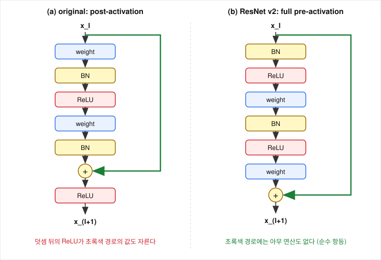

# ResNet v2는 왜 덧셈 뒤의 ReLU를 없앴고, 같은 구조는 Transformer에서 어떻게 쓰이는가?

## 문제

ResNet v2(He, Zhang, Ren, Sun, 2016)는 $F(x) + x$ 바깥에 있던 ReLU를 없애고 BN과 ReLU를 합성곱 앞으로 옮겼습니다. 이것을 해 보니 좋아진 결과로만 읽어도 되는지, shortcut에 다른 연산을 넣으면 왜 나빠지는지, 그리고 같은 구조가 ResNet 뒤의 모델에서 어떻게 이어지는지를 봅니다.

## 아이디어



| | 변환 경로의 순서 | 덧셈 뒤 |
|---|---|---|
| original (post-activation) | conv → BN → ReLU → conv → BN | ReLU |
| v2 (full pre-activation) | BN → ReLU → conv → BN → ReLU → conv | 없음 |

pre-activation은 활성화(BN과 ReLU)가 가중치 layer의 앞에 온다는 뜻입니다. 원래 설계에서는 ReLU가 두 경로를 합친 직후에 있어서, ReLU가 값을 0으로 만들 때마다 shortcut으로 온 값도 함께 막힙니다. v2는 그 ReLU를 변환 경로 안으로 옮겨서 shortcut을 처음부터 끝까지 순수한 덧셈으로 이었습니다.

## 수식으로 보기

블록을 일반형으로 쓰면

$$
y_l = h(x_l) + F(x_l, W_l),\qquad x_{l+1} = f(y_l)
$$

- $x_l$: $l$번째 블록의 입력
- $h$: shortcut이 하는 연산. 항등이면 $h(x_l) = x_l$
- $F$: 변환 경로. $W_l$은 그 가중치
- $f$: 덧셈 뒤에 적용하는 함수. 원 설계에서는 ReLU

$h$와 $f$가 둘 다 항등이면 $x_{l+1} = x_l + F(x_l, W_l)$이고, 반복해서 대입하면 임의의 얕은 블록 $l$과 깊은 블록 $L$ 사이에서

$$
x_L = x_l + \sum_{i=l}^{L-1} F(x_i, W_i),
\qquad
\frac{\partial \mathcal{E}}{\partial x_l}
= \frac{\partial \mathcal{E}}{\partial x_L}\left(1 + \frac{\partial}{\partial x_l}\sum_{i=l}^{L-1}F(x_i, W_i)\right)
$$

가 성립합니다. 첫 항 $\partial \mathcal{E}/\partial x_L$은 중간 블록의 가중치를 하나도 거치지 않고 $x_l$에 도착합니다. 두 번째 항이 미니배치의 모든 샘플에서 정확히 $-1$이 될 가능성은 없으므로 가중치가 아무리 작아도 기울기가 0이 되지 않습니다. [04-skip-connection-gradient.md](04-skip-connection-gradient.md)에서 블록 하나에 대해 본 $1 + \partial F/\partial x$가 블록 여러 개에 걸쳐 유지된다는 뜻이고, 조건은 $f$가 항등이라는 것입니다.

원래 설계는 $f = \text{ReLU}$라서 $x_{l+1} = \text{ReLU}(x_l + F)$이고 위의 합으로 펼쳐지지 않습니다. 역전파에서 덧셈 노드에 도착하기 전에 ReLU의 도함수(0 또는 1)가 shortcut 경로의 기울기에도 곱해지고, $x_l + F$가 음수인 원소에서는 shortcut으로 흐르는 기울기도 0이 됩니다.

### shortcut에 연산을 넣으면

shortcut에 상수를 곱해서 $h(x_l) = \lambda_l x_l$이라고 하면

$$
x_L = \Big(\prod_{i=l}^{L-1}\lambda_i\Big)x_l + \sum(\cdots),
\qquad
\frac{\partial \mathcal{E}}{\partial x_l} = \frac{\partial \mathcal{E}}{\partial x_L}\left(\prod_{i=l}^{L-1}\lambda_i + \cdots\right)
$$

기울기의 직통 항에 $\prod \lambda_i$가 붙습니다. $\lambda < 1$이면 지수적으로 소실하고 $\lambda > 1$이면 폭발합니다. 게이트나 1x1 conv를 넣어도 $\lambda$가 행렬이나 입력에 따라 달라지는 값으로 바뀔 뿐 같습니다.

## 코드로 확인

`experiments/blocks.py`의 `PreActBasicBlock`입니다. 덧셈 뒤에 아무것도 없습니다.

```python
def forward(self, x):
    out = torch.relu(self.bn1(x))
    # 모양이 바뀌는 블록에서는 BN-ReLU를 지난 값에서 shortcut을 뽑는다
    identity = self.shortcut(out) if self.shortcut is not None else x
    out = self.conv1(out)
    out = self.conv2(torch.relu(self.bn2(out)))
    return out + identity
```

마지막 conv의 가중치를 0으로 두어 $F(x) = 0$을 만들고, 음수가 섞인 입력에 대해 출력이 입력과 같은지 봅니다.

```python
pre = PreActBasicBlock(64, 64)
nn.init.zeros_(pre.conv2.weight)
pre.eval()
x_any = torch.randn(1, 64, 8, 8)       # 음수 포함
print(torch.allclose(pre(x_any), x_any))
```

## 실험 결과

[results/blocks.txt](results/blocks.txt)의 출력입니다.

| 블록 | $F(x) = 0$일 때 음수가 섞인 입력에서 `y == x` |
|---|---|
| original (post-activation), zero-init | False |
| pre-activation | True |

원래 설계는 덧셈 뒤의 ReLU가 음수를 잘라 내므로 $F = 0$이어도 항등이 아닙니다([03-residual-learning.md](03-residual-learning.md)). pre-activation 블록은 입력의 부호와 상관없이 정확히 항등입니다.

### 논문의 ablation

아래는 ResNet v2 논문의 CIFAR-10, ResNet-110 실험 결과입니다. 이 저장소에서 재현하지 않았습니다. ablation study는 모델의 일부를 하나씩 제거하거나 바꿔서 각 부분의 기여를 확인하는 실험입니다.

| shortcut 종류 | 결과 |
|---|---|
| 항등 (원래 설계) | 가장 낮은 오차 |
| 상수 0.5 곱하기 | 크게 나빠짐. 설정에 따라 수렴 실패 |
| 1x1 conv shortcut | 크게 나빠짐 |
| dropout shortcut | 수렴 실패 |
| 게이트 (Highway 방식) | 항등보다 나쁨. 설정에 따라 수렴 실패 |

| 활성화 위치 | 문제 | 결과 |
|---|---|---|
| (a) original | 덧셈 뒤 ReLU | 기준 |
| (b) BN을 덧셈 뒤에 | BN이 shortcut 경로를 바꿉니다 | 기준보다 나쁨 |
| (c) ReLU를 덧셈 앞에 | $F$의 출력이 항상 0 이상이라 잔차가 양수 방향으로만 조정합니다 | 기준보다 나쁨 |
| (d) ReLU만 pre-activation | | 기준과 비슷 |
| (e) full pre-activation | BN과 ReLU를 모두 conv 앞에 | 가장 낮은 오차 |

게이트는 항등을 포함하는 더 일반적인 구조인데도 결과가 나빴습니다. 표현할 수 있는 것과 최적화로 도달할 수 있는 것은 다르다는 점이 [01-why-depth-fails.md](01-why-depth-fails.md)의 degradation과 같습니다.

| 데이터 | 모델 | 결과 |
|---|---|---|
| CIFAR-10 | 원래 설계 1,202-layer | 110-layer보다 나쁨 |
| CIFAR-10 | pre-activation 1,001-layer | 당시 최고 기록 |
| ImageNet | 원래 설계 200-layer | 152-layer보다 나쁨 |
| ImageNet | pre-activation 200-layer | 152-layer보다 좋음 |

같은 깊이의 pre-activation 구조는 좋아졌으므로, 원래 설계가 200-layer에서 나빠진 것은 깊이 자체보다 덧셈 뒤의 ReLU 때문으로 읽을 수 있습니다. 또 pre-activation ResNet은 학습 오차는 조금 높고 테스트 오차는 낮았는데, 저자들은 모든 conv의 입력이 BN을 막 지난 값이 되는 데서 오는 regularization 효과로 설명했습니다.

## 결과 해석

덧셈 뒤의 ReLU를 없앤 이유는 수식이 먼저 말합니다. $f$가 항등이어야 $x_L = x_l + \sum F$가 정확히 성립하고 기울기의 "+1"이 모든 블록에서 그대로 남습니다. 이 저장소의 확인에서도 원래 설계의 블록은 $F = 0$일 때 음수 입력에서 항등이 아니었고, pre-activation 블록은 항등이었습니다. 논문의 ablation은 이 분석과 같은 방향을 가리킵니다. 실험만 있는 논문이 아니라 수식 분석을 먼저 내고 실험으로 확인한 구조입니다.

ablation 표를 읽을 때는 다섯 가지를 봅니다. 모든 행이 같은 데이터, 같은 깊이, 같은 학습 설정인지. 한 번에 하나만 바꿨는지((a)에서 (e)로 가면 ReLU와 BN의 위치가 둘 다 바뀌고, (d)가 그 중간을 분리합니다). 차이가 잡음보다 큰지(논문은 여러 번 돌린 중앙값을 보고했습니다). "수렴 실패"도 결과라는 점. 표는 어느 쪽이 나은가를 보여 주고 왜 그런가는 수식이 맡는다는 점입니다.

### 같은 구조의 쓰임

**블록을 지워도 무너지지 않는다.** Veit 등(2016)은 학습된 VGG에서 layer 하나를 지우면 오차가 무작위 추측 수준으로 치솟지만, 학습된 ResNet에서 블록 하나를 지우면 오차가 조금만 늘고, 여러 개를 지우거나 순서를 뒤섞어도 완만하게 나빠진다는 것을 보였습니다. 블록 하나를 지우면 $2^n$개 경로 중 그 블록을 지나는 절반이 사라지지만 나머지 절반은 그대로이기 때문입니다. 이 성질을 학습에 쓴 것이 stochastic depth(Huang 등, 2016)입니다. 학습 중에 블록의 변환 경로를 무작위로 건너뛰고 shortcut은 남깁니다.

**반복해서 다듬는 구조.** $x_L = x_0 + \sum F_i(x_i)$는 네트워크의 상태가 $x$ 하나이고 각 블록이 거기에 수정분을 더한다는 뜻입니다. 미분방정식을 수치로 푸는 오일러 방법 $x_{t+1} = x_t + h\cdot f(x_t)$와 모양이 같고, 이 관찰에서 Neural ODE(Chen 등, 2018) 같은 연구가 나왔습니다.

**Transformer의 residual stream.** Transformer의 layer 하나(pre-LN 기준)는 residual block 두 개입니다.

$$
x' = x + \text{Attention}\big(\text{LN}(x)\big),
\qquad
x'' = x' + \text{FFN}\big(\text{LN}(x')\big)
$$

LN은 Layer Normalization이고 FFN은 토큰마다 적용하는 2-layer MLP입니다. 원래 Transformer(2017)는 덧셈 뒤에 LN을 두는 post-LN이었고, GPT-2 이후 대부분의 대형 언어 모델은 sublayer 앞에 LN을 두는 pre-LN을 씁니다.

| | ResNet v2 block | Transformer block (pre-LN) |
|---|---|---|
| 정규화 | BN | LN |
| 변환 | ReLU → conv | Attention 또는 FFN |
| 합치기 | $x + F(\cdot)$ | $x + F(\cdot)$ |
| shortcut 위의 연산 | 없음 | 없음 |

layer $L$개를 펼치면 $x_L = x_0 + \sum_{l}\big(\text{Attn}_l + \text{FFN}_l\big)$이고, 언어 모델의 해석 가능성 연구에서는 shortcut을 따라 흐르는 이 $x$를 residual stream이라고 부릅니다. 각 sublayer는 stream에서 읽고, 계산하고, 결과를 더해 씁니다. 모든 layer가 같은 공간을 공유하므로 layer 3이 쓴 정보를 layer 20이 중간을 거치지 않고 읽을 수 있습니다.

**LSTM의 cell state.** LSTM은 같은 덧셈 구조를 시간 방향에 두었습니다.

$$
\text{ResNet}:\ x_{l+1} = x_l + F(x_l)
\qquad
\text{LSTM}:\ C_t = f_t \odot C_{t-1} + i_t \odot \tilde{C}_t
$$

1997년의 LSTM은 덧셈 경로의 계수가 1로 고정돼 있었고, 계수 $f_t$를 학습하는 forget gate는 2000년에 추가됐습니다. 시간 순서로는 LSTM이 ResNet보다 먼저입니다. Highway Network(2015)는 게이트로 두 경로의 비율을 학습하는 $y = T(x) \odot H(x) + (1 - T(x)) \odot x$를 layer 방향에 썼습니다. ResNet에서는 shortcut에 게이트를 다는 것이 나빴는데 LSTM은 게이트가 달린 덧셈 경로로 잘 동작합니다. 깊이 방향에서는 layer마다 가중치가 다르고, 시간 방향에서는 시점마다 같은 가중치를 쓰며 지난 정보를 잊어야 할 때가 있다는 점이 다릅니다. 자세한 내용은 [RNN과 LSTM](../03-rnn-lstm/README.md)에 있습니다.

## 한계와 주의할 점

- ablation 표와 결과 표는 ResNet v2 논문의 결과이고 이 저장소에서 학습으로 재현하지 않았습니다. 논문과 직접 대조하지 않은 오차 수치는 싣지 않았습니다.
- 이 저장소에서 확인한 것은 $F = 0$일 때 두 블록이 항등인지 여부입니다. pre-activation이 학습을 얼마나 개선하는지는 재지 않았습니다.
- 블록 삭제 실험과 경로 길이 측정은 Veit 등의 결과입니다.

## References

- [Identity Mappings in Deep Residual Networks](https://arxiv.org/abs/1603.05027) (He, Zhang, Ren, Sun, 2016)
- [Deep Residual Learning for Image Recognition](https://arxiv.org/abs/1512.03385) (He, Zhang, Ren, Sun, 2015)
- [Residual Networks Behave Like Ensembles of Relatively Shallow Networks](https://arxiv.org/abs/1605.06431) (Veit, Wilber, Belongie, 2016)
- [Deep Networks with Stochastic Depth](https://arxiv.org/abs/1603.09382) (Huang 등, 2016)
- [Neural Ordinary Differential Equations](https://arxiv.org/abs/1806.07366) (Chen 등, 2018)
- [Attention Is All You Need](https://arxiv.org/abs/1706.03762) (Vaswani 등, 2017)
- [Highway Networks](https://arxiv.org/abs/1505.00387) (Srivastava, Greff, Schmidhuber, 2015)
