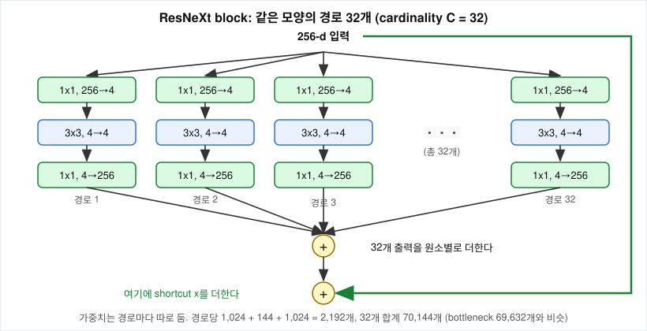

# ResNeXt의 cardinality는 무엇이고, 경로를 32개로 나눠도 비용이 같은 이유는 무엇인가?

## 문제

ResNeXt 논문(Xie, Girshick, Dollár, Tu, He, 2017)은 주어진 연산 예산을 cardinality에 쓰는 것이 깊이나 너비에 쓰는 것보다 효율적이라고 주장합니다. cardinality가 정확히 무엇인지, 32개 경로의 가중치가 따로인데 어떻게 비용이 같을 수 있는지, grouped convolution과는 어떤 관계인지를 계산합니다.

## 아이디어



ResNeXt 블록은 bottleneck block의 변환 경로를 같은 모양의 좁은 경로 $C$개로 쪼갠 것입니다. $C$가 cardinality입니다. 집합의 원소 개수를 뜻하는 수학 용어를 빌렸습니다. 논문은 신경망의 크기를 정하는 요소로 깊이(layer 수), 너비(채널 수)에 이어 cardinality를 세 번째로 제안합니다.

cardinality를 서로 다른 모듈 종류의 개수로 이해하기 쉬운데, 정의는 같은 모양의 병렬 경로 개수입니다. 서로 다른 모양의 경로를 병렬로 두는 것은 GoogLeNet의 Inception module입니다.

| | Inception module | ResNeXt block |
|---|---|---|
| 경로의 모양 | 서로 다릅니다 (1x1, 3x3, 5x5, pool) | 전부 같습니다 |
| 설계자가 정할 것 | 경로마다 필터 크기와 채널 수 | 경로 개수 $C$와 경로 너비 $d$ 두 개 |
| 합치는 방법 | 채널 방향으로 이어 붙입니다 | 원소별로 더합니다 |
| shortcut | 없습니다 (v1 기준) | 있습니다 |

## 수식으로 보기

$$
y = x + \sum_{i=1}^{C} T_i(x)
$$

- $T_i$: $i$번째 경로의 변환. 모든 경로가 같은 구조(1x1 → 3x3 → 1x1)이고 가중치는 각자 따로입니다
- $x$: shortcut

### grouped convolution

grouped convolution은 입력 채널을 $g$개 그룹으로 나누고, 각 그룹이 자기 그룹의 입력 채널만 보고 자기 그룹의 출력 채널을 만드는 합성곱입니다.

```
일반 3x3 conv (128 → 128)                grouped 3x3 conv (128 → 128, g = 32)
  모든 출력 채널이                          출력 채널 1~4   는 입력 채널 1~4   만 본다
  모든 입력 채널 128개를 본다               출력 채널 5~8   는 입력 채널 5~8   만 본다
                                            ...
```

$$
\text{일반}:\ k^2 C_{in} C_{out}
\qquad
\text{grouped}:\ g \cdot k^2 \cdot \frac{C_{in}}{g}\cdot\frac{C_{out}}{g} = \frac{k^2 C_{in} C_{out}}{g}
$$

가중치가 $g$분의 1이 됩니다. 논문은 ResNeXt 블록의 세 가지 표현이 같다는 것을 보였습니다.

| 표현 | 구조 |
|---|---|
| (a) 경로 32개를 따로 돌리고 더합니다 | $[1\text{x}1, 4] \to [3\text{x}3, 4] \to [1\text{x}1, 256]$ 을 32번 |
| (b) 앞의 1x1들을 하나로 합칩니다 | 32개의 256 → 4 1x1 conv는 256 → 128 1x1 conv 하나와 같습니다 |
| (c) grouped conv로 씁니다 | $[1\text{x}1, 128] \to [3\text{x}3, 128, g=32] \to [1\text{x}1, 256]$ |

(c)의 마지막 1x1이 32개 경로의 출력을 더하는 일을 대신하는 이유는, 128채널을 256채널로 보내는 행렬곱이 곧 4채널짜리 32묶음 각각에 행렬을 곱해 더하는 것이기 때문입니다.

## 작은 숫자로 직접 계산

표준 구성 32x4d는 경로 32개, 경로마다 중간 채널 4개입니다.

| layer (경로 하나) | 계산 | 가중치 |
|---|---|---|
| 1x1, 256 → 4 | $256 \cdot 4$ | 1,024 |
| 3x3, 4 → 4 | $9 \cdot 4 \cdot 4$ | 144 |
| 1x1, 4 → 256 | $4 \cdot 256$ | 1,024 |
| 합계 | | 2,192 |

블록 전체는 $32 \times 2{,}192 = 70{,}144$입니다. grouped 표현 (c)로 세어도 같습니다.

| layer | 계산 | 가중치 |
|---|---|---|
| 1x1, 256 → 128 | $256 \cdot 128$ | 32,768 |
| 3x3, 128 → 128, $g=32$ | $9 \cdot 128 \cdot 128 / 32$ | 4,608 |
| 1x1, 128 → 256 | $128 \cdot 256$ | 32,768 |
| 합계 | | 70,144 |

| | ResNet bottleneck | ResNeXt 32x4d |
|---|---|---|
| 경로 수 | 1 | 32 |
| 경로의 중간 채널 | 64 | 4 |
| 중간 채널 합계 | 64 | 128 |
| 가중치 | 69,632 | 70,144 |

## 코드로 확인

`experiments/param_count.py`는 경로 32개를 따로 만든 모듈과 grouped conv 모듈을 만들고, 경로 32개의 가중치를 grouped 모듈의 해당 자리에 옮겨 담은 뒤 같은 입력에 대한 출력을 비교합니다.

```python
C, d = 32, 4
paths = nn.ModuleList([nn.Sequential(nn.Conv2d(256, d, 1, bias=False),
                                     nn.Conv2d(d, d, 3, padding=1, bias=False),
                                     nn.Conv2d(d, 256, 1, bias=False)) for _ in range(C)])
grouped = nn.Sequential(nn.Conv2d(256, C * d, 1, bias=False),
                        nn.Conv2d(C * d, C * d, 3, padding=1, groups=C, bias=False),
                        nn.Conv2d(C * d, 256, 1, bias=False))
with torch.no_grad():
    for i, p in enumerate(paths):
        grouped[0].weight[i * d:(i + 1) * d] = p[0].weight
        grouped[1].weight[i * d:(i + 1) * d] = p[1].weight
        grouped[2].weight[:, i * d:(i + 1) * d] = p[2].weight
    x = torch.randn(2, 256, 8, 8)
    print(torch.allclose(sum(p(x) for p in paths), grouped(x), atol=1e-5))
```

## 실험 결과

[results/param-count.txt](results/param-count.txt)의 출력입니다.

| 확인한 것 | 출력 |
|---|---|
| 경로 하나 / 경로 32개 / grouped 표현의 conv 가중치 | 2,192 / 70,144 / 70,144 |
| grouped 3x3의 가중치 모양과 개수 | (128, 4, 3, 3), 4,608 |
| 경로 32개를 더한 출력과 grouped 출력이 같은가 | True |

가중치 모양 (128, 4, 3, 3)은 출력 채널 128개 각각이 입력 채널 4개만 본다는 뜻입니다.

## 결과 해석

cardinality는 블록 안에 나란히 놓인 같은 모양의 경로 개수입니다. 경로를 32개로 나눠도 비용이 같은 이유는 각 경로를 16분의 1로 좁혔기 때문입니다. 3x3 conv의 비용은 채널 수의 제곱에 비례하므로 좁은 경로 여러 개는 넓은 경로 하나보다 훨씬 쌉니다. 그렇게 아낀 예산으로 중간 채널 합계를 64에서 128로 늘렸습니다. 가중치는 경로마다 따로이고 각 경로는 독립된 난수로 초기화됩니다. 같은 값으로 초기화하면 32개 경로가 같은 기울기를 받아 끝까지 똑같이 움직입니다. 구현은 grouped convolution 한 번이고, 위 실험에서 두 표현의 출력이 같았습니다.

논문의 실험은 ResNet-50과 연산량을 맞춘(ResNeXt 논문 기준 약 41억 FLOPs) 조건에서 1x64d, 2x40d, 8x14d, 32x4d로 경로를 늘리고 좁힐수록 ImageNet top-1 오차가 줄었다고 보고합니다. 연산량을 두 배로 늘릴 때도 더 깊게, 더 넓게, cardinality를 늘리는 세 방법 가운데 마지막이 가장 나았다고 합니다. 연산량을 고정한 비교이므로 모델이 커져서 좋아졌다는 설명은 빠집니다. 그룹 사이의 연결을 끊으니 regularization(과적합을 누르는 효과)이라고 해석하기 쉬운데, 논문은 32x4d ResNeXt의 학습 오차도 같은 복잡도의 ResNet보다 낮았다는 것을 근거로 이득이 regularization이 아니라 더 강한 표현에서 온다고 봅니다.

grouped convolution은 AlexNet에 이미 있었습니다. GPU 두 장에 네트워크를 반씩 나눠 올린 것이 $g=2$인 grouped conv입니다. 그때는 메모리 제약 때문에 쓴 것이고 ResNeXt는 설계 요소로 다시 가져왔습니다. 이후 MobileNet(2017)은 그룹 수를 채널 수와 같게 둔 depthwise convolution에 1x1 conv를 붙였고, ShuffleNet(2017)은 그룹끼리 정보가 섞이지 않는 문제를 채널 순서를 뒤섞어서 풉니다.

### 같은 예산을 다르게 쓰는 방향

ResNeXt와 같은 시기에 연산 예산을 다르게 쓰는 구조가 나왔습니다. 이 저장소에서 실험하지 않았고, 논문의 설계만 적습니다.

- DenseNet(Huang 등, 2017)은 앞 layer의 출력을 더하지 않고 채널 방향으로 이어 붙여 입력으로 받습니다($x_l = H_l([x_0, \dots, x_{l-1}])$). 각 layer는 새 채널을 growth rate $k$개만 만듭니다. 입력 채널 64, $k = 32$면 $l$번째 layer의 입력 채널은 $64 + 32(l-1)$로 늘어나서 64, 96, 128, …이 됩니다. 앞 layer의 특징이 원본 그대로 남는 대신 중간 feature map을 모두 들고 있어야 해서 메모리가 많이 듭니다.
- EfficientNet(Tan, Le, 2019)은 깊이 $d = \alpha^{\phi}$, 너비 $w = \beta^{\phi}$, 해상도 $r = \gamma^{\phi}$를 계수 하나 $\phi$로 함께 키웁니다. 합성곱의 연산량은 깊이에 비례하고 너비와 해상도에는 제곱에 비례하므로 제약식을 $\alpha\beta^2\gamma^2 \approx 2$로 두어 $\phi$가 1 늘 때 연산량이 약 2배가 되게 합니다. 논문의 값 $\alpha = 1.2, \beta = 1.1, \gamma = 1.15$를 넣으면 $1.2 \times 1.21 \times 1.3225 \approx 1.92$이고, $\phi = 3$이면 깊이 1.73배, 너비 1.33배, 해상도 1.52배, 연산량 약 7.1배입니다. 상수 셋은 작은 기준 모델에서 탐색으로 찾은 것이고 왜 그 값인지에 대한 이론은 없습니다.

## 한계와 주의할 점

- 이 저장소에서 확인한 것은 가중치 수와 두 표현의 출력이 같다는 것입니다. cardinality가 정확도를 올린다는 결과는 ResNeXt 논문의 것이고 학습으로 재현하지 않았습니다. 논문과 직접 대조하지 않은 오차 수치는 싣지 않았습니다.
- 여러 부분공간에서 따로 특징을 뽑는다는 해석, Transformer의 multi-head attention과 비슷하다는 해석이 자주 나오지만 논문이 이론으로 제시한 것은 아닙니다.

## References

- [Aggregated Residual Transformations for Deep Neural Networks](https://arxiv.org/abs/1611.05431) (Xie, Girshick, Dollár, Tu, He, 2017)
- [Going Deeper with Convolutions](https://arxiv.org/abs/1409.4842) (Szegedy 등, 2014)
- [Densely Connected Convolutional Networks](https://arxiv.org/abs/1608.06993) (Huang 등, 2017)
- [EfficientNet: Rethinking Model Scaling for Convolutional Neural Networks](https://arxiv.org/abs/1905.11946) (Tan, Le, 2019)
