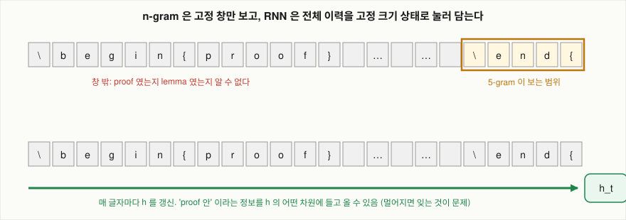
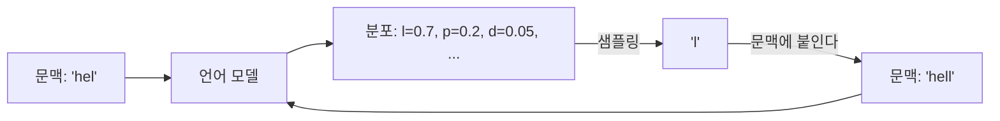

# 글자 단위 language model은 문장의 확률을 어떻게 계산하는가?

## 문제

문장처럼 길이가 정해지지 않고 순서가 뜻을 바꾸는 데이터는 고정 크기 입력을 받는 모델에 그대로 넣을 수 없습니다. 여기서는 문장의 확률을 다음 글자의 조건부 확률의 곱으로 쪼개는 방법과, 글자를 모델이 받을 수 있는 벡터로 바꾸는 방법을 작은 숫자로 계산합니다. language model(LM)은 앞에 나온 글을 보고 다음에 올 글자나 단어의 확률을 내는 모델을 말합니다.

## 아이디어

### 시퀀스 데이터의 정의

시퀀스 모델은 텍스트, 음성, 시계열처럼 원소의 위치가 의미를 갖는, 순서 있는 데이터를 다룹니다.

#### 두 가지 성질

시퀀스 데이터를 이미지와 구분하는 성질은 두 가지입니다.

1. 순서를 바꾸면 의미가 바뀝니다. "개가 사람을 물었다"와 "사람이 개를 물었다"는 같은 단어 집합이지만 다른 문장입니다. 단어 개수만 세는 모델(bag of words)은 이 둘을 구분하지 못합니다.
2. 길이가 정해져 있지 않습니다. 문장은 3단어일 수도 300단어일 수도 있습니다. 음성은 1초일 수도 1분일 수도 있습니다.

| 데이터 | 원소 | 길이 | 순서의 의미 |
|---|---|---|---|
| 텍스트 | 글자, 단어, subword | 가변 | 문법과 의미 |
| 음성 | 10ms 단위 음향 특징 벡터 | 가변 | 발음 순서 |
| 시계열 | 시각별 측정값 | 계속 늘어남 | 인과 관계 |
| 서버 로그 | 이벤트 한 줄 | 계속 늘어남 | 요청 흐름 |
| 이미지 (비교용) | 픽셀 | 고정 (예: 224×224) | 공간 배치 |

### 고정 크기 입력 모델이 막히는 곳

Karpathy는 RNN의 특징을 CNN과 대비해 설명합니다. CNN은 고정 크기 벡터를 입력으로 받아 고정 크기 벡터를 출력합니다. 정지 이미지 한 장이나 영상의 프레임 하나를 독립적으로 분석하기에는 맞지만, 문장, 음성 스트림, 연속 영상 같은 순차 데이터에서는 제약이 됩니다.

#### 왜 고정 크기인가

AlexNet의 마지막 부분은 fully connected layer입니다. fully connected layer의 가중치 행렬은 크기가 `(출력 수) × (입력 수)`로 정해져 있습니다. 입력이 하나 늘면 행렬의 열이 하나 늘어야 하는데, 학습된 행렬은 크기를 바꿀 수 없습니다. 그래서 이미지는 항상 같은 크기로 잘라서 넣습니다.

문장에 같은 방법을 쓰면 세 가지 선택지가 있고 전부 문제가 있습니다.

| 방법 | 문제 |
|---|---|
| 최대 길이를 정하고 짧은 문장은 빈칸으로 채웁니다 | 최대 길이보다 긴 입력은 버려야 합니다. 빈칸 자리의 가중치가 낭비됩니다 |
| 직전 n개만 잘라서 넣습니다 (고정 창) | n개보다 앞의 정보는 볼 방법이 없습니다. n-gram이 이 방식입니다 |
| 위치마다 다른 가중치를 둡니다 | "3번째 자리의 the"와 "7번째 자리의 the"를 따로 배워야 합니다. 같은 패턴을 위치 수만큼 다시 학습합니다 |

세 번째 문제는 이미지에서 CNN이 푼 문제와 같은 종류입니다. CNN은 "고양이 귀가 왼쪽 위에 있든 오른쪽 아래에 있든 같은 필터로 찾는다"는 생각으로 공간 방향으로 가중치를 공유했습니다. 시퀀스에서는 시간 방향으로 가중치를 공유하면 됩니다. 이것이 RNN이고 [RNN](04-rnn.md)에서 다룹니다.

### 여기서 다루는 세 모델의 위치

```
                 입력 길이        과거를 보는 범위          과거를 저장하는 방식
n-gram           가변             직전 n-1개 (고정 창)      조회 표 (문맥 → 다음 것의 횟수)
RNN              가변             원리상 처음부터 전부      고정 크기 벡터 h 하나
LSTM             가변             원리상 처음부터 전부      고정 크기 벡터 두 개 (C 와 h)
CNN (비교용)     고정             입력 전체 (공간)          저장하지 않는다 (한 번에 본다)
```



### 언어 모델의 정의

**언어 모델**은 앞부분 $x_{<t}$를 받아 다음 원소 $x_t$의 확률 분포를 내는 함수입니다.

$$
f_\theta : x_{<t} \longmapsto \big(P(x_t = v_1 \mid x_{<t}),\; \dots,\; P(x_t = v_{|V|} \mid x_{<t})\big)
$$

- $\theta$: 모델의 파라미터(가중치) 전체.
- $V$: 어휘. 나올 수 있는 원소의 집합. $|V|$는 그 크기. 글자 단위면 100개 안팎, 단어 단위면 수만 개.
- 출력은 길이 $|V|$인 벡터이고 모든 값을 더하면 1입니다.

이 정의에서 모델마다 달라지는 것은 $x_{<t}$를 어떻게 다루는가 하나뿐입니다.

| 모델 | $x_{<t}$를 다루는 방법 |
|---|---|
| n-gram | 직전 $n-1$개만 남기고 나머지는 버립니다: $P(x_t \mid x_{<t}) \approx P(x_t \mid x_{t-n+1}, \dots, x_{t-1})$ |
| RNN | 전부를 고정 크기 벡터 $h_{t-1}$로 요약합니다: $P(x_t \mid x_{<t}) \approx P(x_t \mid h_{t-1})$ |
| Transformer | 전부를 그대로 보관했다가 필요한 위치를 직접 찾아봅니다 |

n-gram의 근사에는 **마르코프 가정**이라는 이름이 있습니다. "다음 것은 최근 몇 개에만 의존한다"는 가정입니다. RNN은 이 가정을 하지 않습니다. 대신 "과거 전체를 고정 크기 벡터에 눌러 담을 수 있다"고 가정합니다. 어느 가정이든 대가가 있고, 그 대가가 이 문서들의 주제입니다.

## 수식으로 보기

### 확률과 조건부 확률

기호부터 정합니다.

- $P(A)$: 사건 $A$가 일어날 확률. 0과 1 사이.
- $P(A, B)$: $A$와 $B$가 둘 다 일어날 확률 (결합 확률).
- $P(B \mid A)$: $A$가 일어났다는 것을 아는 상태에서 $B$가 일어날 확률 (조건부 확률).

조건부 확률의 정의는 다음과 같습니다.

$$
P(B \mid A) = \frac{P(A, B)}{P(A)}
$$

#### 숫자 예제

영어 글자 100만 개를 세었더니 `q`가 1,000번 나왔고, 그중 `qu`로 이어진 것이 980번이었다고 가정합니다.

- $P(\text{q}) = 1000 / 1000000 = 0.001$
- $P(\text{q}, \text{u}) = 980 / 1000000 = 0.00098$
- $P(\text{u} \mid \text{q}) = 0.00098 / 0.001 = 0.98$

`u` 자체는 흔한 글자가 아니지만($P(\text{u})$는 약 0.03) `q` 다음이라는 조건이 붙으면 0.98이 됩니다. 문맥이 확률을 바꿉니다. 언어 모델이 하는 일은 이 조건부 확률을 잘 맞히는 것입니다.

### 연쇄법칙

조건부 확률의 정의를 뒤집으면 $P(A, B) = P(A) \times P(B \mid A)$ 입니다. 이것을 세 개, 네 개로 늘려 가면 됩니다.

$$
P(x_1, x_2, x_3) = P(x_1) \times P(x_2 \mid x_1) \times P(x_3 \mid x_1, x_2)
$$

길이 $T$인 시퀀스로 일반화하면 다음과 같습니다.

$$
P(x_1, \dots, x_T) = \prod_{t=1}^{T} P(x_t \mid x_1, \dots, x_{t-1}) = \prod_{t=1}^{T} P(x_t \mid x_{<t})
$$

- $x_t$: $t$번째 원소 (글자, 단어, 토큰). 토큰은 모델이 텍스트를 다루는 최소 단위를 말합니다. 글자 하나일 수도 있고 단어나 단어 조각일 수도 있습니다.
- $x_{<t}$: $t$번째보다 앞에 있는 원소 전부. $x_1, \dots, x_{t-1}$의 줄임 표기.
- $\prod$: 곱 기호. $\sum$이 더하기의 반복이듯 $\prod$는 곱하기의 반복입니다.

이 식은 근사가 아니라 **항등식**입니다. 어떤 분포든 이렇게 쪼갤 수 있습니다. 그래서 다음 두 문장은 같은 말입니다.

- 문장 전체에 확률을 매기는 모델을 만듭니다.
- 앞부분을 보고 다음 것의 확률 분포를 내는 모델을 만듭니다.

#### 숫자 예제

"hello"의 확률을 글자 단위로 쪼갭니다.

$$
P(\text{hello}) = P(\text{h}) \times P(\text{e} \mid \text{h}) \times P(\text{l} \mid \text{he}) \times P(\text{l} \mid \text{hel}) \times P(\text{o} \mid \text{hell})
$$

모델이 각 항을 0.1, 0.5, 0.6, 0.7, 0.4로 냈다면 $P(\text{hello}) = 0.1 \times 0.5 \times 0.6 \times 0.7 \times 0.4 = 0.0084$ 입니다.

곱이 길어지면 값이 금방 0에 가까워져서 컴퓨터로 다루기 어렵습니다. 그래서 실제로는 로그를 취해 **곱을 합으로** 바꿉니다.

$$
\log P(x_1, \dots, x_T) = \sum_{t=1}^{T} \log P(x_t \mid x_{<t})
$$

위 예에서는 $\ln 0.0084 = -4.78$ 입니다. 이 값에 음수를 붙이고 길이로 나눈 것이 [softmax와 perplexity](02-softmax-and-perplexity.md)에서 다루는 loss입니다.

### 토큰화: 어디서 자를 것인가

**토큰화**는 텍스트를 모델이 다루는 최소 단위(토큰)로 자르는 일입니다. 자르는 단위에 따라 어휘 크기와 시퀀스 길이가 반대로 움직입니다.

문장 `unbelievable results` 를 세 방식으로 자르면 다음과 같습니다.

| 단위 | 토큰 | 토큰 수 | 어휘 크기 (대략) |
|---|---|---|---|
| 글자 | `u n b e l i e v a b l e _ r e s u l t s` | 20 | 100 안팎 |
| subword | `un` `believ` `able` `_results` | 4 | 3만~10만 |
| 단어 | `unbelievable` `results` | 2 | 수십만 이상 |

subword의 실제 분할은 토크나이저마다 다릅니다. 위는 설명용 예시입니다.

글자 단위 모델은 한 번에 글자 하나를 만듭니다. 단어라는 단위를 알려 주지 않으므로 철자부터 스스로 배워야 하고, 같은 문장을 만드는 데 거쳐야 하는 시점 수가 단어 단위보다 몇 배 많습니다. 그만큼 먼 거리의 정보를 유지하기가 어렵습니다. 아래 표가 그 비용을 숫자로 보여 줍니다.

#### 숫자로 보는 비용

영어 단어의 평균 길이는 공백 포함 약 5~6글자입니다. 20단어 떨어진 두 단어의 관계(France와 French 같은 것)를 잡으려면 다음 거리만큼 정보를 유지해야 합니다.

- 단어 단위: 약 20 시점
- 글자 단위: 약 100~120 시점

RNN의 기울기는 거슬러 가는 시점 수에 대해 지수적으로 줄어듭니다([BPTT](05-bptt.md)에서 계산합니다). 시점 수가 5배가 되면 어려움은 5배보다 크게 늘어납니다.

| | 글자 단위 | 단어 단위 | subword |
|---|---|---|---|
| 어휘 크기 | 작습니다 | 매우 큽니다 | 중간 |
| output layer 크기 ($\text{hidden} \times \lvert V \rvert$) | 작습니다 | 매우 큽니다 | 중간 |
| 처음 보는 단어 | 문제없습니다. 글자로 조립합니다 | 처리 못 합니다 (어휘 밖) | 조각으로 나눠 처리합니다 |
| 시퀀스 길이 | 깁니다 | 짧습니다 | 중간 |
| 장거리 의존성 부담 | 큽니다 | 작습니다 | 중간 |

Karpathy가 글자 단위를 고른 것은 실용적인 이유입니다. 어휘가 100개 안팎이라 output layer가 작고, 어떤 텍스트 파일이든(소스 코드, LaTeX, 마크다운) 전처리 없이 넣을 수 있습니다. GPU 한 장과 텍스트 파일만 있으면 누구나 돌려 볼 수 있었던 이유입니다.

지금 LLM은 subword를 씁니다. 단계 수가 줄어 먼 거리의 의존성을 다루기 쉬워지는 대신 비용이 있습니다. 철자나 글자 수 세기에 약한 것은 모델이 글자를 직접 보지 않기 때문입니다.

### one-hot: 토큰을 벡터로

신경망은 실수 벡터를 받습니다. 어휘의 각 토큰에 번호를 붙이고, 그 번호 자리만 1이고 나머지는 0인 벡터로 바꿉니다.

어휘가 $V = \{h, e, l, o\}$ 이면 다음과 같습니다.

$$
\text{h} = \begin{bmatrix}1\\0\\0\\0\end{bmatrix},\quad
\text{e} = \begin{bmatrix}0\\1\\0\\0\end{bmatrix},\quad
\text{l} = \begin{bmatrix}0\\0\\1\\0\end{bmatrix},\quad
\text{o} = \begin{bmatrix}0\\0\\0\\1\end{bmatrix}
$$

번호를 그대로 숫자로 넣지 않는 이유가 있습니다. `h=0, e=1, l=2, o=3` 을 실수로 넣으면 모델은 "o는 e의 3배"라는 없는 관계를 읽습니다. one-hot은 모든 토큰을 서로 같은 거리에 놓습니다.

### one-hot에 행렬을 곱하면 열 하나를 고르는 것이다

RNN의 입력 가중치 $W_{xh}$는 크기가 `(hidden 크기) × (어휘 크기)`인 행렬입니다. 여기에 one-hot 벡터를 곱하면 다음과 같습니다.

$$
W_{xh}\, x =
\begin{bmatrix}
0.5 & -0.3 & 0.8 & 0.1\\
-0.2 & 0.9 & 0.4 & -0.6\\
0.7 & 0.2 & -0.5 & 0.3
\end{bmatrix}
\begin{bmatrix}0\\0\\1\\0\end{bmatrix}
=
\begin{bmatrix}0.8\\0.4\\-0.5\end{bmatrix}
$$

`l`의 one-hot(세 번째가 1)을 곱했더니 행렬의 **세 번째 열**이 그대로 나왔습니다. 곱셈과 덧셈을 한 것 같지만 실제로는 조회입니다. 이 숫자들은 [RNN](04-rnn.md)에서 그대로 다시 씁니다.

### 임베딩: 그 열이 곧 토큰의 표현

위에서 고른 열 $[0.8, 0.4, -0.5]^\top$ 은 글자 `l`을 나타내는 3차원 벡터입니다. 이것을 **임베딩**이라고 부릅니다. $W_{xh}$는 학습되는 가중치이므로 임베딩도 학습됩니다.

- one-hot: 어휘 크기만큼의 차원. 모든 토큰이 서로 직교합니다. 비슷함을 표현할 수 없습니다.
- 임베딩: 훨씬 작은 차원(수십~수천). 학습 결과 비슷하게 쓰이는 토큰은 비슷한 벡터가 됩니다.

프레임워크에서는 행렬 곱 대신 조회를 직접 합니다. PyTorch의 `nn.Embedding(vocab, dim)`은 `vocab × dim` 크기의 표를 들고 있다가 정수 인덱스를 받으면 해당 행을 돌려줍니다. 결과는 one-hot에 행렬을 곱한 것과 같고 계산만 빠릅니다. 실습 코드 `char_lstm.py`가 이 방식을 쓰고, `char_rnn.py`(numpy)는 설명을 위해 one-hot 곱을 그대로 씁니다.

#### 임베딩과 word2vec

[n-gram baseline](03-ngram-baseline.md)의 문제 3("비슷한 문맥을 비슷하다고 보지 못한다")을 신경망이 푸는 첫 단계가 임베딩입니다. Mikolov의 word2vec(2013)이 단어 임베딩을 학습하는 대표적인 방법입니다. Mikolov는 그보다 앞선 2010년에 RNN 언어 모델로 n-gram을 넘는 수치를 냈습니다.

### 출력 쪽도 같은 구조다

입력에서 토큰을 벡터로 바꿨다면, 출력에서는 hidden 벡터를 **토큰별 점수**로 바꿔야 합니다. $W_{hy}$는 크기가 `(어휘 크기) × (hidden 크기)`이고, $W_{hy} h_t$ 는 어휘 크기만큼의 점수(logit) 벡터입니다. 이 점수를 확률로 바꾸는 것이 다음 문서의 softmax입니다.

```
토큰 번호 ──one-hot/임베딩──▶ 입력 벡터 ──RNN 셀──▶ hidden 벡터 ──W_hy──▶ logit (어휘 크기) ──softmax──▶ 확률
```

### 생성은 같은 모델을 반복 호출하는 것

char-rnn은 학습이 끝난 뒤 글자를 하나씩 예측하며 새 텍스트를 만듭니다. 확률 분포에서 샘플링하고, 그 무작위성은 temperature로 조절합니다.

#### 절차

1. 시작 문맥을 넣습니다.
2. 모델이 다음 글자의 분포를 냅니다.
3. 그 분포에서 글자 하나를 뽑습니다 (샘플링).
4. 뽑은 글자를 문맥 뒤에 붙입니다.
5. 2로 돌아갑니다.

이렇게 자기 출력을 다시 입력으로 넣는 방식을 자기회귀(autoregressive) 생성이라고 부릅니다. 지금 쓰는 LLM도 같은 방식입니다. 토큰이 글자에서 subword로, 모델이 RNN에서 Transformer로 바뀌었을 뿐입니다.



#### 개발자라면

언어 모델은 **순수 함수**이고 생성 루프는 그 함수를 호출하는 **클라이언트 코드**입니다. 무작위성은 모델 안이 아니라 3번 단계(샘플링)에 있습니다. 같은 문맥을 넣으면 모델은 항상 같은 분포를 냅니다. LLM API에서 temperature를 0으로 두면 거의 같은 답이 나오는 이유가 이것입니다.

### 학습은 분류 문제의 반복

언어 모델 학습은 이미지 분류와 같은 틀입니다.

| | 이미지 분류 | 다음 글자 예측 |
|---|---|---|
| 입력 | 이미지 한 장 | 앞부분 $x_{<t}$ |
| 클래스 | 1,000개 (ImageNet) | $\lvert V \rvert$개 (어휘) |
| 출력 | softmax 확률 1,000개 | softmax 확률 $\lvert V \rvert$개 |
| 정답 | 사람이 붙인 라벨 | **텍스트의 실제 다음 글자** |
| loss | cross-entropy | cross-entropy |

가장 큰 차이는 정답을 사람이 붙일 필요가 없다는 것입니다. 텍스트가 있으면 모든 위치가 (입력, 정답) 쌍이 됩니다. 100만 글자짜리 파일은 100만 개의 학습 예제입니다.

문장의 확률은 다음 글자의 조건부 확률을 시점마다 곱한 값이고, language model이 하는 일은 그 조건부 확률 분포를 내는 것입니다. n-gram, RNN, LSTM은 앞부분 $x_{<t}$를 다루는 방법만 다릅니다.

## 확인 문제

1. "서울에서 부산까지"와 "부산에서 서울까지"를 단어 개수만 세는 모델에 넣으면 어떤 입력이 되나요? (답: 같은 입력. 순서 정보가 없습니다)
2. 최대 길이 50으로 고정한 모델에 80단어 문장이 오면 무엇을 잃나요? (답: 앞 또는 뒤 30단어)
3. 같은 가중치를 모든 시점에 쓰면 파라미터 수는 입력 길이에 어떻게 의존하나요? (답: 의존하지 않습니다)
4. $P(\text{the})$를 글자 단위 연쇄법칙으로 써 보세요.
5. 모델이 "cat"의 세 글자에 각각 0.2, 0.5, 0.8을 냈습니다. $\log P(\text{cat})$ 은 얼마인가요? (답: $\ln 0.08 = -2.53$)
6. bigram 모델(직전 1개만 봅니다)이 "I grew up in France … I speak fluent ___"의 빈칸을 채울 때 볼 수 있는 문맥은 무엇인가요? (답: "fluent" 하나)
7. 어휘 65개, hidden 512인 글자 모델에서 $W_{xh}$의 파라미터 수는 얼마인가요? (답: 512 × 65 = 33,280)
8. 같은 모델을 어휘 50,000개 단어 모델로 바꾸면 $W_{xh}$는 몇 개가 되나요? (답: 25,600,000. output layer $W_{hy}$도 같은 크기)
9. 글자 단위 모델이 처음 보는 단어를 만들어 낼 수 있는 이유는 무엇인가요? (답: 출력 단위가 글자라서 어떤 조합이든 낼 수 있습니다)

## References

- [The Unreasonable Effectiveness of Recurrent Neural Networks](https://karpathy.github.io/2015/05/21/rnn-effectiveness/) (Karpathy, 2015)
- [Recurrent neural network based language model](https://www.isca-archive.org/interspeech_2010/mikolov10_interspeech.html) (Mikolov 등, 2010)
