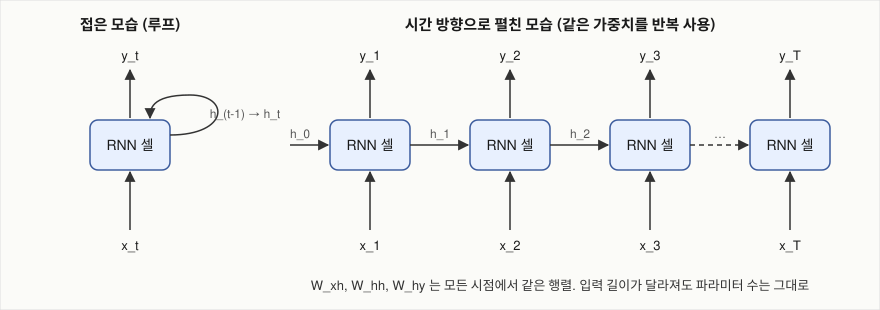
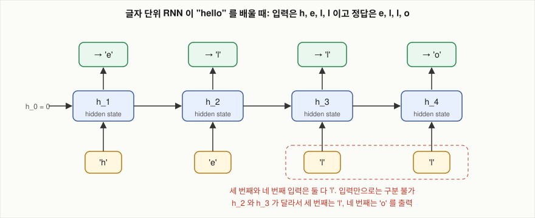

# RNN은 길이가 정해지지 않은 입력을 고정된 수의 파라미터로 어떻게 처리하는가?

## 문제

RNN(recurrent neural network)은 같은 계산을 시점마다 반복하면서, 지금까지 읽은 내용을 요약한 벡터인 hidden state를 다음 시점으로 넘깁니다. 입력 길이가 5든 500이든 파라미터 수가 같은 이유, 같은 글자가 들어와도 출력이 달라지는 이유를 hidden 3차원짜리 RNN에 "hell"을 넣어 네 시점을 직접 계산해 확인합니다. 같은 계산을 NumPy 코드로 다시 확인합니다.

## 아이디어

### 같은 계산 단위를 반복 적용한다

순환 루프 덕분에 RNN은 고정 크기 입력 없이 임의 길이의 시퀀스를 처리할 수 있습니다. 같은 계산 단위가 매 단계에 재귀적으로 적용되면서 문맥을 시간 방향으로 실어 나르기 때문입니다.

아래 손계산에서 시점 1부터 4까지 쓰는 $W_{xh}$, $W_{hh}$, $W_{hy}$는 전부 같은 행렬입니다. 시점마다 행렬을 따로 두지 않습니다. 이것을 시간 방향 가중치 공유라고 합니다.

| | CNN | RNN |
|---|---|---|
| 무엇을 공유하나 | 필터(커널) | 셀의 가중치 세 개 |
| 어느 방향으로 | 이미지의 공간 위치 | 시퀀스의 시간 위치 |
| 깔린 가정 | 고양이 귀는 어디에 있든 같은 모양입니다 | "q 다음은 u"라는 규칙은 문장의 어디서든 같습니다 |
| 얻는 것 | 파라미터 수가 이미지 크기와 무관 | 파라미터 수가 시퀀스 길이와 무관 |

가중치를 공유하기 때문에 생기는 성질이 두 가지 있습니다.

1. 학습 때 본 적 없는 길이의 입력도 처리할 수 있습니다. 50글자 단위로 학습한 모델로 5,000글자를 생성할 수 있습니다.
2. 같은 행렬이 반복해서 곱해집니다. 먼 시점의 정보를 잊는 원인이 여기에 있습니다([BPTT](05-bptt.md)).

### 펼치기(unrolling)

루프가 있는 그래프에는 역전파를 바로 적용할 수 없습니다. 역전파는 출력에서 입력으로 한 방향으로 거슬러 가는 계산인데 루프가 있으면 끝이 없습니다.

RNN 학습은 backpropagation through time(BPTT)에 의존합니다. BPTT는 역전파를 시간 방향으로 적용한다는 뜻으로, 루프를 시간 방향으로 펼쳐서 가중치를 공유하는 깊은 직렬 구조로 바꿉니다. 100단어를 보고 다음 단어를 예측하면 layer 100개짜리 네트워크를 학습하는 셈입니다.

입력 길이가 $T$로 정해지면 루프를 $T$번 복사해서 일렬로 늘어놓을 수 있습니다. 그러면 루프가 없는 보통의 깊은 네트워크가 됩니다.

```
접은 모습                     펼친 모습 (T = 4)

   ┌──────┐                  x1      x2      x3      x4
   │      ▼                  │       │       │       │
x ─▶ [ 셀 ] ─▶ y       h0 ─▶[셀]─h1─▶[셀]─h2─▶[셀]─h3─▶[셀]─▶ h4
                             │       │       │       │
                             y1      y2      y3      y4

                          네 개의 [셀] 은 같은 가중치를 가리킨다
```

펼친 네트워크가 보통의 layer 4개짜리 네트워크와 다른 점은 세 가지입니다.

- layer마다 외부 입력 $x_t$가 새로 들어옵니다.
- layer마다 출력과 loss가 있을 수 있습니다.
- 모든 layer의 가중치가 같은 변수입니다. 그래서 가중치의 기울기는 각 layer에서 계산한 기울기를 전부 더한 것입니다.

마지막 항목은 코드에서 `+=`로 나타납니다.

```python
g["Whh"] += np.outer(da, hs[t - 1])     # 시점마다 같은 g["Whh"] 에 누적한다
```

펼친 네트워크의 깊이는 입력 길이에 비례합니다. 그래서 역전파를 하려면 모든 시점의 hidden state를 메모리에 들고 있어야 합니다. 학습 시 메모리 사용량이 시퀀스 길이에 비례하는 이유가 이것이고, 긴 시퀀스를 일정 길이로 끊어서 학습하는(truncated BPTT, [BPTT](05-bptt.md)) 이유이기도 합니다.

깊은 네트워크는 layer를 쌓을수록 학습이 어려워집니다. RNN은 layer를 쌓지 않아도 입력이 길면 저절로 깊어집니다.

### 입출력 형태 다섯 가지

Karpathy의 글에 나오는 분류입니다.

| 형태 | 입력 | 출력 | 예 |
|---|---|---|---|
| one-to-one | 고정 1개 | 고정 1개 | 이미지 분류. 순환이 필요 없습니다 (CNN) |
| one-to-many | 고정 1개 | 시퀀스 | 이미지 캡션 생성 |
| many-to-one | 시퀀스 | 고정 1개 | 리뷰 감성 분류, 로그 구간의 이상 여부 판정 |
| many-to-many (입력 뒤) | 시퀀스 | 시퀀스 | 기계 번역. attention이 나온 배경 |
| many-to-many (시점마다) | 시퀀스 | 같은 길이의 시퀀스 | 글자 단위 언어 모델 (char-rnn), 음성 프레임별 분류 (Deep Speech 2) |

char-rnn은 마지막 형태입니다. 시점마다 입력 글자를 받고 시점마다 다음 글자의 분포를 냅니다. 학습할 때는 정답 시퀀스가 입력을 한 칸 민 것입니다.

```
입력:  h  e  l  l
정답:  e  l  l  o
```

생성할 때는 시점 $t$의 출력에서 뽑은 글자를 시점 $t+1$의 입력으로 넣습니다([문장의 확률 계산](01-language-model.md)의 자기회귀 생성).

### layer를 쌓는 것은 별개의 방향이다

Karpathy의 char-rnn은 LSTM을 2-layer로 쌓았고 각 layer의 hidden unit은 512개입니다.

RNN에는 깊이가 두 방향으로 있습니다.

- 시간 방향: 펼쳤을 때의 길이. 입력 길이가 정합니다.
- layer 방향: 셀을 위로 쌓은 수. 설계자가 정합니다. layer 1의 $h_t$가 layer 2의 입력 $x_t$ 자리에 들어갑니다.

```
           t=1      t=2      t=3
layer 2:  ─▶ [셀2] ─▶ [셀2] ─▶ [셀2] ─▶        ← layer 2끼리 가중치 공유
           ▲        ▲        ▲
layer 1:  ─▶ [셀1] ─▶ [셀1] ─▶ [셀1] ─▶        ← layer 1끼리 가중치 공유
           ▲        ▲        ▲
           x1       x2       x3
```

가로 화살표는 순환 연결, 세로 화살표는 layer 사이 연결입니다. 이 구분은 dropout을 걸 때 필요합니다. Zaremba, Sutskever, Vinyals(2014)의 방법은 dropout을 세로 화살표에만 걸고 가로 화살표에는 걸지 않습니다.

### hidden state가 담는 것

hidden state는 RNN이 지금까지 읽은 입력을 고정 크기 벡터 하나로 요약한 것입니다. 매 시점 새 입력을 반영해 갱신되고, 다음 시점의 계산에 문맥으로 들어갑니다. n-gram이 문맥을 글자 그대로 키로 쓰는 것과 달리, RNN은 문맥을 실수 벡터로 나타내므로 비슷한 문맥이 비슷한 벡터가 됩니다.

#### 세 가지로 풀어 쓰면

첫째, 크기가 고정입니다. hidden이 512차원이면 10글자를 봤든 10,000글자를 봤든 실수 512개입니다. 입력이 길어질수록 글자당 쓸 수 있는 자리가 줄어듭니다. 무엇을 남기고 무엇을 버릴지 정해야 하고, 그 기준은 "다음 글자 예측에 도움이 되는가"입니다. loss가 그것만 보기 때문입니다.

둘째, 매 시점 통째로 다시 씁니다. $h_t = \tanh(W_{xh}x_t + W_{hh}h_{t-1})$ 에서 $h_{t-1}$은 행렬 곱과 tanh를 거칩니다. 이전 값의 어느 차원도 "그대로" 넘어가지 않습니다. 100시점 전의 정보가 남아 있으려면 100번의 변환을 전부 버텨야 합니다. LSTM이 고치는 것이 이 부분입니다. LSTM은 hidden state 옆에 cell state라는 두 번째 상태를 두고, 무엇을 남기고 무엇을 새로 쓸지를 gate(0과 1 사이의 값을 곱해 정보를 통과시키는 정도를 정하는 장치)로 조절합니다([LSTM](06-lstm.md)).

셋째, 각 차원의 뜻을 사람이 정하지 않습니다. "3번 차원은 따옴표 안인지 여부"라고 설계하지 않습니다. 학습 결과 그런 차원이 생길 수 있을 뿐입니다. Karpathy가 찾은 따옴표 셀, URL 셀이 그 예이고, 이 저장소의 실험에서도 하나 찾았습니다([cell state 해석](09-interpreting-cell-state.md)).

#### "hello"로 다시 보면

아래 손계산에서 `l`을 두 번째로 받았을 때 모델이 구분해야 하는 것은 "지금이 첫 번째 `l`인가 두 번째 `l`인가"입니다. 이 1비트가 hidden state에 담겨 있어야 합니다. 실제 텍스트에서 들고 있어야 하는 것은 훨씬 많습니다.

| 기억해야 하는 정보 | 필요한 거리 | 예 |
|---|---|---|
| 지금 단어의 몇 번째 글자인가 | 수 글자 | `hel` 다음은 `l`, `hell` 다음은 `o` |
| 따옴표나 괄호가 열려 있나 | 수십 글자 | `"` 를 열었으면 닫아야 합니다 |
| 어떤 환경 안에 있나 | 수십~수백 글자 | `\begin{proof}` … `\end{proof}` |
| 누구 이야기인가 | 수백 글자 이상 | Alice와 she |

거리가 길어질수록 vanilla RNN은 맞히기 어려워집니다. 세 번째 행의 경우를 [먼 거리의 짝 맞추기](08-long-term-dependency.md)에서 실험합니다.

### 세 모델 비교

| | n-gram | CNN | vanilla RNN |
|---|---|---|---|
| 과거를 어떻게 갖고 있나 | 직전 $n-1$개를 그대로 | 갖고 있지 않습니다. 입력 전체를 한 번에 봅니다 | 고정 크기 벡터로 요약 |
| 과거를 보는 범위 | $n-1$ (고정) | 수용 영역(receptive field) | 원리상 무제한 |
| 학습 방법 | 횟수 세기 | 역전파 | 시간 방향 역전파 (BPTT) |
| 파라미터 수 | 문맥 수에 비례 (지수적 증가) | 필터 수에 비례 | 입력 길이와 무관 |
| 비슷한 문맥끼리 일반화 | 못 합니다 (키가 달라집니다) | 합니다 | 합니다 |
| 병렬 처리 | 쉽습니다 (표 조회) | 쉽습니다 | 시간 방향으로는 불가 |
| 약점 | 희소성, 창 밖은 못 봅니다 | 가변 길이를 못 다룹니다 | 먼 과거를 잊습니다, 느립니다 |

$h_t$를 계산하려면 $h_{t-1}$이 먼저 끝나야 하므로, GPU 코어를 늘려도 시간 방향의 계산은 빨라지지 않습니다([순환 구조의 한계](10-limits-of-recurrence.md)).

Karpathy가 "CNN은 고정 크기 입출력"이라고 쓴 것은 2015년의 이미지 분류 CNN(AlexNet, VGG)을 기준으로 한 말입니다. 합성곱 연산 자체는 입력 크기에 묶여 있지 않고, 고정 크기를 강제하는 것은 끝에 붙은 fully connected layer입니다. CNN과 RNN의 차이는 시점 사이에 상태를 넘기는지에 있습니다.

### "원리상 무제한"과 "실제로 쓸 수 있다"는 다르다

RNN의 hidden state는 원리상 처음 글자의 정보까지 담을 수 있습니다. 그러나 그러려면 두 조건이 필요합니다.

1. 표현할 수 있어야 합니다. 고정 크기 벡터에 그 정보를 담을 자리가 있어야 합니다.
2. 학습으로 거기에 도달할 수 있어야 합니다. "100시점 전의 이 정보를 남겨 두면 지금 loss가 줄어든다"는 신호가 역전파로 100시점을 거슬러 전달되어야 합니다.

vanilla RNN은 1번은 되는데 2번에서 실패합니다. 신호가 거슬러 가는 동안 지수적으로 줄어들기 때문입니다. 이 구분은 ResNet 논문이 다룬 degradation 문제(깊은 네트워크가 얕은 네트워크를 흉내 낼 수 있는데도 학습으로는 거기 도달하지 못합니다)와 같은 종류입니다.

### 개발자라면

n-gram은 최근 $k$개 이벤트를 키로 통계를 조회하는 슬라이딩 윈도우와 조회 테이블입니다. vanilla RNN은 `state = f(state, event)` 형태로 상태를 갱신하는 스트림 처리기이고, 입력이 아무리 길어도 상태 크기가 일정합니다. 다른 점은 갱신 규칙과 상태에 무엇을 남길지를 사람이 정하지 않고 데이터에서 배운다는 것입니다.

## 수식으로 보기

매 시점 RNN은 입력을 두 개 받습니다. 시퀀스의 현재 원소(글자나 단어)와 이전 시점에 자기가 만든 hidden state입니다. 출력도 매 시점 내지만 다음 시점으로 넘어가는 것은 출력이 아니라 hidden state입니다. 가중치, bias, 활성화 함수로 이뤄져 있고 역전파로 학습한다는 점은 다른 신경망과 같습니다.

"vanilla"는 아무것도 더하지 않은 기본형이라는 뜻입니다. LSTM, GRU 같은 변형과 구분할 때 씁니다.

$$
\begin{aligned}
a_t &= W_{xh}\, x_t + W_{hh}\, h_{t-1} + b_h \\
h_t &= \tanh(a_t) \\
y_t &= W_{hy}\, h_t + b_y \\
p_t &= \text{softmax}(y_t)
\end{aligned}
$$

| 기호 | 뜻 | 크기 (어휘 $V$, hidden $H$) |
|---|---|---|
| $x_t$ | 시점 $t$의 입력. one-hot 벡터 | $V$ |
| $h_{t-1}$ | 이전 시점의 hidden state. $h_0$은 0 벡터 | $H$ |
| $a_t$ | 활성화 함수에 넣기 전의 값 | $H$ |
| $h_t$ | 현재 시점의 hidden state | $H$ |
| $y_t$ | 어휘별 점수 (logit) | $V$ |
| $p_t$ | 다음 글자의 확률 분포 | $V$ |
| $W_{xh}$ | 입력을 hidden으로 | $H \times V$ |
| $W_{hh}$ | 이전 hidden을 현재 hidden으로 | $H \times H$ |
| $W_{hy}$ | hidden을 logit으로 | $V \times H$ |
| $b_h, b_y$ | bias | $H$, $V$ |

보통 신경망의 뉴런 식 $y = \sigma(Wx + b)$ 와 비교하면 $W_{hh} h_{t-1}$ 항 하나가 더 붙은 것이 전부입니다. 이 항이 없으면 각 글자를 독립적으로 처리하는 보통 신경망입니다.

$\tanh$는 값을 $-1$과 $1$ 사이로 누르는 함수입니다. $\tanh(0) = 0$, $\tanh(1) = 0.762$, $\tanh(-1) = -0.762$, 입력이 커지면 $\pm 1$에 붙습니다. hidden state를 매 시점 같은 범위로 되돌려 놓는 역할을 합니다. 이것이 없으면 $W_{hh}$를 반복해서 곱하는 동안 값이 발산합니다.



## 작은 숫자로 직접 계산

### 손계산 준비

어휘는 $V = \{h, e, l, o\}$ (4개), hidden은 3차원으로 잡습니다. 가중치는 학습 전의 임의 값입니다. 예측이 맞는지가 아니라 계산이 어떻게 흘러가는지를 봅니다. bias는 0으로 둡니다.

$$
W_{xh} = \begin{bmatrix} 0.5 & -0.3 & 0.8 & 0.1\\ -0.2 & 0.9 & 0.4 & -0.6\\ 0.7 & 0.2 & -0.5 & 0.3 \end{bmatrix}
\quad
W_{hh} = \begin{bmatrix} 0.1 & 0.4 & -0.3\\ -0.5 & 0.2 & 0.6\\ 0.3 & -0.7 & 0.1 \end{bmatrix}
\quad
W_{hy} = \begin{bmatrix} 0.2 & -0.4 & 0.1\\ 1.0 & 0.3 & -0.2\\ -0.3 & 0.8 & 0.5\\ 0.4 & -0.1 & 0.9 \end{bmatrix}
$$

$W_{xh}$의 열은 왼쪽부터 h, e, l, o의 임베딩입니다([문장의 확률 계산](01-language-model.md)). $W_{hy}$의 행은 위부터 h, e, l, o의 점수를 만듭니다.

입력은 `h e l l`, 정답은 `e l l o`입니다.

### 시점 1: 입력 `h`

입력 항. `h`의 one-hot은 $[1,0,0,0]^\top$ 이므로 $W_{xh}x_1$ 은 첫 번째 열 $[0.5, -0.2, 0.7]^\top$ 입니다.

순환 항. $h_0 = 0$ 이므로 $W_{hh} h_0 = 0$.

$$
a_1 = [0.5,\; -0.2,\; 0.7]
\qquad
h_1 = \tanh(a_1) = [0.462,\; -0.197,\; 0.604]
$$

출력. $W_{hy} h_1$ 의 첫 행만 풀어 씁니다.

$$
y_1[\text{h}] = 0.2(0.462) + (-0.4)(-0.197) + 0.1(0.604) = 0.092 + 0.079 + 0.060 = 0.232
$$

네 행 전부 계산하면 $y_1 = [0.232,\; 0.282,\; 0.006,\; 0.749]$ 이고, softmax를 거치면 다음과 같습니다.

| | h | e | l | o |
|---|---|---|---|---|
| $p_1$ | 0.221 | **0.232** | 0.176 | 0.370 |

정답은 `e`이고 모델이 준 확률은 0.232입니다. 이 시점의 loss는 $-\ln 0.232 = 1.461$ 입니다. 학습 전이므로 거의 찍는 수준(균등이면 0.25)입니다.

### 시점 2: 입력 `e`

이번에는 순환 항이 0이 아닙니다.

$$
W_{xh} x_2 = [-0.3,\; 0.9,\; 0.2] \quad (\text{두 번째 열})
$$

$$
W_{hh} h_1 =
\begin{bmatrix}
0.1(0.462) + 0.4(-0.197) - 0.3(0.604)\\
-0.5(0.462) + 0.2(-0.197) + 0.6(0.604)\\
0.3(0.462) - 0.7(-0.197) + 0.1(0.604)
\end{bmatrix}
=
\begin{bmatrix} -0.214 \\ 0.092 \\ 0.337 \end{bmatrix}
$$

$$
a_2 = [-0.514,\; 0.992,\; 0.537]
\qquad
h_2 = \tanh(a_2) = [-0.473,\; 0.758,\; 0.491]
$$

| | h | e | l | o |
|---|---|---|---|---|
| $p_2$ | 0.133 | 0.134 | **0.509** | 0.225 |

정답 `l`에 0.509. (우연히 맞은 것입니다. 가중치는 임의 값입니다.)

### 시점 3과 4: 같은 입력 `l`, 다른 hidden state

두 시점 모두 입력 항은 $W_{xh}$의 세 번째 열 $[0.8, 0.4, -0.5]$ 로 똑같습니다. 다른 것은 순환 항뿐입니다.

| | 시점 3 | 시점 4 |
|---|---|---|
| 입력 $x_t$ | `l` | `l` |
| 입력 항 $W_{xh}x_t$ | $[0.8,\; 0.4,\; -0.5]$ | $[0.8,\; 0.4,\; -0.5]$ |
| 이전 hidden $h_{t-1}$ | $h_2 = [-0.473,\; 0.758,\; 0.491]$ | $h_3 = [0.721,\; 0.794,\; -0.809]$ |
| 순환 항 $W_{hh}h_{t-1}$ | $[0.109,\; 0.683,\; -0.624]$ | $[0.632,\; -0.687,\; -0.421]$ |
| $a_t$ | $[0.909,\; 1.083,\; -1.124]$ | $[1.432,\; -0.287,\; -0.921]$ |
| $h_t$ | $[0.721,\; 0.794,\; -0.809]$ | $[0.892,\; -0.279,\; -0.726]$ |
| $p_t$ (h, e, l, o) | $[0.142,\; 0.562,\; 0.186,\; 0.109]$ | $[0.247,\; 0.516,\; 0.085,\; 0.152]$ |
| 정답 | `l` (0.186) | `o` (0.152) |

$h_3$과 $h_4$의 두 번째 차원을 보면 $0.794$와 $-0.279$로 부호까지 다릅니다. 같은 글자가 들어왔는데 네트워크 내부 상태가 다르고, 그래서 출력 분포도 다릅니다. 학습은 이 차이를 이용해서 시점 3에서는 `l`의 확률을, 시점 4에서는 `o`의 확률을 올리도록 가중치를 조정합니다.



"hell"까지 본 모델은 단어가 여기서 끝나는지("hell") "hello"로 이어지는지를 정해야 합니다. 이 결정에 쓰는 것이 hidden state에 담긴 직전 문맥입니다. 글자 빈도만으로는 두 `l`을 구분할 수 없습니다.

### 네 시점의 loss

$$
\mathcal{L} = -\tfrac{1}{4}\big(\ln 0.232 + \ln 0.509 + \ln 0.186 + \ln 0.152\big) = \tfrac{1}{4}(1.461 + 0.675 + 1.682 + 1.884) = 1.425
$$

반올림한 네 항을 더하면 1.426이고, 반올림하지 않은 값으로 계산하면 1.425입니다. perplexity는 $e^{1.425} = 4.16$ 입니다. 어휘가 4개이므로 균등하게 찍는 수준(4)과 비슷합니다. 아직 학습하지 않은 가중치이기 때문입니다. 학습은 이 loss를 세 행렬에 대해 미분해서 값을 조금씩 옮기는 것이고, 그 미분이 [BPTT](05-bptt.md)입니다.

### 코드와 맞춰 보기

`experiments/char_rnn.py` 의 순전파는 위 네 줄 수식 그대로입니다.

```python
hs[t] = np.tanh(p["Wxh"] @ xs[t] + p["Whh"] @ hs[t - 1] + p["bh"])   # a_t 와 h_t
y = p["Why"] @ hs[t] + p["by"]                                       # y_t
ps[t] = np.exp(y) / np.exp(y).sum()                                  # p_t
loss += -np.log(ps[t][targets[t]])                                   # 정답에 준 확률의 -log
```

같은 계산을 하는 `experiments/hand_calc.py`의 출력과 네 시점의 $h$, $p$가 일치합니다([results/hand-calc.txt](results/hand-calc.txt)).

## 코드로 확인

프레임워크 없이 numpy만으로 vanilla RNN의 순전파, 갱신, 샘플링을 짭니다. 코드는 `experiments/char_rnn.py`(약 130줄)이고, 역전파(BPTT)와 기울기 검사는 [BPTT](05-bptt.md)에 있습니다.

Karpathy가 글과 함께 공개한 최소 구현(min-char-rnn)과 같은 발상이고, 코드는 새로 짠 것입니다.

### 가중치

```python
class CharRNN:
    def __init__(self, vocab_size, hidden_size, seed=0):
        rng = np.random.default_rng(seed)
        V, H = vocab_size, hidden_size
        self.p = {
            "Wxh": rng.normal(0, 0.01, (H, V)),               # 입력 -> hidden
            "Whh": rng.normal(0, 1.0 / np.sqrt(H), (H, H)),   # hidden -> hidden (모든 시점이 공유)
            "Why": rng.normal(0, 0.01, (V, H)),               # hidden -> 출력 logit
            "bh": np.zeros(H),
            "by": np.zeros(V),
        }
```

가중치는 다섯 개가 전부입니다. 시퀀스 길이와 관계없습니다.

`Whh` 의 초기화 크기 $1/\sqrt{H}$ 는 [BPTT](05-bptt.md)과 관련이 있습니다. 평균 0, 표준편차 $1/\sqrt{H}$ 로 잡으면 $W_{hh}$ 의 스펙트럼 반경(절댓값이 가장 큰 고윳값)이 1 근처가 됩니다. 가장 큰 특이값은 약 2입니다($H = 96$ 에서 시드 다섯 개로 재면 스펙트럼 반경 0.98~1.05, 특이값 1.90~2.02). 거듭 곱해도 바로 줄거나 커지지 않는 크기에서 출발하는 것입니다. 다만 실제 기울기에는 tanh의 미분이 같이 곱해지므로 거리가 멀어지면 소실됩니다.

### 순전파

```python
def forward(self, inputs, targets, h0):
    p = self.p
    xs, hs, ps = {}, {-1: h0}, {}
    loss = 0.0
    for t, ix in enumerate(inputs):
        xs[t] = np.zeros(self.V); xs[t][ix] = 1.0                           # one-hot
        hs[t] = np.tanh(p["Wxh"] @ xs[t] + p["Whh"] @ hs[t - 1] + p["bh"])  # h_t
        y = p["Why"] @ hs[t] + p["by"]                                      # logit
        y -= y.max()                                                        # 수치 안정화
        ps[t] = np.exp(y) / np.exp(y).sum()                                 # softmax
        loss += -np.log(ps[t][targets[t]])                                  # cross-entropy
    return loss, (xs, hs, ps)
```

- `hs[-1] = h0` 으로 두어 첫 시점에서도 `hs[t - 1]` 이 동작합니다.
- 모든 시점의 `xs`, `hs`, `ps` 를 보관합니다. 역전파에서 다시 씁니다. 메모리가 조각 길이에 비례하는 이유입니다.
- `y -= y.max()` 는 softmax의 결과를 바꾸지 않으면서 `exp` 가 넘치는 것을 막습니다([softmax와 perplexity](02-softmax-and-perplexity.md)).

### 갱신

```python
def step(self, inputs, targets, h0, lr=0.1, clip=5.0):
    loss, cache = self.forward(inputs, targets, h0)
    g = self.backward(inputs, targets, cache)
    for k in self.p:
        np.clip(g[k], -clip, clip, out=g[k])              # 기울기 폭발 방지
        self.mem[k] += g[k] ** 2                          # Adagrad
        self.p[k] -= lr * g[k] / np.sqrt(self.mem[k] + 1e-8)
    return loss, cache[1][len(inputs) - 1]                # 마지막 hidden state 를 값으로만 돌려준다
```

- clipping: 원소별로 $[-5, 5]$ 로 자릅니다.
- Adagrad: 기본 경사 하강법에서 학습률을 가중치마다 다르게 조절하는 변형입니다. 지금까지 기울기가 컸던 가중치는 학습률을 줄입니다.
- truncated BPTT: 돌려주는 hidden state는 숫자 배열일 뿐 계산 이력이 없습니다. 다음 조각은 이 값에서 시작하지만 기울기는 조각 경계를 넘지 않습니다.

### 샘플링

`sample()`은 순전파와 같은 식으로 한 글자씩 계산하고, logit을 temperature로 나눈 뒤 softmax 분포에서 글자 하나를 뽑아 다음 입력으로 넣습니다([softmax와 perplexity](02-softmax-and-perplexity.md)).

## 실험 결과

`experiments/char_rnn.py`를 합성 말뭉치([먼 거리의 짝 맞추기](08-long-term-dependency.md)에서 설명합니다)에 hidden 96, 조각 길이 64, 갱신 12,000회, seed 하나로 실행한 출력입니다([results/rnn-numpy.txt](results/rnn-numpy.txt)).

```
$ python3 char_rnn.py 96 64 12000
iter 0     loss/char 3.219  PP 25.007
iter 1000  loss/char 0.527  PP 1.694
iter 4000  loss/char 0.454  PP 1.575
iter 12000 loss/char 0.443  PP 1.558
test PP 1.561
T 0.5 closer ok/bad (73, 63)
\begin{proof} then let holds the by \end{lemma}
\begin{lemma} and by by let holds \end{proof}
\begin{proof} and then \end{proof}
```

- 시작 perplexity 25는 어휘 크기(25)와 같습니다. 학습 전에는 균등하게 찍는다는 뜻입니다([softmax와 perplexity](02-softmax-and-perplexity.md)).
- 1,000회 갱신(약 2초) 만에 1.69까지 떨어집니다. 가까운 구조는 금방 배웁니다.
- 그 뒤로는 거의 줄지 않습니다. 12,000회에서 1.56입니다.
- 생성된 텍스트는 철자와 형식이 전부 맞고, 환경 이름만 절반 가까이 틀립니다(73 대 63).

## 결과 해석

RNN은 가중치 다섯 개를 시점마다 다시 적용하고, 지금까지의 입력을 hidden state 하나로 요약해 다음 시점으로 넘깁니다. 그래서 입력 길이와 관계없이 파라미터 수가 같고, 같은 글자가 들어와도 hidden state가 다르면 출력이 달라집니다. 위 실험의 NumPy 구현은 철자와 형식은 배웠고, 평균 29글자 앞에 있는 환경 이름은 136번 가운데 73번만 맞혔습니다. 그 이유는 [BPTT](05-bptt.md)에서 계산합니다.

## 더 해 볼 것

1. hidden을 96에서 256, 512로 키웁니다. Karpathy는 모델이 커지면 이런 오류가 줄어든다고 했습니다. 이 과제에서도 그런지 확인합니다.
2. 조각 길이를 64에서 16으로 줄입니다. 환경 이름까지의 거리보다 짧아지므로 truncated BPTT가 원리상 신호를 전달하지 못합니다.
3. 말뭉치의 본문 길이를 단어 1~2개로 줄입니다(`make_corpus.py` 의 `randint(4, 9)`). 거리가 짧아지면 vanilla RNN도 맞히기 시작하는지 봅니다. 맞히기 시작하는 거리가 이 모델이 실제로 쓸 수 있는 기억의 길이입니다.
4. `np.clip` 을 지웁니다. loss가 튀는지 봅니다.

## 확인 문제

1. $W_{hh}$를 0 행렬로 두면 시점 3과 시점 4의 출력은 어떻게 되나요? (답: 완전히 같아집니다. 입력이 같고 순환 항이 없으므로)
2. 위 모델의 파라미터 수는 얼마인가요? (답: $3 \times 4 + 3 \times 3 + 4 \times 3 + 3 + 4 = 40$)
3. 입력이 4글자가 아니라 400글자면 파라미터 수는 얼마인가요? (답: 그대로 40)
4. 길이 50으로 학습한 char-rnn으로 길이 5,000을 생성할 수 있는 이유는 무엇인가요? (답: 가중치가 시점과 무관하므로 같은 셀을 몇 번이든 반복 적용할 수 있습니다)
5. 펼친 네트워크에서 $W_{hh}$의 기울기는 어떻게 구하나요? (답: 각 시점에서 구한 기울기를 모두 더합니다)
6. 2-layer RNN을 100시점 펼치면 셀은 그림에 몇 개 그려지고, 서로 다른 가중치 묶음은 몇 개인가요? (답: 200개, 2묶음)
7. hidden 512차원 RNN이 1,000글자를 읽은 뒤와 10글자를 읽은 뒤, 상태의 메모리 사용량은 각각 얼마인가요? (답: 같습니다. 실수 512개)
8. n-gram이 "비슷한 문맥끼리 일반화"를 못 하는 이유를 자료구조로 설명해 보세요. (답: 문맥이 정확히 일치해야 하는 문자열 키이기 때문)
9. "표현할 수 있다"와 "학습으로 도달한다"의 차이가 드러난 ResNet의 사례는 무엇인가요? (답: degradation. 더 깊은 네트워크는 추가 layer를 항등 함수로 두면 얕은 네트워크와 같아질 수 있는데도 학습 결과는 더 나빴습니다)

## References

- [The Unreasonable Effectiveness of Recurrent Neural Networks](https://karpathy.github.io/2015/05/21/rnn-effectiveness/) (Karpathy, 2015)
- [Minimal character-level language model with a Vanilla Recurrent Neural Network](https://gist.github.com/karpathy/d4dee566867f8291f086) (Karpathy)
- [Recurrent Neural Network Regularization](https://arxiv.org/abs/1409.2329) (Zaremba, Sutskever, Vinyals, 2014)
