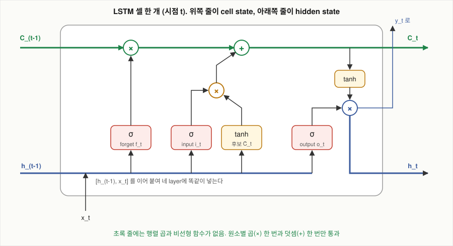

# LSTM은 vanilla RNN의 상태 갱신을 어떻게 바꾸었는가?

## 문제

vanilla RNN은 매 시점 hidden state 전체를 행렬 곱과 tanh로 새로 씁니다. LSTM(long short-term memory)은 cell state라는 상태를 하나 더 두고, 이전 값에 0과 1 사이의 계수를 곱해 남긴 뒤 새 값을 더하는 방식으로 갱신합니다. 무엇을 남기고 쓰고 내보낼지를 정하는 값을 gate라고 부릅니다. 수식을 한 줄씩 보고 2차원 예제로 한 시점을 직접 계산하고, 파라미터 수를 계산합니다.

## 아이디어

### 바꾼 것 한 가지

vanilla RNN은 매 시점 상태를 통째로 다시 씁니다.

$$
h_t = \tanh(W_{hh} h_{t-1} + W_{xh} x_t + b)
$$

LSTM은 상태를 하나 더 두고, 그 상태는 이전 값에 조금 곱하고 조금 더하는 방식으로만 바꿉니다.

$$
C_t = f_t \odot C_{t-1} + i_t \odot \tilde{C}_t
$$

- $\odot$: 원소별 곱. 같은 자리끼리 곱합니다. 행렬 곱이 아닙니다.
- $f_t$, $i_t$: 0과 1 사이 값으로 이뤄진 벡터. 뒤에서 설명합니다.

나머지는 전부 이 한 줄을 돌리기 위한 장치입니다. $f_t$가 1에 가깝고 $i_t$가 0에 가까운 차원은 $C_t \approx C_{t-1}$ 이 되어 값이 그대로 넘어갑니다. vanilla RNN에는 이런 경로가 없었습니다.

LSTM은 Hochreiter와 Schmidhuber가 1997년 논문에서 제안한 구조입니다. 아래 수식은 2000년에 forget gate가 추가된 뒤의 표준형이고, 그 경위는 [LSTM의 기울기 경로](07-lstm-gradient-path.md)에 있습니다. Olah의 글은 vanilla RNN의 반복 단위가 신경망 layer 하나인 데 비해 LSTM은 네 개의 layer가 정해진 방식으로 상호작용한다고 설명하고, cell state를 컨베이어 벨트에 빗댑니다. 벨트는 셀을 곧게 지나가고, 중간에 정보를 올리거나 내릴 수 있습니다.

LSTM에는 상태가 두 개 있습니다. cell state $C_t$ 는 여러 시점 동안 값이 거의 바뀌지 않고 넘어갈 수 있는 상태이고, hidden state $h_t$ 는 매 시점 현재 입력 $x_t$에 반응해 바뀌는 상태입니다.

## 수식으로 보기

### 전체 수식

$$
\begin{aligned}
f_t &= \sigma(W_f\,[h_{t-1}, x_t] + b_f) && \text{forget gate: 무엇을 남길까}\\
i_t &= \sigma(W_i\,[h_{t-1}, x_t] + b_i) && \text{input gate: 무엇을 쓸까}\\
\tilde{C}_t &= \tanh(W_C\,[h_{t-1}, x_t] + b_C) && \text{후보: 쓸 내용}\\
C_t &= f_t \odot C_{t-1} + i_t \odot \tilde{C}_t && \text{cell state 갱신}\\
o_t &= \sigma(W_o\,[h_{t-1}, x_t] + b_o) && \text{output gate: 무엇을 내보낼까}\\
h_t &= o_t \odot \tanh(C_t) && \text{hidden state, 출력}
\end{aligned}
$$

- $[h_{t-1}, x_t]$: 두 벡터를 이어 붙인 것. hidden이 $H$차원, 입력이 $D$차원이면 $H + D$차원.
- $\sigma$: sigmoid 함수 $\sigma(z) = 1/(1 + e^{-z})$. 출력이 0과 1 사이. $\sigma(0) = 0.5$, $\sigma(3) = 0.953$, $\sigma(-2) = 0.119$.
- $W_f, W_i, W_C, W_o$: 각각 $H \times (H + D)$ 행렬. 앞에서 말한 "네 개의 layer"가 이것입니다.

네 layer는 같은 입력 $[h_{t-1}, x_t]$ 를 받습니다. 가중치만 다릅니다.

### 한 줄씩

#### forget gate $f_t$

이전 cell state의 각 차원을 얼마나 남길지 정합니다. $[h_{t-1}, x_t]$ 에 가중치를 곱하고 sigmoid를 통과시켜 0과 1 사이 값을 만든 뒤 $C_{t-1}$ 에 원소별로 곱합니다.

이름은 forget이지만 값의 뜻은 "남기는 비율"입니다. $f = 1$이 기억, $f = 0$이 망각입니다. 차원마다 값이 다르므로 어떤 기억은 남기고 어떤 기억은 지우는 것이 한 시점에 같이 일어납니다.

#### input gate $i_t$ 와 후보 $\tilde{C}_t$

둘이 함께 새 정보를 cell state에 씁니다. 후보 $\tilde{C}_t$ 는 tanh로 $-1$과 $1$ 사이 값을 만들고, input gate $i_t$ 는 sigmoid로 후보의 각 차원을 얼마나 받아들일지 정합니다. 둘을 원소별로 곱한 값이 cell state에 더해집니다. 원소별 곱이므로 차원마다 따로 조절됩니다.

역할이 둘로 나뉜 이유는 다음과 같습니다.

- $\tilde{C}_t$: 무엇을 쓸지. 부호가 있어야 하므로 tanh($-1$~$1$). cell state의 값을 올릴 수도 내릴 수도 있어야 합니다.
- $i_t$: 얼마나 쓸지. 비율이므로 sigmoid(0~1).

#### cell state 갱신

$$
C_t = \underbrace{f_t \odot C_{t-1}}_{\text{남긴 과거}} + \underbrace{i_t \odot \tilde{C}_t}_{\text{새로 쓴 것}}
$$

ResNet의 식 $y = x + F(x)$ 와 같은 모양입니다. $x$ 자리에 $C_{t-1}$, $F(x)$ 자리에 $i_t \odot \tilde{C}_t$ 가 있고, $x$ 앞에 계수 $f_t$가 붙었습니다. 자세한 비교는 [LSTM의 기울기 경로](07-lstm-gradient-path.md)에 있습니다.

#### output gate $o_t$ 와 hidden state

갱신된 cell state를 tanh에 통과시킨 값에 output gate $o_t$ 를 원소별로 곱한 것이 hidden state $h_t$ 입니다.

cell state에 들어 있다고 전부 밖으로 내보내지 않습니다. 지금 예측에 필요한 부분만 $h_t$로 꺼냅니다. $h_t$는 두 곳으로 갑니다. output layer($y_t = W_{hy} h_t$)와 다음 시점의 네 layer 입력($[h_t, x_{t+1}]$)입니다. cell state $C_t$ 는 셀 밖의 어떤 layer에도 직접 연결되지 않습니다. 다음 시점의 자기 자신에게만 넘어갑니다.

### sigmoid와 tanh의 역할 분담

LSTM 수식에서 sigmoid는 세 게이트에, tanh는 후보 값과 출력에 쓰입니다. sigmoid는 0과 1 사이 값을 내므로 곱해서 통과시키는 비율로 쓰기에 맞고, tanh는 $-1$과 $1$ 사이 값을 내므로 cell state를 올리거나 내리는 값으로 쓰기에 맞습니다.

#### sigmoid와 tanh를 다시 쓰는 이유

AlexNet이 sigmoid와 tanh를 버리고 ReLU를 택한 이유는 이 함수들의 미분이 작아서 layer를 지날 때마다 기울기가 줄기 때문이었습니다. sigmoid의 미분은 최대 0.25이고, tanh의 미분은 입력이 0일 때만 1이고 그 밖에서는 1보다 작습니다. LSTM에서는 그 문제가 cell state 경로에 해당하지 않습니다. cell state가 다음 시점으로 넘어가는 길에는 sigmoid도 tanh도 없습니다. 원소별 곱 한 번과 덧셈 한 번뿐입니다. sigmoid와 tanh는 그 길의 옆에서 "얼마나 곱할지", "무엇을 더할지"를 계산하는 가지에만 있습니다.

### 주인공을 기억하는 예를 수식 기호로

이야기에 Alice가 나오고 몇 문장 뒤에 she를 예측해야 하는 경우를 생각합니다. LSTM은 그 정보를 $C_t$에 두었다가, 대명사를 예측할 때 $o_t$로 꺼내고, 주인공이 바뀌면 $f_t$로 지웁니다.

| 시점 | 일어나는 일 | 게이트 |
|---|---|---|
| "Alice"를 읽습니다 | 어떤 차원에 "주인공은 여성 단수"를 씁니다 | 그 차원의 $i_t \approx 1$ |
| 다음 수십 단어 | 그 차원을 그대로 둡니다 | $f_t \approx 1$, $i_t \approx 0$ |
| 대명사가 나올 자리 | 그 차원을 꺼내 출력에 반영합니다 | $o_t \approx 1$ |
| "Bob"이 새 주인공이 됩니다 | 그 차원을 지우고 새로 씁니다 | $f_t \approx 0$, $i_t \approx 1$ |

이것은 설명을 위한 이상적인 그림입니다. 실제 학습된 LSTM에서 개체 하나가 차원 하나에 깔끔하게 담긴다는 보장은 없습니다. 다만 단순한 과제에서는 실제로 그렇게 됩니다. [cell state 해석](09-interpreting-cell-state.md)에서 "지금 proof 안인가 lemma 안인가"를 나타내는 차원 하나를 찾아 찍어 봤습니다.

### 개발자라면: cell state를 캐시로 보면

| LSTM | 캐시 |
|---|---|
| cell state $C_t$ | 캐시에 들어 있는 값들 |
| forget gate | eviction 정책. 어떤 항목을 비울까 |
| input gate | write 정책. 들어온 값 중 무엇을 넣을까 |
| output gate | read 정책. 들어 있는 것 중 이번 요청에 무엇을 노출할까 |

보통 캐시는 이 정책을 사람이 정합니다(LRU, TTL). LSTM은 정책 자체를 데이터에서 학습하고 차원마다 다르게 적용합니다.

비유가 맞지 않는 부분도 있습니다.

- 캐시는 키로 찾습니다. cell state는 주소가 없는 고정 크기 벡터입니다. "어디에 무엇을 넣었는지" 조회할 수 없습니다.
- 캐시의 eviction은 0 아니면 1입니다. 게이트는 0.3 같은 중간값을 가지므로 기억이 서서히 흐려질 수 있습니다.
- 컨베이어 벨트 비유의 "정확한 순간에"라는 표현도 같은 주의가 필요합니다. 규칙이 있는 것처럼 들리지만 실제로는 학습된 연속값이고, 잘못 학습되면 잊지 말아야 할 것을 잊습니다.

## 작은 숫자로 직접 계산

### LSTM 한 시점

cell state를 2차원으로 잡습니다. 네 layer의 sigmoid, tanh에 들어가기 직전 값(행렬 곱의 결과)이 다음과 같이 나왔다고 가정합니다.

| | 차원 1 | 차원 2 |
|---|---|---|
| 이전 cell state $C_{t-1}$ | 0.8 | $-0.5$ |
| forget layer의 출력 (sigmoid 전) | 3.0 | $-2.0$ |
| input layer의 출력 (sigmoid 전) | $-1.0$ | 2.0 |
| 후보 layer의 출력 (tanh 전) | 0.5 | 1.5 |
| output layer의 출력 (sigmoid 전) | 0.0 | 2.0 |

1단계. 게이트와 후보를 계산합니다.

$$
f_t = \sigma([3.0, -2.0]) = [0.953,\; 0.119] \qquad i_t = \sigma([-1.0, 2.0]) = [0.269,\; 0.881]
$$
$$
\tilde{C}_t = \tanh([0.5, 1.5]) = [0.462,\; 0.905] \qquad o_t = \sigma([0.0, 2.0]) = [0.5,\; 0.881]
$$

2단계. cell state를 갱신합니다.

$$
C_t = [0.953 \times 0.8 + 0.269 \times 0.462,\;\; 0.119 \times (-0.5) + 0.881 \times 0.905] = [0.762 + 0.124,\;\; -0.060 + 0.797] = [0.886,\; 0.738]
$$

3단계. hidden state를 만듭니다.

$$
h_t = o_t \odot \tanh(C_t) = [0.5 \times 0.709,\;\; 0.881 \times 0.628] = [0.355,\; 0.553]
$$

두 차원이 다르게 움직였습니다.

| | 차원 1 | 차원 2 |
|---|---|---|
| forget | 0.953 (거의 다 남깁니다) | 0.119 (거의 다 지웁니다) |
| input | 0.269 (조금만 씁니다) | 0.881 (많이 씁니다) |
| 결과 | $0.8 \to 0.886$. **옛 값을 유지** | $-0.5 \to 0.738$. **새 값으로 교체** |
| output | 0.5 (절반만 내보냅니다) | 0.881 (대부분 내보냅니다) |

차원 1은 이전 값을 유지하는 중이고 차원 2는 "방금 새 정보를 받아 적은" 상태입니다. 한 셀 안에서 같은 시점에 두 가지가 같이 일어납니다. 같은 계산을 하는 `experiments/hand_calc.py`의 출력과 일치합니다([results/hand-calc.txt](results/hand-calc.txt)).

### char-rnn의 구성

Karpathy의 글은 Paul Graham의 에세이(약 1MB, 약 100만 글자)로 글자 단위 언어 모델을 학습시킨 실험을 소개하면서 구성을 이렇게 적었습니다. 2-layer LSTM, layer마다 hidden unit 512개, 파라미터 약 350만 개, 각 layer 뒤에 dropout 0.5.

### LSTM layer 하나의 파라미터 수

위 수식에서 본 대로 LSTM layer 하나에는 행렬이 네 개 있습니다($W_f, W_i, W_C, W_o$). 각 행렬은 $[h_{t-1}, x_t]$ 를 받아 hidden 크기의 벡터를 냅니다.

- 입력 차원 $D$, hidden 차원 $H$
- 행렬 하나: $H \times (H + D)$
- bias 하나: $H$

$$
\text{LSTM layer 하나} = 4 \times \big(H(H + D) + H\big)
$$

같은 크기의 vanilla RNN layer 하나는 $H(H + D) + H$ 입니다. LSTM은 같은 hidden 크기의 vanilla RNN보다 파라미터가 4배입니다. 게이트마다 가중치 행렬이 하나씩 필요하기 때문입니다.

### char-rnn의 파라미터 수 계산

글자 어휘 크기를 $V$라 하겠습니다. layer 1의 입력은 글자 one-hot($D = V$), layer 2의 입력은 layer 1의 hidden($D = 512$)입니다.

| 부분 | 식 | $V = 65$ | $V = 100$ |
|---|---|---|---|
| LSTM layer 1 | $4(512(512 + V) + 512)$ | 1,183,744 | 1,255,424 |
| LSTM layer 2 | $4(512(512 + 512) + 512)$ | 2,099,200 | 2,099,200 |
| output layer | $V \times 512 + V$ | 33,345 | 51,300 |
| **합계** | | **3,316,289** | **3,405,924** |

어휘가 65개든 100개든 약 330만~340만이고, 알려진 "약 350만"과 맞습니다.

영어 산문의 글자 어휘는 대소문자, 숫자, 문장부호를 합쳐 65~100개 범위에 들어오므로 양 끝을 계산했습니다. 구현에 따라 bias 개수는 조금 다릅니다. PyTorch의 표준 LSTM은 입력용과 순환용 bias를 따로 둬서 layer당 $4H$가 더 많습니다. 합계에 미치는 영향은 수천 개 수준입니다.

#### 숫자에서 읽을 것

- 파라미터의 대부분은 순환 행렬에 있습니다. layer 2의 210만 개 중 절반이 $h_{t-1}$을 받는 부분($4 \times 512 \times 512 = 1{,}048{,}576$)입니다. hidden을 2배로 늘리면 파라미터는 약 4배가 됩니다.
- 글자 단위라서 입출력 layer가 작습니다. output layer는 3~5만 개로 전체의 1~2%입니다. 단어 단위(어휘 5만)였다면 output layer만 $50{,}000 \times 512 = 2{,}560$만 개로 나머지 전체의 7배가 넘습니다.
- 데이터보다 파라미터가 많습니다. 학습 데이터는 약 100만 글자인데 파라미터는 350만 개입니다. 과적합하기 좋은 조건이고, 그래서 dropout 0.5를 씁니다. RNN에서는 dropout을 어느 연결에 거는지가 따로 문제가 됩니다.

실험에 쓴 모델로도 같은 식을 확인할 수 있습니다. `char_lstm.py`는 어휘 25, hidden 128, layer 1개이고 출력된 파라미터 수는 138,521입니다.

| 부분 | 계산 | 값 |
|---|---|---|
| 임베딩 | $25 \times 128$ | 3,200 |
| LSTM (PyTorch는 bias 두 벌) | $4(128(128 + 128) + 128 + 128)$ | 132,096 |
| output layer | $25 \times 128 + 25$ | 3,225 |
| 합계 | | 138,521 |

### GRU: 게이트를 줄인 변형

GRU(gated recurrent unit)는 2014년에 Cho 등이 제안했습니다. cell state를 따로 두지 않고 hidden state 하나만 쓰며, 게이트는 두 개입니다.

$$
\begin{aligned}
z_t &= \sigma(W_z\,[h_{t-1}, x_t]) && \text{update gate}\\
r_t &= \sigma(W_r\,[h_{t-1}, x_t]) && \text{reset gate}\\
\tilde{h}_t &= \tanh(W_h\,[r_t \odot h_{t-1},\; x_t]) && \text{후보}\\
h_t &= (1 - z_t) \odot h_{t-1} + z_t \odot \tilde{h}_t && \text{갱신}
\end{aligned}
$$

문헌에 따라 마지막 줄의 $z_t$ 와 $1 - z_t$ 자리가 서로 바뀌어 있습니다. 뜻은 같습니다.

마지막 줄을 LSTM의 cell state 갱신식과 비교하면 같은 모양입니다.

| | LSTM | GRU |
|---|---|---|
| 남기는 비율 | $f_t$ | $1 - z_t$ |
| 쓰는 비율 | $i_t$ (따로 학습) | $z_t$ (남기는 비율과 합이 1로 묶여 있습니다) |
| 상태 | $C_t$ 와 $h_t$ 두 개 | $h_t$ 하나 |
| 내보내기 조절 | output gate | 없습니다. 상태를 그대로 내보냅니다 |
| 행렬 수 | 4 | 3 |
| 파라미터 | vanilla의 4배 | vanilla의 3배 |

두 구조가 쓰는 장치는 같습니다. 이전 상태에 비율을 곱해 남기고 새 값을 더합니다. GRU는 "남기는 만큼 덜 쓴다"로 묶어서 게이트 하나를 줄였습니다. 두 구조를 여러 과제에서 비교한 연구(Greff 등 2015, Jozefowicz 등 2015)에서는 어느 쪽이 나은지가 과제마다 달랐습니다.

## 결과 해석

vanilla RNN은 매 시점 상태 전체를 행렬 곱과 tanh로 다시 씁니다. LSTM은 cell state의 각 차원을 남기는 비율($f_t$)과 새로 쓰는 비율($i_t$)로 따로 갱신하고, 밖으로 내보낼 부분은 $o_t$로 고릅니다. 손계산의 두 차원처럼 한 시점에 어떤 차원은 값을 유지하고 어떤 차원은 교체합니다. 그 대가로 같은 hidden 크기에서 파라미터가 vanilla RNN의 4배입니다. 이 구조가 기울기에 주는 영향은 [LSTM의 기울기 경로](07-lstm-gradient-path.md)에서 계산합니다.

## 확인 문제

1. 어떤 차원에서 $f_t = 1$, $i_t = 0$이 100시점 동안 유지되면 $C_{t+100}$의 그 차원 값은 얼마인가요? (답: $C_t$와 같습니다)
2. 위 손계산에서 forget layer의 sigmoid 전 값이 $[0, 0]$이었다면 $C_t$는 무엇인가요? (답: $f = [0.5, 0.5]$. $C_t = [0.4 + 0.124,\; -0.25 + 0.797] = [0.524,\; 0.547]$)
3. cell state가 밖으로 나가는 경로는 몇 개인가요? (답: 두 개. 다음 시점의 cell state로 가는 경로와, tanh와 output gate를 거쳐 $h_t$가 되는 경로)
4. hidden 256, 입력 256인 LSTM layer 하나의 파라미터 수는 얼마인가요? (답: $4(256 \times 512 + 256) = 525{,}312$)
5. 같은 크기의 GRU는 무엇인가요? (답: $3(256 \times 512 + 256) = 393{,}984$)
6. char-rnn의 hidden을 512에서 1024로 늘리면 layer 2의 파라미터는 약 몇 배가 되나요? (답: $4(1024 \times 2048 + 1024) = 8{,}392{,}704$. 약 4배)

## References

- [Long Short-Term Memory](https://www.bioinf.jku.at/publications/older/2604.pdf) (Hochreiter, Schmidhuber, 1997)
- [Understanding LSTM Networks](https://colah.github.io/posts/2015-08-Understanding-LSTMs/) (Olah, 2015)
- [Learning Phrase Representations using RNN Encoder-Decoder for Statistical Machine Translation](https://arxiv.org/abs/1406.1078) (Cho 등, 2014)
- [LSTM: A Search Space Odyssey](https://arxiv.org/abs/1503.04069) (Greff 등, 2015)
- [The Unreasonable Effectiveness of Recurrent Neural Networks](https://karpathy.github.io/2015/05/21/rnn-effectiveness/) (Karpathy, 2015)
- [An Empirical Exploration of Recurrent Network Architectures](https://proceedings.mlr.press/v37/jozefowicz15.html) (Jozefowicz, Zaremba, Sutskever, 2015)
