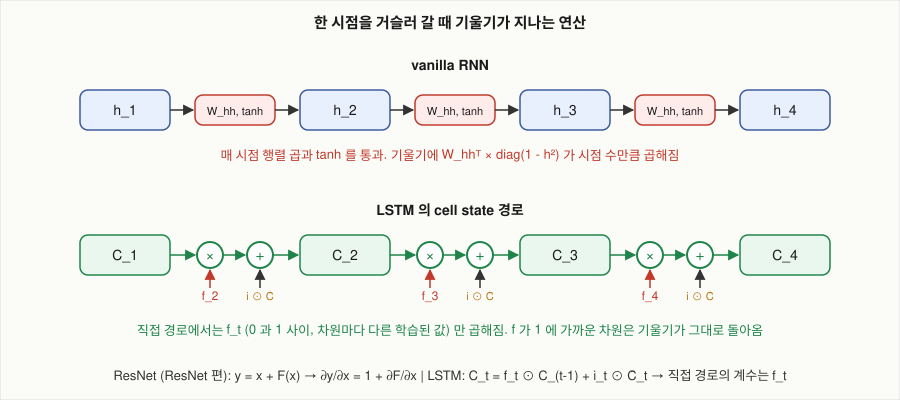

# LSTM의 cell state는 기울기가 지나는 경로를 어떻게 바꾸는가?

## 문제

vanilla RNN에서는 시점을 하나 거슬러 갈 때마다 기울기에 같은 행렬과 tanh의 미분이 곱해집니다. LSTM의 cell state 경로에서는 forget gate 값이 곱해집니다. 이 차이를 미분으로 확인하고, ResNet의 skip connection과 나란히 놓고, 학습된 모델에서 forget gate 값을 실제로 쟀습니다. 1997년의 구조에서 지금의 LSTM이 되기까지 바뀐 것도 함께 적습니다.

## 아이디어

### constant-error carousel (CEC)

1997년 설계의 출발점은 [BPTT](05-bptt.md)의 식입니다. 기울기가 한 칸 거슬러 갈 때 곱해지는 값이 1보다 작으면 소실되고 크면 폭발합니다. 그래서 정확히 1이 곱해지는 유닛을 만듭니다.

자기 자신으로 돌아오는 연결의 가중치를 1로 고정하고 활성화 함수를 항등 함수로 둡니다.

$$
C_t = C_{t-1} + (\text{새로 쓸 값}), \qquad \frac{\partial C_t}{\partial C_{t-1}} = 1
$$

오차(기울기)가 크기 변화 없이 이 유닛 안을 계속 돈다고 해서 "오차가 일정한 회전목마"라는 이름이 붙었습니다. 지금 식으로는 $f_t = 1$ 로 고정한 LSTM입니다. 이 구조는 ResNet의 잔차 연결 $y = x + F(x)$ 와 식이 같습니다(아래 「ResNet과의 대응」).

CEC만으로는 부족합니다. 아무 입력이나 다 더해지면 기억이 금방 오염되고, 기억한 것이 필요 없는 시점에도 출력을 흔듭니다. 그래서 1997년 논문은 gate 두 개를 붙였습니다.

- input gate: 언제 CEC에 쓸지 (쓰기 보호)
- output gate: 언제 CEC의 내용을 밖에 보일지 (읽기 보호)

### forget gate가 추가된 이유

CEC는 한번 들어온 값을 버릴 방법이 없습니다. 1997년 논문의 실험은 시퀀스가 하나씩 따로 주어지고 시작할 때마다 상태를 0으로 되돌렸기 때문에 문제가 드러나지 않았습니다. 끊김 없이 이어지는 입력(연속 텍스트, 음성 스트림)에서는 cell state가 계속 쌓여 커지고, 커진 값이 tanh를 포화시켜 셀이 쓸모없어집니다.

2000년의 해법은 CEC의 고정 가중치 1을 학습되는 게이트 $f_t$ 로 바꾸는 것이었습니다.

$$
C_t = C_{t-1} + i_t \odot \tilde{C}_t \quad\longrightarrow\quad C_t = f_t \odot C_{t-1} + i_t \odot \tilde{C}_t
$$

기울기 보존이라는 원래 목적에서 보면 한 발 물러선 것입니다. $f_t < 1$ 이면 기울기가 다시 줄어듭니다. 대신 언제 줄일지를 모델이 고릅니다. 기억할 구간에서는 $f \approx 1$ 로 CEC처럼 동작하고, 문맥이 바뀌면 $f \approx 0$ 으로 비웁니다. 주인공이 바뀌면 이전 주인공 정보를 $f_t$ 로 지우는 것이 이 동작입니다.

Olah의 그림과 PyTorch의 `nn.LSTM` 은 모두 이 2000년판입니다.

### 연표

| 연도 | 사건 | 무엇이 바뀌었나 |
|---|---|---|
| 1991 | Hochreiter의 학위 논문 | RNN의 기울기 소실을 분석했습니다 |
| 1997 | Hochreiter, Schmidhuber. *Long Short-Term Memory* | constant-error carousel, input gate, output gate. forget gate 없음 |
| 2000 | Gers, Schmidhuber, Cummins. *Learning to Forget* | forget gate 추가 |
| 2000~2002 | Gers, Schmidhuber (2000), Gers, Schraudolph, Schmidhuber (2002) | peephole connection 추가 |
| 2013~2014 | Graves의 필기 생성, Sutskever 등의 seq2seq | LSTM이 실제 과제에서 성과를 냅니다 |
| 2014 | Zaremba, Sutskever, Vinyals | LSTM에 맞는 dropout |
| 2014 | Cho 등 | GRU ([LSTM](06-lstm.md)) |
| 2015 | Karpathy, Olah의 블로그 | RNN과 LSTM이 널리 알려집니다 |
| 2015 | Jozefowicz, Zaremba, Sutskever | 구조 탐색. forget gate bias 초기화의 중요성 |

peephole은 2000년 학회 발표에서 처음 나왔고 2002년 저널 논문에서 정리됐습니다.

구조는 1997년에 나왔고 널리 쓰이기까지 15년 넘게 걸렸습니다.

## 수식으로 보기

### cell state 한 칸의 미분

cell state 갱신식입니다.

$$
C_t = f_t \odot C_{t-1} + i_t \odot \tilde{C}_t
$$

$C_{t-1}$ 에 대해 미분합니다. 먼저 $f_t$, $i_t$, $\tilde{C}_t$ 를 상수로 취급하면(이것들은 $C_{t-1}$ 이 아니라 $h_{t-1}$ 과 $x_t$ 로 계산됩니다) 다음과 같습니다.

$$
\frac{\partial C_t}{\partial C_{t-1}} \bigg|_{\text{직접 경로}} = \text{diag}(f_t)
$$

여러 시점에 걸치면 곱이 됩니다.

$$
\frac{\partial C_t}{\partial C_k} \bigg|_{\text{직접 경로}} = \prod_{j=k+1}^{t} \text{diag}(f_j) = \text{diag}\Big(\prod_{j=k+1}^{t} f_j\Big)
$$

대각 행렬끼리의 곱은 대각 원소끼리의 곱입니다. 차원끼리 섞이지 않습니다. 차원 $d$의 기울기는 그 차원의 forget 값들의 곱 $\prod_j f_j[d]$ 만큼만 줄어듭니다.

### vanilla RNN과 나란히

| | vanilla RNN | LSTM cell state (직접 경로) |
|---|---|---|
| 한 칸의 야코비안 | $\text{diag}(1 - h_t^2)\; W_{hh}$ | $\text{diag}(f_t)$ |
| 행렬의 모양 | 꽉 찬 행렬. 차원을 섞습니다 | 대각 행렬. 차원을 섞지 않습니다 |
| 값을 누가 정하나 | $W_{hh}$ 는 모든 시점에 같은 값. tanh 미분은 상태에 따라 | 시점마다, 차원마다 모델이 계산합니다 |
| $n$칸의 곱 | $\approx (\gamma \sigma_{\max})^n$. 한 방향으로 쏠립니다 | $\prod f_j[d]$. 차원별로 따로 |
| 기억하고 싶은 차원에서 | 방법이 없습니다 | $f \approx 1$ 로 두면 기울기가 그대로 돌아옵니다 |
| 활성화 함수를 지나나 | 매번 tanh | 지나지 않습니다 |



#### 숫자로

어떤 차원에서 forget gate가 50시점 동안 계속 0.99였다면 기울기는 $0.99^{50} = 0.605$ 배가 됩니다. 0.999였다면 $0.951$ 배입니다. vanilla RNN에서 $0.9^{50} = 0.005$ 였던 것과 비교하면 됩니다.

반대로 forget gate가 0.5였다면 $0.5^{50} \approx 10^{-15}$ 로 소실됩니다. 그런데 이것은 문제가 아닙니다. 모델이 그 차원을 잊기로 한 것이기 때문입니다. 순전파에서 값이 $0.5^{50}$ 배로 지워졌으니 역전파에서 기울기가 같은 비율로 줄어드는 것이 맞습니다.

### 직접 경로가 전부는 아니다

위에서 $f_t$, $i_t$, $\tilde{C}_t$ 를 상수로 취급했습니다. 실제로는 이 셋이 $h_{t-1}$ 에 의존하고 $h_{t-1} = o_{t-1} \odot \tanh(C_{t-1})$ 이므로, $C_{t-1}$ 에서 $C_t$ 로 가는 간접 경로가 있습니다.

```
C_{t-1} ──────────────( × f_t )────────( + )──────▶ C_t        직접 경로: 곱 한 번, 덧셈 한 번
   │                      ▲               ▲
   └─▶ tanh ─▶ (× o) ─▶ h_{t-1} ─▶ [W_f, W_i, W_C 와 σ, tanh] ─┘      간접 경로: vanilla RNN 과 같은 종류
```

전체 야코비안은 두 경로의 합입니다.

$$
\frac{\partial C_t}{\partial C_{t-1}} = \underbrace{\text{diag}(f_t)}_{\text{직접}} + \underbrace{(\text{행렬 곱과 sigmoid, tanh 미분을 지나는 항들})}_{\text{간접}}
$$

간접 경로는 vanilla RNN과 같은 이유로 거리가 멀어지면 소실됩니다. 그래도 학습이 되는 이유는 전체가 두 항의 합이기 때문입니다. 한 항이 0으로 가도 다른 항이 살아 있으면 합은 살아 있습니다. ResNet의 skip connection에서와 같은 논리입니다.

### ResNet과의 대응

ResNet의 잔차 블록과 나란히 놓습니다.

| | ResNet | LSTM |
|---|---|---|
| 식 | $y = x + F(x)$ | $C_t = f_t \odot C_{t-1} + i_t \odot \tilde{C}_t$ |
| 그대로 넘어가는 것 | $x$ | $C_{t-1}$ |
| 새로 더해지는 것 | $F(x)$ | $i_t \odot \tilde{C}_t$ |
| 넘어가는 경로의 계수 | 1 (고정) | $f_t$ (학습, 0~1, 시점과 차원마다 다릅니다) |
| 야코비안 | $I + \partial F / \partial x$ | $\text{diag}(f_t) + (\text{간접 항})$ |
| 깊이의 방향 | layer | 시간 |
| 풀려는 문제 | layer가 깊어지면 학습이 안 됩니다 | 시퀀스가 길어지면 학습이 안 됩니다 |
| 연도 | 2015 | 1997 (forget gate는 2000) |

두 구조 모두 기울기가 지나갈 길 하나를 행렬 곱과 비선형 함수 없이 덧셈으로만 이어 둡니다.

#### 계수가 고정 1인 것과 학습되는 것의 차이

- 1997년의 원래 LSTM에는 forget gate가 없었습니다. $f_t = 1$ 고정이었고 이것이 ResNet의 $y = x + F(x)$ 와 같은 구조입니다(위의 「constant-error carousel」).
- 시간 방향에서는 고정 1이 문제를 만듭니다. layer는 수십~수백 개에서 끝나지만 시퀀스는 끝없이 이어질 수 있습니다. 버릴 방법이 없으면 cell state에 계속 쌓입니다. 그래서 forget gate가 추가됐습니다.
- ResNet v2는 반대 방향으로 갔습니다. 덧셈 경로 위에 있던 ReLU를 치워서 그 경로를 항등 경로에 더 가깝게 만들었습니다. skip connection 뒤에 ReLU를 두면 음수 값이 거기서 0이 되어 항등 경로가 깨지기 때문입니다. LSTM의 cell state 경로에 tanh나 sigmoid가 없는 것과 같은 설계 판단입니다.

ResNet과 LSTM 사이의 직접적인 계보도 있습니다. Highway Network(Srivastava, Greff, Schmidhuber, 2015)는 LSTM의 게이트를 깊은 feed-forward 네트워크의 layer 방향에 옮긴 것으로, $y = T(x) \odot F(x) + (1 - T(x)) \odot x$ 형태입니다. ResNet은 여기서 게이트를 떼고 계수를 1로 고정한 경우로 볼 수 있습니다. ResNet 논문도 Highway Network를 게이트가 달린 shortcut의 선행 연구로 인용합니다.

### peephole connection

표준 LSTM에서 게이트는 $[h_{t-1}, x_t]$ 만 봅니다. cell state $C_{t-1}$ 을 직접 보지 못합니다. output gate가 닫혀 있으면 $h_{t-1} = o_{t-1} \odot \tanh(C_{t-1}) \approx 0$ 이므로, 게이트는 자기가 관리하는 기억에 무엇이 들어 있는지 모르는 채로 결정을 내립니다.

peephole은 게이트의 입력에 cell state를 추가하는 연결입니다.

$$
f_t = \sigma(W_f\,[h_{t-1}, x_t] + w_f \odot C_{t-1} + b_f)
$$

정확한 간격을 세어야 하는 과제에서 도움이 된다고 보고됐습니다. 지금 널리 쓰는 구현(PyTorch 등)에는 기본으로 들어 있지 않습니다. 2015년의 LSTM 변형 비교 연구에서는 peephole을 넣든 빼든 성능 차이가 크지 않았습니다.

### forget gate bias 초기화

가중치를 0 근처의 작은 값으로 초기화하면 학습 시작 시점에 $f_t = \sigma(\approx 0) \approx 0.5$입니다. 위의 「숫자로」에서 계산한 대로 $0.5^{50} \approx 10^{-15}$ 입니다. 학습을 시작하는 순간의 LSTM은 vanilla RNN만큼 기울기가 소실되는 상태입니다. 장거리 신호가 오지 않으니 forget gate를 열어야 한다는 것도 배우기 어렵습니다.

해법은 forget gate의 bias $b_f$ 를 1이나 2 같은 양수로 초기화하는 것입니다. $\sigma(1) = 0.73$, $\sigma(2) = 0.88$ 이므로 "일단 기억하고 시작"합니다. 2000년 forget gate 논문이 이미 권했고, 2015년 구조 탐색 논문(Jozefowicz, Zaremba, Sutskever)이 이 초기화를 다시 권했습니다.

## 실험 결과

### 학습된 모델의 forget gate 값

[cell state 해석](09-interpreting-cell-state.md)에서 찾은 cell state 차원 하나(같은 일을 나눠 맡은 차원이 두 개 더 있습니다)는 `\begin{proof}` 를 읽은 뒤 음수로, `\begin{lemma}` 를 읽은 뒤 양수로 가서 줄 끝의 `\end{` 까지 그 부호를 유지합니다(평균 $-4.80$ 대 $+3.73$). 40 epoch 학습한 LSTM(seed 하나)에서 본문 구간의 forget gate 값을 재면(`experiments/fgate.py`, [results/fgate.txt](results/fgate.txt)) 분리도가 가장 큰 세 차원 가운데 차원 69와 61은 평균 0.999, 차원 88은 평균 0.870입니다. 128개 차원 전체의 평균은 0.525입니다. 29시점을 거슬러 갈 때 직접 경로의 기울기는 $0.999^{29} \approx 0.97$ 배로 거의 그대로이고, $0.870^{29} \approx 0.018$ 배로는 많이 줄어듭니다. 값을 오래 유지하는 두 차원에서는 "환경 이름을 기억해 두면 나중에 loss가 준다"는 신호가 그 거리를 거슬러 전달될 수 있었습니다. vanilla RNN은 같은 조건에서 이것을 배우지 못했습니다([먼 거리의 짝 맞추기](08-long-term-dependency.md)).

### forget gate bias를 바꾼 결과

합성 말뭉치에서 forget gate bias의 초기값만 바꿔 학습시켰습니다(seed 하나, [results/forget-bias.txt](results/forget-bias.txt)). PyTorch의 `nn.LSTM` 은 bias를 작은 균등 분포로 초기화하므로 $f \approx 0.5$ 에서 출발합니다. 이 기본값으로는 LSTM이 6 epoch까지 환경 이름을 못 맞히고(62 대 64) 12 epoch에서야 맞힙니다. forget bias를 1로 두고 시작하면 6 epoch에서 이미 전부 맞힙니다(125 대 0, perplexity 1.535 대 1.512). 자세한 것은 [먼 거리의 짝 맞추기](08-long-term-dependency.md)에 있습니다.

## 결과 해석

vanilla RNN에서는 시점을 하나 거슬러 갈 때마다 꽉 찬 행렬 $W_{hh}$ 와 tanh의 미분이 곱해집니다. LSTM의 cell state 직접 경로에서는 그 자리에 차원별 값 $f_t$ 가 곱해집니다. LSTM에서도 $f_t$ 가 1보다 작은 차원의 기울기는 줄어듭니다. 달라진 것은 어느 차원을 얼마나 유지할지를 모델이 학습으로 정한다는 점입니다. 위 측정에서 환경 이름을 담은 세 차원 가운데 둘은 forget gate 평균이 0.999였고, 128개 차원 전체의 평균은 0.525였습니다.

## 한계와 주의할 점

- 위 계산은 직접 경로만 본 것입니다. 간접 경로의 기울기는 vanilla RNN과 같은 이유로 거리가 멀어지면 줄어듭니다.
- forget gate 값은 합성 말뭉치 하나, seed 하나로 학습한 모델에서 잰 것입니다. 세 차원 가운데 차원 88은 평균 0.870, 최소 0.045로 값을 오래 유지하지 않았습니다.
- 학습 시작 시점에는 $f_t \approx 0.5$ 라서 직접 경로도 기울기를 거의 전달하지 못합니다. forget gate bias 초기화가 결과를 바꾼 이유입니다.

## 확인 문제

1. forget gate가 모든 차원에서 항상 1이고 input gate가 항상 0이면 LSTM의 cell state는 무엇을 하나요? (답: 초기값이 바뀌지 않고 계속 유지됩니다. 새 정보를 쓰지 못하므로 아무것도 배우지 못합니다)
2. 어떤 차원의 forget 값이 100시점 동안 0.98이었습니다. 직접 경로의 기울기는 몇 배가 되나요? (답: $0.98^{100} = 0.133$)
3. ResNet의 야코비안 $I + \partial F/\partial x$ 에서 $I$ 가 하는 일과 같은 역할을 LSTM에서 하는 것은 무엇인가요? (답: $\text{diag}(f_t)$. $f_t \approx 1$ 일 때 $I$ 와 같아집니다)
4. 1997년판 LSTM에서 $\partial C_t / \partial C_{t-1}$ 의 직접 경로 값은 얼마인가요? (답: 정확히 1)
5. forget gate가 없으면 연속 텍스트에서 생기는 문제는 무엇인가요? (답: cell state에 값이 계속 쌓여 커지고 tanh가 포화됩니다)
6. 학습 시작 시 $b_f = 0$ 이면 30시점 거리의 직접 경로 기울기는 대략 몇 배인가요? $b_f = 2$ 면 몇 배인가요? (답: $0.5^{30} \approx 10^{-9}$. $0.88^{30} \approx 0.022$)

## References

- [Long Short-Term Memory](https://www.bioinf.jku.at/publications/older/2604.pdf) (Hochreiter, Schmidhuber, 1997)
- [An Empirical Exploration of Recurrent Network Architectures](https://proceedings.mlr.press/v37/jozefowicz15.html) (Jozefowicz, Zaremba, Sutskever, 2015)
- [LSTM: A Search Space Odyssey](https://arxiv.org/abs/1503.04069) (Greff 등, 2015)
- [On the difficulty of training Recurrent Neural Networks](https://arxiv.org/abs/1211.5063) (Pascanu, Mikolov, Bengio, 2013)
- [Highway Networks](https://arxiv.org/abs/1505.00387) (Srivastava, Greff, Schmidhuber, 2015)
- Gers, Schmidhuber, Cummins. Learning to Forget: Continual Prediction with LSTM. Neural Computation, 2000
