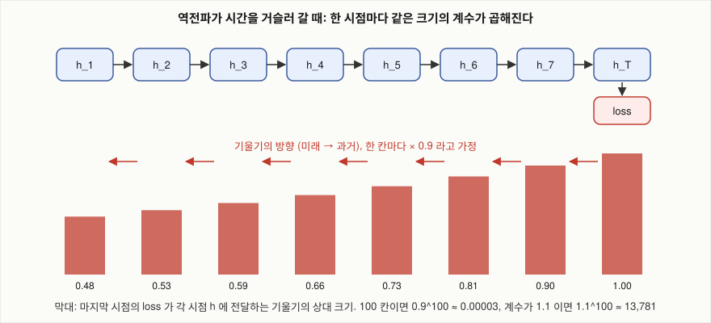

# vanilla RNN과 LSTM은 먼 거리의 짝 맞추기에서 얼마나 다르게 동작하는가?

## 문제

Karpathy의 글에는 LaTeX 소스를 학습한 multi-layer LSTM이 `\begin{proof}` 로 연 환경을 `\end{lemma}` 로 닫는 실수가 나옵니다. 여는 이름과 닫는 이름 사이의 거리를 평균 29글자로 줄인 합성 말뭉치를 만들어, 이 거리에서 n-gram, vanilla RNN, LSTM이 어떻게 갈리는지 쟀습니다. perplexity와 환경 짝 정답률을 함께 봅니다.

## 아이디어

### 두 가지 예

#### France와 French

Olah의 글에 나오는 예입니다. "I grew up in France … I speak fluent French." 에서 French를 맞히려면 네트워크가 앞에 나온 France를 기억해야 합니다. 사이에 단어가 많이 끼어 있어도 그렇습니다. RNN은 사이에 낀 단어가 늘어날수록 정보를 잇는 데 어려움을 겪습니다.

#### `\begin{proof}` 와 `\end{lemma}`

Karpathy의 글에 나오는 예입니다. 대수기하학 교재의 LaTeX 소스로 학습한 모델은 문법에 맞는 수식을 자주 만들었지만 실수도 했습니다. LaTeX에서 proof, lemma 같은 환경은 같은 이름의 명령으로 열고 닫아야 합니다. 모델은 `\begin{proof}`로 시작해 놓고 `\end{lemma}`로 닫기도 했고, `\begin{enumerate}`를 열고 닫는 것을 잊기도 했습니다. 환경을 연 지 한참 지나 닫을 때가 되면 모델은 자기가 proof 안에 있었는지 lemma 안에 있었는지를 놓칩니다. 글은 모델을 키우면 이런 오류가 준다고 적었습니다.

이 실수를 낸 모델은 vanilla RNN이 아니라 16MB짜리 소스로 학습한 multi-layer LSTM입니다. LSTM도 증명 하나가 끝날 만큼 먼 거리에서는 환경 이름을 놓쳤다는 뜻입니다.

두 예의 공통점은 다음과 같습니다.

- 답을 정하는 데 필요한 정보가 한참 앞에 있습니다.
- 그 사이에는 그 정보와 무관한 입력이 많이 끼어 있습니다.
- 가까운 문맥만으로는 그럴듯한 오답이 여러 개 있습니다 (fluent 다음에는 어떤 언어 이름이든 올 수 있습니다).

### 원인: 기울기가 시간을 거슬러 가며 줄어든다

RNN을 시간 방향으로 펼치면 100단어짜리 입력은 layer 100개짜리 네트워크가 됩니다. 깊은 네트워크의 기울기 소실 문제가 그대로 생깁니다. 첫 단어가 마지막 예측에 준 영향을 알려 주는 기울기는 거리가 늘수록 지수적으로 작아지고, 모델은 먼 의존성에 대한 학습 신호를 거의 받지 못합니다.

#### 직관

학습은 "이 가중치를 조금 바꾸면 loss가 얼마나 변하나"(기울기)를 따라 움직입니다. France를 기억하는 법을 배우려면 다음 신호가 전달되어야 합니다.

> "시점 5에서 France에 대한 정보를 hidden state에 남겨 뒀더라면, 시점 30에서 French의 확률이 올라가서 loss가 줄었을 것입니다."

이 신호는 시점 30에서 시점 5까지 25칸을 거슬러 가야 합니다. 한 칸을 거슬러 갈 때마다 기울기에는 $W_{hh}^\top$ 와 tanh의 미분이 곱해집니다. 이 곱의 크기가 대략 0.9라면 다음과 같습니다.

| 거슬러 가는 칸 수 | 기울기에 곱해지는 값 ($0.9^k$) |
|---|---|
| 10 | 0.349 |
| 25 | 0.072 |
| 50 | 0.0052 |
| 100 | 0.000027 |



신호가 0에 가까워지면 "France를 기억해 두면 좋다"는 것을 배울 방법이 없습니다. 반대로 가까운 문맥에서 오는 신호는 크기가 그대로이므로, 학습은 가까운 패턴(철자, 단어, 구문)만 잘 익힌 상태에 머뭅니다. 곱해지는 값이 1보다 크면 반대로 발산합니다(기울기 폭발, $1.1^{100} \approx 13{,}781$).

깊은 네트워크의 신호 감쇠와 방향만 다릅니다. 깊은 CNN에서는 layer를 지나며 신호가 약해졌고, 여기서는 시점을 지나며 약해집니다. RNN은 매 시점 같은 $W_{hh}$ 가 곱해진다는 점이 다르고, 그 영향은 [BPTT](05-bptt.md)에서 계산합니다.

### RNN의 어려움 세 가지

여기서 다루는 RNN의 어려움은 세 가지입니다. (1) 기울기 소실 또는 폭발, (2) 먼 거리의 의존성을 잘 다루지 못함, (3) 시간 방향으로 순서대로만 계산할 수 있어 학습이 느림.

| 걸림돌 | 원인 | 문서 | 해법 |
|---|---|---|---|
| 기울기 소실, 폭발 | 같은 행렬의 반복 곱 | [BPTT](05-bptt.md) | 소실은 LSTM, 폭발은 gradient clipping |
| 장거리 의존성 | 위의 결과 | 이 문서 | LSTM |
| 비효율적인 학습 | 시간 방향 순차 계산 | [순환 구조의 한계](10-limits-of-recurrence.md) | 여러 GPU와 시스템 최적화(Deep Speech 2), 그 뒤 attention |

(1)이 원인이고 (2)가 증상입니다. 여기에 과적합을 네 번째로 더할 수 있습니다. RNN은 키우면 쉽게 과적합했고, dropout을 어디에 걸어야 하는지가 따로 문제였습니다.

## 코드로 확인

### 말뭉치

`experiments/make_corpus.py`가 만드는 합성 말뭉치입니다. 한 줄이 환경 하나입니다.

```
\begin{lemma} let set so have we map by \end{lemma}
\begin{lemma} then and map map a so be \end{lemma}
\begin{proof} x holds x map the y \end{proof}
```

| 항목 | 값 |
|---|---|
| 줄 수 | 3,000 |
| 글자 수 | 148,458 |
| 어휘 | 25글자 |
| 환경 | proof, lemma (각 50%) |
| 본문 | 15개 단어에서 무작위로 4~9개 |
| 환경 이름까지의 거리 | 14~47글자, 평균 29글자 |

설계 의도는 두 가지입니다. (1) 가까운 구조(철자, 명령어, 중괄호)는 쉽게 배울 수 있어야 합니다. (2) 환경 이름은 멀리 있는 정보 없이는 맞힐 수 없어야 합니다. 본문에 단서가 없으므로 기억하지 못하면 정답률은 50%입니다.

### 모델

```python
class CharModel(nn.Module):
    def __init__(self, vocab, hidden, layers, cell, dropout):
        super().__init__()
        self.embed = nn.Embedding(vocab, hidden)                      # one-hot 곱 대신 조회
        rnn_cls = nn.LSTM if cell == "lstm" else nn.RNN               # 여기만 바뀐다
        self.rnn = rnn_cls(hidden, hidden, num_layers=layers, batch_first=True,
                           dropout=dropout if layers > 1 else 0.0)
        self.out = nn.Linear(hidden, vocab)

    def forward(self, x, state=None):
        h, state = self.rnn(self.embed(x), state)     # h: (batch, time, hidden)
        return self.out(h), state, h
```

- `nn.RNN` 은 [RNN](04-rnn.md)의 tanh RNN입니다.
- `nn.LSTM` 은 [LSTM](06-lstm.md)의 여섯 줄 수식입니다. `state` 가 `(h, C)` 튜플로 돌아옵니다.
- PyTorch의 `dropout` 인자는 layer 사이에만 걸립니다(마지막 layer 제외). Zaremba, Sutskever, Vinyals(2014)가 제안한 방식과 같습니다.

Karpathy의 Paul Graham 생성기 구성은 `--layers 2 --hidden 512 --dropout 0.5`입니다.

### 학습 루프에서 볼 세 줄

```python
for x, y in batches(train, a.batch, a.seq):
    logits, state, _ = model(x, detach(state))                 # (1) truncated BPTT
    loss = lossf(logits.reshape(-1, len(chars)), y.reshape(-1))
    opt.zero_grad(); loss.backward()                           # (2) BPTT 는 자동 미분이 해 준다
    nn.utils.clip_grad_norm_(model.parameters(), 1.0)          # (3) gradient clipping
    opt.step()
```

1. `detach(state)`: 이전 조각의 마지막 상태를 값으로만 이어받습니다. 이것을 빼면 계산 그래프가 말뭉치 처음까지 이어져서 메모리가 부족해집니다([BPTT](05-bptt.md)의 truncated BPTT 설명).
2. `loss.backward()`: numpy에서 열 줄로 짠 것을 프레임워크가 합니다. LSTM의 역전파를 손으로 짜면 수십 줄입니다.
3. `clip_grad_norm_`: 기울기 전체의 노름이 1을 넘으면 줄입니다([BPTT](05-bptt.md)의 gradient clipping 설명).

numpy 구현과 다른 점이 하나 더 있습니다. 배치입니다. 말뭉치를 32개의 평행한 줄기로 나눠 동시에 학습합니다. 시간 방향은 병렬화할 수 없지만 배치 방향은 할 수 있습니다([순환 구조의 한계](10-limits-of-recurrence.md)).

## 실험 결과

### 환경 짝 맞추기 비교

세 모델을 같은 말뭉치로 학습시키고, 생성한 텍스트(temperature 0.5, 6,000글자)에서 환경 짝이 맞는 줄을 세었습니다. 코드는 `experiments/`에, 실행 방법은 [README](README.md)에 있습니다.

| 모델 | 시험 perplexity | 맞게 닫음 | 틀리게 닫음 | 정답률 |
|---|---|---|---|---|
| n-gram (문맥 4, $\alpha = 0.01$) | 1.604 | 35 | 34 | 51% |
| n-gram (문맥 8, $\alpha = 0.01$) | 1.782 | 64 | 57 | 53% |
| vanilla RNN, numpy (hidden 96, $T = 0.5$) | 1.561 | 73 | 63 | 54% |
| vanilla RNN, PyTorch (hidden 128, 40 epoch, $T = 0.5$) | 1.542 | 57 | 68 | 46% |
| LSTM, PyTorch (hidden 128, 40 epoch, $T = 0.5$) | 1.511 | 126 | 0 | 100% |

vanilla RNN이 만든 텍스트의 앞부분입니다.

```
\begin{proof} then let holds the by \end{lemma}
\begin{lemma} and by by let holds \end{proof}
\begin{proof} and then \end{proof}
```

`\begin{`, 단어 철자, 공백, `\end{`, 중괄호 닫기까지 가까운 구조는 전부 맞습니다. 틀리는 것은 멀리 있는 정보가 필요한 환경 이름 하나뿐입니다. Karpathy의 글에 나온 실수와 같은 모양입니다. n-gram은 temperature 없이 분포 그대로 샘플링했습니다.

PyTorch 두 모델의 실행 출력입니다([results/rnn.txt](results/rnn.txt), [results/lstm.txt](results/lstm.txt)). 파라미터 수와 temperature별 환경 짝 수가 함께 나옵니다.

```
$ python3 char_lstm.py --cell rnn --epochs 40
params 39449
epoch 10 test PP 1.542   epoch 20 test PP 1.539   epoch 40 test PP 1.542   (27초)
T=0.2 closer ok/bad=(73, 55)
T=0.5 closer ok/bad=(57, 68)
T=1.0 closer ok/bad=(56, 52)

$ python3 char_lstm.py --cell lstm --epochs 40
params 138521
epoch 10 test PP 1.512   epoch 20 test PP 1.508   epoch 40 test PP 1.511   (65초)
T=0.2 closer ok/bad=(133, 0)
T=0.5 closer ok/bad=(126, 0)
T=1.0 closer ok/bad=(116, 0)
T=1.5 closer ok/bad=(98, 10)
```

### epoch 6에서의 LSTM

epoch 수를 6으로 줄이면 LSTM도 환경 이름을 맞히지 못합니다.

```
$ python3 char_lstm.py --cell lstm --epochs 6
epoch 6 test PP 1.535
T=0.5 closer ok/bad=(62, 64)
```

### 파라미터 수를 맞춘 vanilla RNN

hidden 크기를 128로 맞췄기 때문에 LSTM이 파라미터가 3.5배 많습니다. 공정한 비교인지 확인하려고 vanilla RNN의 hidden을 256으로 키워 파라미터 수를 맞춘 뒤 다시 돌렸습니다.

```
$ python3 char_lstm.py --cell rnn --hidden 256 --epochs 40
params 144409
epoch 40 test PP 1.556
T=0.5 closer ok/bad=(78, 57)
```

파라미터가 LSTM보다 많은데도(144,409 대 138,521) 정답률은 58%로 무작위로 고른 수준에 가깝고 perplexity는 1.556으로 조금 높아졌습니다. 환경 이름 1비트를 담기에 256차원이 부족하지는 않으므로, 이 결과는 용량이 아니라 기울기 전달 쪽의 문제로 읽는 것이 맞습니다.

### forget gate bias의 초기값

[LSTM의 기울기 경로](07-lstm-gradient-path.md)에서 설명한 forget gate bias 초기화를 확인했습니다. `--forget-bias 1.0` 은 forget gate의 bias 합을 1로 초기화합니다.

| 초기화 | 6 epoch 뒤 perplexity | 6 epoch 뒤 환경 짝 | 12 epoch 뒤 환경 짝 |
|---|---|---|---|
| PyTorch 기본값 ($f \approx 0.5$ 에서 출발) | 1.535 | 62 / 64 | 127 / 0 |
| forget bias 1 ($f \approx 0.73$ 에서 출발) | 1.512 | 125 / 0 | 130 / 0 |

기본값으로는 6 epoch에서 못 배우고 12 epoch에서 배웁니다. bias를 1로 두면 6 epoch에서 이미 배웁니다. 학습 시작 시점의 forget gate 값이 0.5인지 0.73인지에 따라 직접 경로로 전달되는 기울기의 크기가 달라지기 때문입니다([LSTM의 기울기 경로](07-lstm-gradient-path.md)).

## 결과 해석

이 말뭉치에서 vanilla RNN은 환경 이름을 46%(57/125) 맞혔고 LSTM은 100%(126/126) 맞혔습니다. perplexity는 1.542와 1.511로 비슷합니다.

1. vanilla RNN은 n-gram과 같은 곳에서 틀렸습니다. hidden state에 환경 이름을 담는 것은 원리상 가능하지만 학습으로 거기에 이르지 못했습니다([RNN](04-rnn.md)).
2. 환경 이름을 고르는 결정은 한 줄에 한 번뿐이라 평균 지표인 perplexity에는 작게 반영됩니다.
3. LSTM은 장거리 신호를 받을 수 있는 구조이고, 실제로 배우는 데는 학습량과 초기화가 영향을 줬습니다. 6 epoch에서는 LSTM도 62/126이었습니다.

perplexity 1.535에서 1.511로 내려가는 구간 어딘가에서 짝 맞추기를 배웁니다. 환경 이름 하나를 찍느냐 아느냐의 차이는 줄당 $\ln 2 = 0.69$ nat이고, 한 줄이 평균 약 49글자(148,458 / 3,000)이므로 글자당 약 0.014 nat입니다. perplexity로는 $e^{0.014} \approx 1.014$ 배, 즉 1.4% 차이입니다. 실제로 $1.535 / 1.511 = 1.016$ 입니다. 계산과 맞습니다.

이 1.4%를 줄이려면 수십 글자를 거슬러 가는 기울기가 필요합니다. LSTM은 12 epoch부터 그 구간을 넘었고, vanilla RNN은 40 epoch 동안 perplexity가 1.54에서 거의 움직이지 않았습니다.

## 한계와 주의할 점

- 합성 말뭉치 하나, seed 하나(`torch.manual_seed(0)`)의 결과입니다. 조건을 통제한 시연이고 일반적인 벤치마크가 아닙니다.
- 환경은 두 가지이고 여는 이름과 닫는 이름의 거리는 14~47글자입니다. Karpathy의 글에서 LSTM이 실수한 거리(증명 하나 분량)보다 훨씬 짧습니다. LSTM이 어느 거리에서 틀리기 시작하는지는 재지 않았습니다.
- 정답률은 temperature 0.5로 6,000글자를 생성해 센 값이라 표본이 줄 100여 개입니다.
- hidden 크기를 맞춘 비교라 파라미터 수가 다릅니다. 파라미터 수를 맞춘 결과는 위에 따로 적었습니다.
- Karpathy의 글이 보고한 것과 이 저장소의 실험은 모델도 데이터도 다릅니다. 같은 종류의 실수가 짧은 거리에서도 구조에 따라 갈린다는 것만 확인했습니다.

실행 결과: [results/ngram.txt](results/ngram.txt), [results/rnn-numpy.txt](results/rnn-numpy.txt), [results/rnn.txt](results/rnn.txt), [results/lstm.txt](results/lstm.txt), [results/forget-bias.txt](results/forget-bias.txt)

## 더 해 볼 것

1. forget bias를 2, 3으로 더 키웁니다. 너무 크면 잊지 못해서 나빠지는 지점이 있는지 봅니다. PyTorch에서는 `bias_ih_l0` 과 `bias_hh_l0` 의 두 번째 4분의 1 구간이 forget gate입니다(게이트 순서가 input, forget, cell, output).
2. vanilla RNN의 조각 길이(`--seq`)를 128로 늘립니다. 소실이 원인이라면 달라지지 않아야 합니다.
3. `nn.GRU` 로 바꿔 봅니다. `rnn_cls` 한 줄만 고치면 됩니다([LSTM](06-lstm.md)).
4. 본문 길이를 단어 20~40개로 늘립니다. LSTM이 버티는 거리의 한계를 찾습니다.
5. Karpathy의 구성(2-layer, 512, dropout 0.5)으로 실제 텍스트 1MB를 학습시킵니다. CPU로는 오래 걸립니다.
6. 환경을 중첩시킵니다(`\begin{proof} … \begin{lemma} … \end{lemma} … \end{proof}`). 스택이 필요한 문제가 됩니다. 1비트가 아니라 깊이만큼의 기억이 필요합니다.

## 확인 문제

1. 한 칸에 0.8이 곱해진다면 기울기가 처음의 1% 아래로 떨어지는 것은 몇 칸째인가요? (답: $0.8^k < 0.01$, $k > \ln 0.01 / \ln 0.8 = 20.6$. 21칸)
2. 글자 단위 모델과 단어 단위 모델 중 France와 French 문제가 더 어려운 쪽은 어디이고 이유는 무엇인가요? (답: 글자 단위. 같은 거리가 5~6배 많은 시점이 됩니다)
3. 위 실험에서 vanilla RNN의 perplexity가 n-gram보다 낮은데도 짝 맞추기 정답률이 같은 이유는 무엇인가요? (답: perplexity는 가까운 구조를 얼마나 잘 맞히는지가 대부분을 차지하고, 환경 이름은 한 줄에 한 번만 나옵니다)

## References

- [The Unreasonable Effectiveness of Recurrent Neural Networks](https://karpathy.github.io/2015/05/21/rnn-effectiveness/) (Karpathy, 2015)
- [On the difficulty of training Recurrent Neural Networks](https://arxiv.org/abs/1211.5063) (Pascanu, Mikolov, Bengio, 2013)
- [An Empirical Exploration of Recurrent Network Architectures](https://proceedings.mlr.press/v37/jozefowicz15.html) (Jozefowicz, Zaremba, Sutskever, 2015)
- [Understanding LSTM Networks](https://colah.github.io/posts/2015-08-Understanding-LSTMs/) (Olah, 2015)
- [Recurrent Neural Network Regularization](https://arxiv.org/abs/1409.2329) (Zaremba, Sutskever, Vinyals, 2014)
